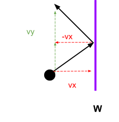
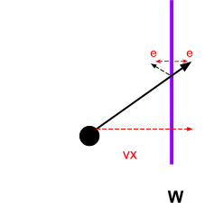
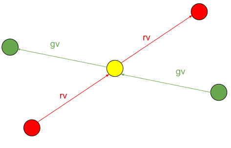
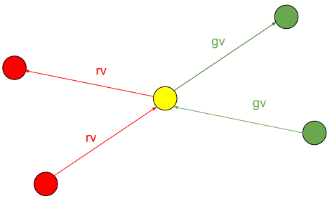
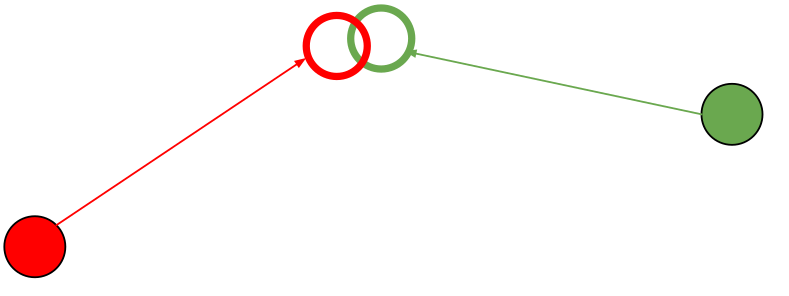
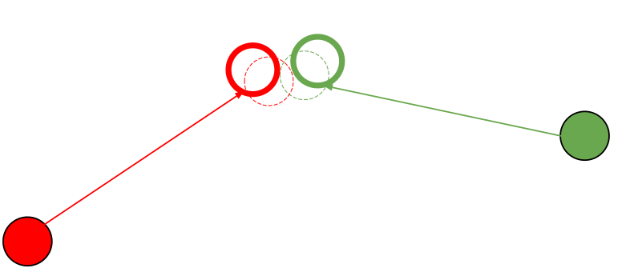

$$
\newcommand{\vecIII}[3]{\left[\begin{array}{c} #1\\\\#2\\\\#3 \end{array}\right]}
\newcommand{\vecIV}[4]{\left[\begin{array}{c} #1\\\\#2\\\\#3\\\\#4 \end{array}\right]}
\newcommand{\Choose}[2]{ { { #1 }\choose{ #2 } } }
\newcommand{\vecII}[2]{\left[\begin{array}{c} #1\\\\#2 \end{array}\right]}
\renewcommand{\vecIII}[3]{\left[\begin{array}{c} #1\\\\#2\\\\#3 \end{array}\right]}
\renewcommand{\vecIV}[4]{\left[\begin{array}{c} #1\\\\#2\\\\#3\\\\#4 \end{array}\right]}
\newcommand{\matIIxII}[4]{\left[
\begin{array}{cc}
#1 & #2 \\\\ #3 & #4
\end{array}\right]}
\newcommand{\matIIIxIII}[9]{\left[
\begin{array}{ccc}
#1 & #2 & #3 \\\\ #4 & #5 & #6 \\\\ #7 & #8 & #9
\end{array}\right]}
$$

# Animation Part 2

With animation, we change the scene dynamically, so instead of a still
scene (even if the user moves the camera), the scene changes over
time. Last time, we discussed what I call *derivative* techniques,
where the scene is updated using a *delta* of some amount, such as the
rotation angles of the spinning cube. In more complex examples, such
as the mass-spring system, the update is based on the physics of the
system, like this:

```js
// by diff eq
a = -1 * springK / mass * x;
v += a * dt;
x += v * dt;
```

where `x` is the position, `v` is the velocity (delta x) and `a` is
the acceleration (delta velocity).

In this part, we will look at techniques that are aware of time, which
I have called "positional" techniques.

We'll also look at *collisions* which can happen now that objects can
move. So far in the course, we can have objects overlap in space, and
that has been useful for modeling (e.g. the upper part of the bear's
leg is inside the torso). To avoid this, your program has to detect
*collisions* (when two objects intersect) and decide what to do (does
the moving one stop, bounce off, and if so where?). Computing
intersections isn't easy. Imagine computing whether two teapots
intersect!

## Positional Techniques

A limitation of the derivative approach is that, because time is absent from
the computation, you can't (easily) have things start and stop, or change
direction at given times. (Yes, the mass-spring system changes direction, but
not at arbitrary times.) The derivative approach works very well for
continuous, unchanging models like the bouncing ball and the mass-spring, but
not so well for, say, cars that start, speed up, turn, slow down, and stop. To
do that, we need to explicitly introduce time as a variable.

In general, what we'd love to have is a position function that tells us where
the object is at a particular time. If so, our idle callback could be as
simple as:

```js
function updateState() {
    time += deltaT;
    updateModel(time);
    TW.render();
}
```

Our hypothetical `updateModel()` function would then use the `time` variable
as an argument to a function (`position` in the code below) to compute where
everything is supposed to be right now:

```js
function updateModel(time) {
   ...
   obj.position.x = position(time);
   ...
}
```

As a more specific example, consider this:

```js
function updateModel(time) {
   ...
   const curr_x = initial_x + velocity_x * time;
   obj.position.x = curr_x;
   ...
}
```

(Notice that the derivative of the equation for the current position is just
`velocity`, which is what we add to the old position to get the new position.)

For example, suppose we have an object that we want to move smoothly
from point A to point B. Using the ideas of parametric equations, and
using the `time` variable as the parameter, we can do something like
this:

```js
function updateModel(time) {
    const A = new THREE.Vector3(...,...,...);   // start of line
    const B = new THREE.Vector3(...,...,...);   // end of line
    const P = new THREE.Vector3();
    // compute P = = A + (B-A)*time
    P.lerpVectors(A,B,time);                  // compute P between A and B
    ...
    obj.position.copy(P);                     // set position of obj to P
}
```

The
[`lerpVectors`](https://threejs.org/docs/#Vector3.lerpVectors)
method is a linear interpolation computation that is supplied by the
Three.js library. It computes in exactly the way we did with
parametric equations for lines. So: `P.x = A.x + (B.x-A.x)*time` and
similarly for the other two coordinates. However, like our use of
parametric equations, the Threejs `lerp` function assumes that the
parameter argument (the third argument) is typically in the closed
interval [0,1]. That's easily dealt with, which we will do below.

This idea is captured in this (old) demo:

[UFO](https://rtsowell.sewanee.edu/courses/cs360/threejs/demos/ufo/UFO.html)

in which a UFO drifts across the scene and fires laser bolts (like
photon torpedoes) downwards. Drawing explosions is separate. The
torpedoes are drawn with five frames. (At one point, I had a version
that checked for intersections with the roof of the barn and animated
an "explosion" using successively larger spheres). Try it!

## Starting and Stopping

What if we want to have the object, such as a UFO or car, be
motionless for a while, then start moving from A to B, then stop, then
do something else, and so on? For this, we need to start thinking
about particular values of the `time` variable. If `time` starts at 0
and increments with each frame, this might mean we want to have the
car start at time 15, move from A to B during time units 15 to 25,
then stop. Our code would look something like:

```js
function updateModel(time) {
    const A = new THREE.Vector3(...,...,...);  // start of line
    const B = new THREE.Vector3(...,...,...);  // end of line
    const time0 = 15;     // start time
    const time1 = 25;     // stop time
    ...
    if ( time < time0 ) {
        obj.position.copy(A);         // set position of obj to A
    } else if ( time <= time1 ) {
        // param is between 0 and 1
        const param = (time - time0)/(time1 - time0);
        const P = new THREE.Vector3();
        P.lerpVectors(A,B,param);
        ...
        obj.position.copy(P);         // set position of obj to P
    } else {
        obj.position.copy(B);         // set position of obj to B
    }
}
```

Notice the computation of `param`. Remember that as the parameter for
our line goes from 0 to 1, the object moves from A to B. So, we have
to map the `Time` units 15 to 25 onto the time interval [0,1]. This is
simply another example of translation and scaling.

Consider these (old) demos of an animation of some cars:

- [cars2](https://rtsowell.sewanee.edu/courses/cs360/threejs/demos/cars2/cars2.html)
- [cars3](https://rtsowell.sewanee.edu/courses/cs360/threejs/demos/cars3/cars3.html)

I haven't had time to update those to more modern JavaScript and
Threejs, but there are some useful things in the code. In the first
example, "cars2", the second car has infinite acceleration: it
instantly goes from zero to its final speed. The second example,
"cars3", the second car starts accelerating when the light turns green
and has linear acceleration until it reaches its maximum
velocity. However, the `move` method is much more
complicated. 

## Object Oriented Programming and Simulation

As the number of objects in our animations (simulations) goes up, the
number of values to keep track of in the *state* object increases. The
function to update the state also increases in
complexity. Essentially, one function needs to understand every object
in the scene. In the "cars" simulations, that single function would
need to know about the traffic light, the two cars and other things
going on in the scene. Eventually, this "update" function gets
completely out of hand.

A better approach is a *distributed* approach, where each object keeps
track of its own state, and the "update" function is distributed to
each object. This is exactly what object-oriented programming (OOP) is
about, and indeed, one of the historical origins of OOP was the 1967
language for simulation called
[Simula](https://en.wikipedia.org/wiki/Simula).

So:

- the **state** of the simulation is captured by the instance
  variables of the simulation objects, and
- each simulation object knows how to **update** its own state when
  time passes.

Imagine that each simulation object is on a global list called
`simulationObjects`. Our `updateState` function then becomes:

```js
function updateState() {
    animationState.time += 1;
    for(const o of simulationObjects) {
        o.update(animationState.time);
    }
}
```

That is, each object has a *method* called `update` and when that
method is invoked, the object updates itself in whatever way is
appropriate for that object: cars change their positions, traffic
lights count down to the next color change, and so forth. We can add
at `time` parameter, so that the update method can know what the
global time is.

## OOP in JavaScript

How do we do OOP in JavaScript? There are two approaches:

- instance-based, and
- class-based

We'll look at the instance-based version because it's more powerful in
our situation: each object can have its own instance variables and
methods. The class-based approach also has extra syntax which we can
get into if you like, but not in this reading.

Both approaches are based on the following fundamentals:

- the special keyword `this` is the object itself
- a method can refer to the object using `this`
- a property of `this` is an instance variable
- a method is a function that is a property of the object

Let's look at a tiny example. We'll create a red car traveling in
the x direction with an initial speed of 5 that changes to 10 at time
7.

```js
let redCar = new THREE.Mesh(...);
redCar.speed = 5
redCar.update = function (time) {
    if(time >= 7) {
        this.speed = 10;
    }
    this.position.x += speed;
};
simulationObjects.push(redCar);
```

Notice that `redCar` is just one of our Threejs Mesh objects. (As you
know, Threejs already uses OOP, so our meshes are already objects.) We
assigned a new property called `speed`, with the initial value
of 5. (You should be careful not to interfere with any pre-existing
properties of the object.)

Next we assigned a property called `update` to be a *function* that
takes the current time as an argument. That function is now a *method*
of the object. As we saw above, to update the state of the animation,
some global function invokes this `update` method with an argument
that is the time of the simulation.

This particular function/method uses the argument to change the speed
at time 7. It does so just by assigning a new value to `this.speed`,
because when the method is called, the `this` keyword will be the red
car object. The `update` function also updates the `x` coordinate of
the car based on the current speed of the object.

We could create a green car with an entirely different `update`
function, etc.

## Balls in a Box

The following demo is an example of a system with a bunch of balls (or
boxes or teapots) all with different colors, positions and velocities
(instance variables) and they all have a method to update their
position based on their velocity.

- [animation2/objects-in-box](https://learn.sewanee.edu/d2l/le/content/43027/viewContent/405823/View)

To keep them from just disappearing into infinity, I surrounded them
with a box and implemented code so that they bounce off the sides of
the box. I also implemented code to have them bounce off *each
other*. Let's turn to that topic now.

## Bouncing off the Walls

Before we get to general-purpose collisions, let's look at a special
case of a ball bouncing inside a box. In the following demo, you can
control the velocity of the ball in the x, y and z dimensions.

- [animation2/ball-in-box](https://learn.sewanee.edu/d2l/le/content/43027/viewContent/405823/View)

If only one velocity is non-zero, the ball travels parallel to that
axis and can only bounce off the walls that cross that axis. Say the x
is non-zero and that the box is symmetrical around the origin: the
ball can only bounce off the walls at x=W and at x=-W.

Now, let's suppose that the ball has non-zero vx and vy. Its path
might look like this:

<center>
<figure>
    
    <figcaption>The velocity vector of the ball decomposes into vx and vy, and after bouncing, the vx is reversed, but the vy stays the same.</figcaption>
</figure>
</center>

In short, if it bounces off the right-hand wall, we can update the
velocity vector of the object by keeping its vy and vz the same and
negating its vx component. Bouncing off other walls is similar.

How can we tell when the ball has bounced? That happens when the new x
component would be greater than W. Let's suppose that the amount by
which the new x coordinate exceeds W is "e". We have something like
this:

<center>
<figure>
    
    <figcaption>The "e" value is the excess "vx", so we need to fix the position of the ball.</figcaption>
</figure>
</center>

All of these pictures so far have ignored the radius of the ball. If
we suppose that the radius of the ball is `r`, we can just subtract
`r` from the x-coordinate of the wall, `W` and proceed as if the ball
was a point.

The code might look like this:

```js
        this.position.x += this.velocity.x;
        const r = this.radius;
        const x = this.position.x;
        let WALL = +W-r;
        if( x > WALL ) {
            // reverse the x component of the velocity
            this.velocity.x = -this.velocity.x;
            // adjust the position to bounce back into the box
            const e = x - WALL;
            const newx = WALL - e;
            console.log(x, 'bounce to', newx);
            this.position.x = newx;
        }
```

So the new x is

$$ x' = W - (x - W) = 2W - x $$

The code for the other direction, where the ball is moving to the
left, is almost the same, except that the wall is now at `-W+r`, we
use `<` instead of `>` in our test, and the update is slightly
different:

```js
        this.position.x += this.velocity.x;
        const r = this.radius;
        const x = this.position.x;
        WALL = -W+r;
        if( x < WALL ) {
            // reverse the x component of the velocity
            this.velocity.x = -this.velocity.x;
            // adjust the position to bounce back into the box
            const e = WALL - x;
            const newx = WALL + e;
            console.log(x, 'bounce to', newx);
            this.position.x = newx;
        }
```

And the calculation of the new x is, surprisingly, the same, after a little algebra:

$$ x' = W + (W - x) = 2W - x $$

So, these two computations can be combined. Furthermore there's
nothing really special about the x dimension, so we can write an
abstract function to handle any of the three axes. I called this
function `axisAlignedBounce`, where the `dir` argument says whether we
are going in the negative direction and should use `<` or the positive
direction and should use `>`.

```js
        function axisAlignedBounce(obj, axis, wall, direction) {
            if( (direction == 'pos' && obj.position[axis] > wall) ||
                (direction == 'neg' && obj.position[axis] < wall)) {
                obj.velocity[axis] = -obj.velocity[axis];
                obj.position[axis] = 2*wall - obj.position[axis];
                console.log('bounce', obj.velocity.x, obj.velocity.y, obj.velocity.z);
            }
        }
```

It is used like this:

```js
        axisAlignedBounce(this, 'x', +W-r, 'pos');
        axisAlignedBounce(this, 'x', -W+r, 'neg');
        axisAlignedBounce(this, 'y', +W-r, 'pos');
        axisAlignedBounce(this, 'y', -W+r, 'neg');
        axisAlignedBounce(this, 'z', +W-r, 'pos');
        axisAlignedBounce(this, 'z', -W+r, 'neg');
```

Note that we've made some simplifying assumptions here that are often
made in beginning physics: collisions are perfectly elastic (no energy
is lost), take zero time, and so forth. But these assumptions get us
started.

## Bouncing off A Ball

What happens when two balls collide? Again, we'll make some
simplifying assumptions. We'll assume that the balls are perfectly
elastic. We'll also assume that they have the same *mass*, which means
that the collision is perfect symmetrical.

This first picture assumes the green ball and the red ball pass right
through each other. On the second step, they overlap to form a yellow
ball:

<center>
<figure>
    
    <figcaption>Three steps, with the red ball and green ball going through each other on the third step</figcaption>
</figure>
</center>

In a perfect collision of balls of equal mass, the red ball would be
where the green ball is, with the velocity vector that the green ball
has, and vice versa. In other words, a bounce might look like this:

<center>
<figure>
    
    <figcaption>Three steps, with the red ball and green ball bouncing and exchanging velocity vectors after the bounce.</figcaption>
</figure>
</center>

Now, suppose we "zoom" in on that collision step:

<center>
<figure>
    
    <figcaption>The red ball and green ball overlap in a hypothetical collision</figcaption>
</figure>
</center>

We'll calculate how much they overlap and use that to adjust their
positions, which should remind you of how we handled collisions with a
wall.

They overlap if the distance between their centers is less than the
sum of their two radiuses (radii, if you prefer Latin plurals). The
amount of the overlap is just the difference. We then move each ball
in the direction it should be going after the bounce, by half the
overlap. It might look like this:

<center>
<figure>
    
    <figcaption>The red ball and green ball moved a bit after a hypothetical collision</figcaption>
</figure>
</center>

After these adjustments, they no longer overlap and they are going the correct way. The code looks like this:

```js
    ...
    const a = objects[i];
    const b = objects[j];
    // collision test
    const distance = a.center.distanceTo(b.center);
    if (distance <= (a.radius + b.radius)) {
        console.log(`${i} hit ${j} at a distance of ${distance}`);
        // d is the penetration distance.
        const d = (a.radius + b.radius) - distance;
        swapVelocities(a,b);
        a.position.addScaledVector(a.velocity, d/2);
        b.position.addScaledVector(b.velocity, d/2);
    }
```

The `addScaledVector` is a method that Threejs provides! The `swapVelocities` helper function is straightforward:

```js
const tmpVector3 = new THREE.Vector3();

function swapVelocities(a, b) {
    const tmp = tmpVector3;
    tmp.copy(a.velocity);
    a.velocity.copy(b.velocity);
    b.velocity.copy(tmp);
}
```

## Multiple Objects

If we have more than two balls bouncing around, we have to consider
multiple possible collisions. Any ball could collide with any other,
so for a moment you might think there are $n^2$ collisions, but of
course a collision betwee ball $i$ and ball $j$ is the same as a
collision between ball $j$ and ball $i$. If we avoid double-counting,
we see there are $n(n-1)/2$ possible collisions.

One way to handle this is just to iterate over all the balls, in
nested loops, but the inner loop starts at `i` instead of at
zero. That is, we only consider collisions $(i,j)$ where $j>i$.

Thus, our code is:

```js
    const n = objects.length;
    for(let i=0; i<n; i++ )
        for( let j=i+1; j<n; j++ ) {
        ...
        const a = objects[i];
        const b = objects[j];
```

Then see the code in the previous section for handling the collision
of `a` and `b`.

Finally, we should consider the more general case, not just of balls
colliding, but any kind of object, such as a teapot.

## General Collisions

The general problem of determining whether two objects collide is very
difficult. Again, consider teapots. One approximation that can be
helpful is to use bounding boxes and bounding spheres. (See the
[Wikipedia page on Bounding
Volumes](https://en.wikipedia.org/wiki/Bounding_volume).)

### Bounding Spheres

Consider bounding spheres first. If you imagine that each of your
objects exists inside a bubble of a particular radius, you can compute
the distance between each pair of bubbles, using the 3D version of the
Pythagorean Theorem. If the distance between the bubbles is greater
than the combined radiuses of the bubbles, the two objects *can't*
intersect. You can then go on to consider another pair of objects.

If the distance isn't greater than the combined radiuses, the objects
*may* intersect, and you can, if you want, try to do additional
geometric tests to determine if they do. In many cases, it might be
sufficient to simply use the bounding sphere. That's what the bouncing
balls demo does. Even the teapots are treated as spheres.

### Bounding Boxes

Using bounding boxes is similar, and the geometry is almost as
easy. For example, if the minimum **x** of one object is greater than
the maximum **x** of the other, they cannot intersect. (Take a moment
to visualize this.) Considering the other two dimensions gives you a
rough idea of whether they can intersect. Thus, bounding boxes give
you a quick-and-dirty way to eliminate certain pairs of objects from
more exacting geometry tests.

### Threejs Support

Threejs has support for both kinds of bounding volumes. All
[BufferGeometry](https://threejs.org/docs/#api/en/core/BufferGeometry)
objects have the following:

- [.boundingBox](https://threejs.org/docs/index.html#api/en/core/BufferGeometry.boundingBox)
  which is the bounding box for the bufferGeometry, which can be
  calculated with .computeBoundingBox(). Default is null.
- [.boundingSphere](https://threejs.org/docs/index.html#api/en/core/BufferGeometry.boundingSphere)
  which is the bounding sphere for the bufferGeometry, which can be
  calculated with .computeBoundingSphere(). Default is null.
- [.computeBoundingBox()](https://threejs.org/docs/index.html#api/en/core/BufferGeometry.computeBoundingBox)
  Computes the bounding box of the geometry, and updates the
  .boundingBox attribute. The bounding box is not computed by the
  engine; it must be computed by your app. You may need to recompute
  the bounding box if the geometry vertices are modified.
- [.computeBoundingSphere()](https://threejs.org/docs/index.html#api/en/core/BufferGeometry.computeBoundingSphere)
  Computes the bounding sphere of the geometry, and updates the
  .boundingSphere attribute. The engine automatically computes the
  bounding sphere when it is needed, e.g., for ray casting or view
  frustum culling. You may need to recompute the bounding sphere if
  the geometry vertices are modified.

There are also methods for
[Sphere](https://threejs.org/docs/index.html#api/en/math/Sphere) and
[Box3](https://threejs.org/docs/index.html#api/en/math/Box3) objects
to compute whether they intersect other spheres and boxes, and much
more.

### Bounding Objects

The bouncing objects demo uses bounding spheres, so the full code for
updating all the objects during the animation is the following:

```js
function updateState() {
    animationState.time += 1;
    for(const o of objects) {
        o.update(animationState.time);
    }
    // consider objects bouncing off each other:
    scene.updateMatrixWorld(true);
    const n = objects.length;
    for(let i=0; i<n; i++ )
        for( let j=i+1; j<n; j++ ) {
            const a = objects[i];
            const b = objects[j];
            // transform bounding spheres into world space
            const bsA = a.geometry.boundingSphere.clone().applyMatrix4(a.matrixWorld);
            const bsB = b.geometry.boundingSphere.clone().applyMatrix4(b.matrixWorld);
            // collision test
            const distance = bsA.center.distanceTo(bsB.center);
            if (distance <= (bsA.radius + bsB.radius)) {
                console.log(`${i} hit ${j} at a distance of ${distance}`);
                // d is the penetration distance.
                const d = (bsA.radius + bsB.radius) - distance;
                swapVelocities(a,b);
                a.position.addScaledVector(a.velocity, d/2);
                b.position.addScaledVector(b.velocity, d/2);
            }
        }
}
```

A few small notes on the code above.

- the first part is exactly what we expect. The `update` method for
  each object updates its position based on its velocity vector. That
  method also considers collisions with walls.
- Next, we update the world matrix. We'll return to this in a moment
- Then, we start the nested loops to consider all pairwise collisions
- For each pair of objects $(a,b)$ with indexes $(i,j)$ we
  - get a copy of the boundingSphere
  - update its position by applying the worldmatrix from the object
  - compute the distance between the centers of the bounding spheres
  - compare that to the sum of the radiuses
  - if they collided
    - swap their velocity vectors, and
    - move each object in the direction of its vector by
      half the distance of the overlap

Because we will need to update the bounding sphere's location, we need
each object's matrixWorld to be updated, so we explicitly do that
before starting the collision check. (I forgot to do this when I was
developing and it was a very difficult bug, because the code seemed
fine, but it was just out-of step.)

## Timers

One thing you may have considered is that if the scene is complex to
draw, it will take more time, and if it's simple to draw, it will take
less time. We request another animation frame as soon as the current
frame is drawn, so simple scenes will run faster than complex
scenes. Furthermore, it will run faster on faster hardware (say, your
laptop) than slower hardware (your phone). If we want the program to
run at a more predictable rate, the animation frame approach won't
work well. Instead, we can use *timers* :

For many years, browsers have supported a function called [`setInterval()`](https://developer.mozilla.org/en-US/docs/Web/API/WindowTimers.setInterval), which is just the tool we need.

Here's an example:

```js
    const intervalID = setInterval(redraw, 500);
```

The `setInterval()` function is similar in many ways to the
`requestAnimationFrame()` function: it takes a function as its input
and runs that function later. In fact, in the example above, it runs
the `redraw()` function every 500 milliseconds (half a second). Using
this, your animation will run at a predictable rate on a wide variety
of browsers and graphics cards. Two caveats:

- If your function takes longer to run than the interval you chose,
  the different executions will overlap, which will probably produce a
  mess. We are using `setInterval()` because we don't want the code to
  run *too fast* , so hopefully, the problem of it running too slowly
  won't occur, but on an underpowered device, it could happen. If you
  are worried about this, your `redraw()` function could check to see
  whether the previous execution finished.
- If you want the animation to run very fast, you might be tempted to
  try an interval of only, say, 2 milliseconds, so that it would
  render 500 times per second. Wow, that would be awesome, wouldn't
  it?! Alas, most monitors are only going to refresh 60-100 times per
  second, so at *best* , you might be able to have an interval of 10
  milliseconds, but more likely 16 or 17 ms, which gets you a frame
  rate of 60 fps (frames per second).

## Double Buffering

To animate smoothly, we need to use double-buffering. In the old days, this
was not automatic, but nowadays it's pretty much taken care of by the graphics
card and/or the browser. So this section is theoretical and historical. You
won't need to worry about double-buffering in your coding. All of our Three.js
programs have used double-buffering, even though we didn't know it, but now
we'll learn about why they do, and the effects of not using double-buffering.

Without double-buffering, the display can flicker terribly. What causes the
flickering?

The graphics system is constantly erasing and redrawing the scene. The
monitor is constantly refreshing the screen. (Most modern monitors
refresh between 50-100 times per second, so every 10 to 20
milliseconds.) If the screen is refreshed when the new image is only
partly drawn (this includes filling areas in the framebuffer), you'll
see, briefly, that partial image. That's what causes the flicker.

The solution is to somehow "synchronize" the two so that the monitor never
draws an incomplete image. The way this is done is:

- the monitor reads out from the "front" buffer, while
- the graphics system draws into the "back" buffer, and when it's done,
- they swap

The names "front" and "back" buffer are conventional: the front buffer
is the one that is "on stage" and the back buffer is the one that is
being prepared for the next scene. In other words, there are *two*
copies of the "frame buffer": one for rendering and one for refreshing
the screen/monitor.

Throughout this course, our Three.js programs have executed OpenGL/WebGL code
that does the following (deep under the covers):

- `glutInitDisplayMode( GLUT_DOUBLE, ... )` in the `main()` method, and
- `glutSwapBuffers()` at the end of the `display()` method.

The first tells OpenGL that you want to use double-buffering, so it
sets up two buffers and automatically draws in the "back" buffer. The
second says that the program is done drawing in the back buffer and
swaps it with the front buffer. The combination means that when we do
animations or even just move the viewpoint with the mouse, we don't
get any flicker.

**Note:** if you were using double buffering and you forgot to do
`glutSwapBuffers()`, your screen would be blank! Why? Because you would be
drawing in the back buffer and there is nothing in the front buffer.

Perhaps the *only* reason to ever use single-buffering is when you know you're
only drawing a static scene and you're short on memory on the graphics card,
but this is pretty rare nowadays.

Note that this double-buffering idea is a general notion that is also used in
database I/O and lots of other areas of CS.

## Summary

This reading covered quite a few ideas:

- positional approaches
- OOP and simulation
- collisions
- timers
- double-buffering

The **positional** approach just says we keep track of the absolute
time of the simulation (which might be just an arbitrary frame
counter, or might be some kind of simulation time in units like
seconds or days). The function that updates the state of an object can
use the absolute time as part of its computation. That allows us to
use sine/cosine functions, if statements, and all sorts of other
computations to start/stop and affect our simulation.

As the complexity of the simulation increases, we should use **OOP**
approaches: the *state* of the simulation is distributed over the
different *objects* of the simulation. The state is updated by
*methods* of the objects.

JavaScript has OOP easily available:

- the `this` keyword inside a method refers to the object itself
- a method is just a function stored as a property of the object
- a method is invoked like `var.meth(arg1,arg2)` where `var` is a
  variable holding an object

A simulation with lots of moving objects has to consider
**collisions**. Collisions can be detected by using *bounding boxes*
and *bounding spheres*. Threejs has a lot of support for this.

If you want a more consistent speed for your animations, you can use
timers like `setTimeout` instead of `requestAnimationFrame`.

Computer Graphics systems use double-buffering to avoid flicker during
animations.