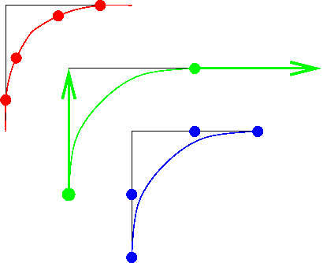
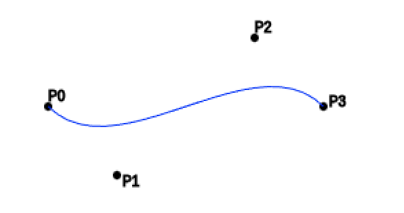
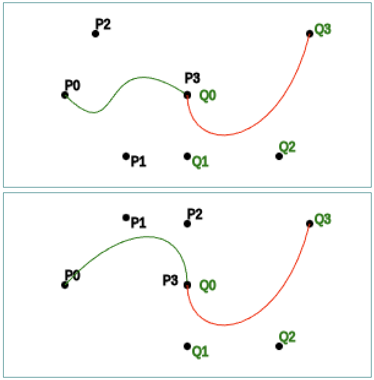
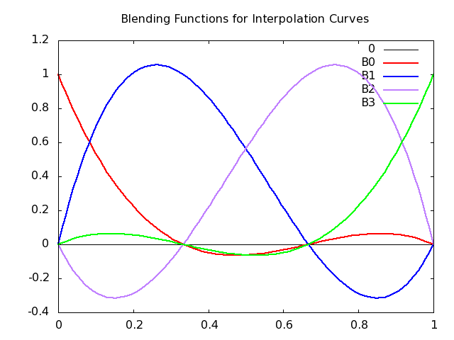
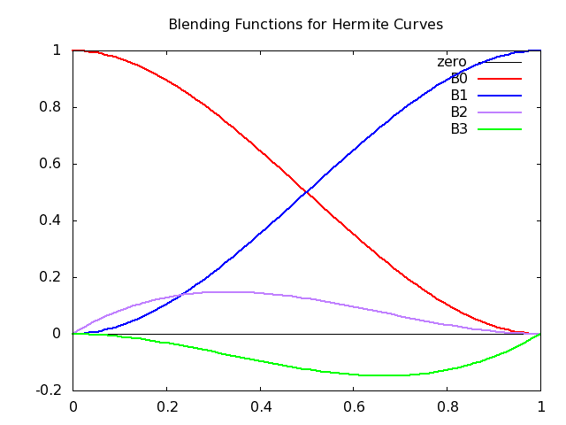
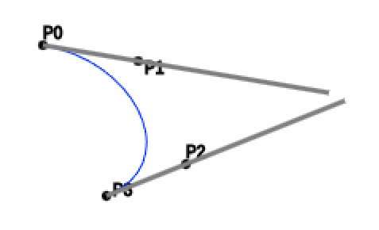
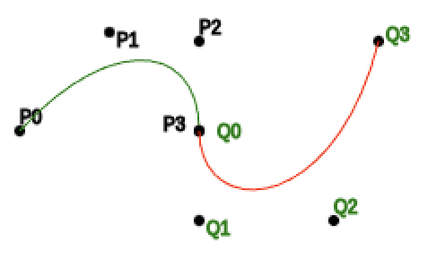
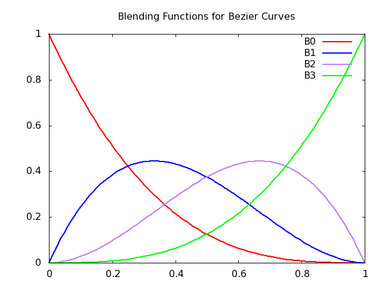
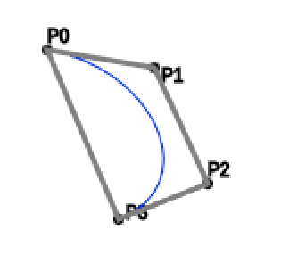

$$
\newcommand{\vecIII}[3]{\left[\begin{array}{c} #1\\\\#2\\\\#3 \end{array}\right]}
\newcommand{\vecIV}[4]{\left[\begin{array}{c} #1\\\\#2\\\\#3\\\\#4 \end{array}\right]}
\newcommand{\Choose}[2]{ { { #1 }\choose{ #2 } } }
\newcommand{\vecII}[2]{\left[\begin{array}{c} #1\\\\#2 \end{array}\right]}
\renewcommand{\vecIII}[3]{\left[\begin{array}{c} #1\\\\#2\\\\#3 \end{array}\right]}
\renewcommand{\vecIV}[4]{\left[\begin{array}{c} #1\\\\#2\\\\#3\\\\#4 \end{array}\right]}
\newcommand{\matIIxII}[4]{\left[
\begin{array}{cc}
#1 & #2 \\\\ #3 & #4
\end{array}\right]}
\newcommand{\matIIIxIII}[9]{\left[
\begin{array}{ccc}
#1 & #2 & #3 \\\\ #4 & #5 & #6 \\\\ #7 & #8 & #9
\end{array}\right]}
$$
# Reading: Bezier Curves

This reading is organized as follows. First, we look at why we try to
represent curves and surfaces in graphics models, but I think most of us are
already pretty motivated by that. Then, we look at major classes of
mathematical functions, discussing the pros and cons, and finally choosing
cubic parametric equations. Next, we describe different ways to specify a
cubic equation, and we ultimately settle on Bezier curves. Finally, we look at
how the mathematical tools that we've discussed are reflected in
WebGL/Three.js code.

The preceding develops *curves* (that is, 1D objects -- wiggly
lines). In graphics, we're mostly interested in *surfaces* (that is,
2D objects -- wiggly planes). Next time, we'll look at how to define
surfaces as a generalization of what we've already done with curves.

## Introduction

Bezier curves were invented by a mathematician working at Renault, the French
car company. He wanted a way to make formal and explicit the kinds of curves
that had previously been designed by taking flexible strips of wood (called
*splines* , which is why these mathematical curves are often called splines)
and bending them around pegs in a pegboard. To give credit where it's due,
another mathematician named de Castelau independently invented the same family
of curves, although the mathematical formalization is a little different.

## Representing Curves

We all know about different kinds of curves, such as parabolas, circles, the
square root function, cosines and so forth. Most of those curves can be
represented mathematically in several ways:

- explicit equations
- implicit equations
- parametric equations

## Explicit Equations

The explicit equations are the ones we're most familiar with. For example,
consider the following functions:

$$
\begin{array}{rcl}
y &=& mx+b\\
y &=& ax^2+bx+c\\
y &=& \sqrt{r^2-x^2}\\
\end{array} $$

An explicit equation has one variable that is dependent on the others; here it
is always $y$ that is the dependent variable: the one that is calculated as a
function of the others.

An advantage of the explicit form is that it's pretty easy to compute many
values on the curve: just iterate $x$ from some minimum to some maximum value.

One trouble with the explicit form is that there are often special cases (for
example, vertical lines). Another is that the limits on $x$ will change from
function to function (the domain is infinite for the first two examples, but
limited to $\pm r$ for the third). The deadly blow is that it's hard to handle
non-functions, such as a complete circle, or a parabola of the form
$x=ay^2+by+c$. You could certainly get a computer program to handle this form,
but you'd need to encode lots of extra stuff, like which variable is the
dependent one and so forth. Bezier curves can be completely specified by just
an array of coefficients.

## Implicit Equations

Another class of representations are implicit equations. These equations
always put everything on one side of the equation, so no variable is
distinguished as the dependent one. For example:

$$
\begin{array}{rcl}
ax+by+cz-d=0 & & \textrm{plane} \\
ax^2+by^2+cz^2-d^2=0 & & \textrm{egg} \\
\end{array}
$$

These equations have a nice advantage that, given a point, it's easy to tell
whether it's on the curve or not: just evaluate the function and see if the
function is zero. Moreover, each of these functions divides space in two: the
points where the function is negative and the points where it's positive.
Interestingly, the surfaces do as well, so the *sign* of the function value
tells you which side of the surface you're on. (It can even tell you how close
you are.)

The fact that no variable is distinguished helps to handle special cases. In
fact, it would be pretty easy to define a large general polynomial in $x$, $y$
and $z$ as our representation.

The deadly blow for this representation, though, is that it's hard to generate
points on the surface. Imagine that I give you a value for $a$, $b$, $c$ and
$d$ and you have to find a value for $x$, $y$, and $z$ that work for the two
examples above. Not easy in general. Also, it's hard to do curves (wiggly
lines). In general, curves are the intersection of two surfaces, like conic
sections (parabola, ellipse, etc.) being the intersection of a cone and a
plane.

## Parametric Equations

Finally, we turn to the parametric equations. We've seen these before, of
course, in defining lines, which are just straight curves.

With parametric equations, we invent some new variables, *parameters* ,
typically $s$ and $t$. These variables are then used to define a function for
each coordinate:

$$ \vecIII{x(s,t)}{y(s,t)}{z(s,t)} $$

Parametric functions have the advantage that they're easy to generalize to 3D,
as we already saw with lines.

The parameters tell us where we are on the *surface* (or curve) rather than
where we are in space. Therefore, we have a conventional domain, namely the
unit interval. This means that, like our line segments, our curves will all go
from $t=0$ to $t=1$. (They don't have to, but they almost always do.)
Similarly, surfaces are all points where $0\leq s,t \leq 1$. Thus, another
advantage of parametric equations is that it's easy to define finite segments
and sheets, by limiting the domains of the parameters.

The problem that remains is what family of functions we will use for the
parametric functions. One standard approach is to use polynomials, thereby
avoiding trigonometric and exponential functions, which are expensive to
compute. In fact, we usually choose a cubic:

$$
\begin{array}{rcl}
x(t) &=& C_0+C_1 t + C_2 t^2 + C_3 t^3 \\
&=& \sum_{i=0}^{3} C_i t^i
\end{array}
$$

Another problem comes with finding these coefficients. We'll develop
this in later sections, but the solution is essentially to appeal to
some nice techniques from linear algebra that let us solve for the
desired coefficients given some desired constraints on the curve, such
as where it starts and where it stops.

## Why We Want Low Degree

Why do we typically use a cubic? Why not something of higher degree, which
would let us have more wiggles in our curves and surfaces? This is a
reasonable question.

In general, we want a low degree: quadratic, cubic or something in that
neighborhood. There are several reasons:

1. The resulting curve is smooth and predictable over long spans. In
   other words, because it wiggles less, we can control it more
   easily. Consider trying to make a nice smooth curve with a piece of
   cardboard or thin wood (a literal spline) versus with a piece of
   string.
2. It takes less information to specify the curve. Since there are
   four unknown coefficients, we need four points (or similar
   constraints) to solve for the coefficients. If we were using a
   quartic, we'd need 5 points, and so forth.
3. If we want more wiggles, we can join up several splines. Because of
   the low degree, we have good control of the derivative at the end
   points, so we can make sure that the curve is smooth through the
   joint.
4. Finally, it's just less computation and therefore easier for the
   program to render.

OpenGL/WebGL will permit you to use higher (and lower) degree functions, but
for this presentation we'll stick to cubics.

## Ways of Specifying a Curve

Once we've settled on a family of functions, such as cubics, what
remains is determining the values of the coefficients that give us a
particular curve. To define a cubic, we need *four* pieces of
information, though there are different choices about what four pieces
of information. If we want, for example, a curve that looks like the
letter "J," what four pieces of information do we need to specify? It
turns out that there are three major ways of doing this. (It's strange
how everything seems to break down into threes in this subject.)

- *Interpolation:* That is, you specify four points on the curve and
  the curve goes through (*interpolates*) the points. This is pretty
  intuitive, and a lot of drawing programs allow you to do this, but
  it's not often used in CG. This is primarily because such curves
  have an annoying way of suddenly lurching as they struggle to get
  through the next specified point.
- *Hermite:* In the Hermite case, the four pieces of information you
  specify are 2 points and 2 vectors: the points are where the curve
  starts and ends, and the vectors indicate the direction of the curve
  at that point. They are, in fact, *derivatives*. (If you've done
  single-dimensional calculus, you know that the derivative gives the
  slope at any point and the slope is just the direction of the line;
  the same idea holds in more dimensions.) This is a very important
  technique, because we often have this information. For example, if I
  want a nice rounded corner on a square box, I know the slope at the
  beginning (vertical, say) and at the end (horizontal).
- *Bezier:* With a Bezier curve, we specify 4 points, as follows: the
  curve starts at the first point, heading for the second, ends at the fourth,
  coming from the third (see the picture below). This is a very
  important technique, because you can easily specify a point using a
  GUI, while a vector is a little harder. It turns out there are other
  reasons that Bezier is preferred, and in practice the first two
  techniques are implemented by finding the Bezier points that draw
  the desired curve.




Three ways to specify a curve that takes a 90-degree
curve. (a) the red curve interpolates (goes through) four points, (b)
the green curve is defined by start and end points with corresponding
direction vectors, and (c) the blue curve is defined by four points
that lie on the right-angle.

The figure above compares these three approaches.

OpenGL/WebGL curves are drawn by calculating points on the line and
drawing straight line segments between those points. The more
segments, the smoother the resulting curve looks. In some
implementations, the calculations can be done by the graphics card. In
Three.js, they compute the vertices in the main processor, rather than
having the graphics card do this. It may be because they want to
simplify the shader program, but that's a guess.

## Defining a Bezier Curve[¶](#defining-a-bezier-curve "Permanent link")

The following figure shows four points defining a Bezier curve.




A Cubic Bezier curve, showing the four control points and the curve.

Fun fact: the curve above was
*drawn* using the [2D WebGL
API](https://developer.mozilla.org/en-US/docs/Web/API/Canvas_API/Tutorial/Drawing_shapes#bezier_and_quadratic_curves).

## Joining Curves

To make longer curves with more wiggles, we can join up several Bezier
curves. The following figure shows two examples. In each subfigure,
the first curve (in green) is defined by 4 points: P0, P1, P2, P3; the
second curve (in red) is defined by 4 points: Q0, Q1, Q2, Q3.

In the first subfigure, the curves are connected (the last control
point of the first curve is the same as the first point of the
second), but not *smooth* through the joint. The second subfigure
manages to make the joint smooth, by making sure the tangents line up.



Joining cubic Bezier curves. The first figure has a sharp joint; the second is smooth through the joint.

How do we make the tangents line up, creating a smooth joint? The
tangents are defined by the line segments from P2 to P3 and from Q0 to
Q1. So, the joint will be smooth if these three points are co-linear
(form a line):

> P2, P3==Q0, Q1

You'll notice in the second subfigure above, P3 is the same as Q0, and
P2, P3=Q0 and Q2 form a straight line. In fact, the distance from P2
to P3 is the same as the distance from Q0 to Q1.

## Solving for the Coefficients

We'll now discuss how we can solve for the coefficients given the control
information (the four points or the two points and two vectors). Essentially,
we're solving four simultaneous equations. We won't do all the gory details,
but we'll appeal to some results from linear algebra.

Let's look at how we solve for the coefficients in the case of the
interpolation curves; the others work similarly.

Note that in every case, the parameter is $t$ and it goes from $0$ to $1$. For
the interpolation curve, the interior points are at $t=1/3$ and $t=2/3$. Let's
focus just on the function for $x(t)$. The other dimensions work the same way.
If we substitute $t=\{0, \frac13, \frac23, 1 \}$ into the cubic equations we
saw earlier, we get the following:

$$ \begin{array}{lclcl}
P_0 &=& x(0) &=& C_0 +C_1\cdot0 + C_2\cdot0+C_3\cdot0\\
P_1 &=& x(1/3) &=& C_0+\frac13C_1 + \left(\frac13\right)^2C_2 + \left(\frac13\right)^3C_3\\
P_2 &=& x(2/3) &=& C_0+\frac23C_1 + \left(\frac23\right)^2C_2 + \left(\frac23\right)^3C_3\\
P_3 &=& x(1) &=& C_0+C_1\cdot1 + C_2\cdot1 + C_3\cdot1\\
\end{array}
$$

What does this mean? It means that the $x$ coordinate of the first point,
$P_0$, is $x(0)$. This makes sense: since the function $x$ starts at $P_0$, it
should evaluate to $P_0$ at $t=0$. (This is also exactly what happens with a
parametric equation for a straight line: at $t=0$, the function evaluates to
the first point.) Similarly, the $x$ coordinate of the second point, $P_1$ is
$x(1/3)$ and that evaluates to the expression that you see there. Most of
those coefficients are still unknown, but we'll get to how to find them soon
enough.

Putting these four equations into a matrix notation, we get the following:

$$
\mathbf{P} = \left[ \begin{array}{cccc}
1 & 0 & 0 & 0 \\[6pt]
1 & \frac13 & (\frac13)^2 & (\frac13)^3 \\[6pt]
1 & \frac23 & (\frac23)^2 & (\frac23)^3 \\[6pt]
1 & 1 & 1 & 1 \\ \end{array}\right] \mathbf{C}
$$

The $\mathbf{P}$ matrix is a matrix of *points*. It could just be the $x$
coordinates of our points $P$, or more generally it could be a matrix each of
whose four entries is an $(x,y,z)$ point. We'll view it as a matrix of points.
The matrix $\mathbf{C}$ is a matrix of *coefficients* , where each element --
each coefficient -- is a triple $(C_x,C_y,C_z)$, meaning the coefficients of
the $x(t)$ function, the $y(t)$ function, and the $z(t)$ function.

If we let $\mathbf{A}$ stand for the array of numbers, we get the following
deceptively simple equation:

$$ \mathbf{P} = \mathbf{A} \mathbf{C} $$

By inverting the matrix $\mathbf{A}$, we can solve for the coefficients! (The
inverse of a matrix is the analog to a reciprocal in scalar mathematics. It's
also equivalent to solving the simultaneous equations in a very general way.)
The inverse of $\mathbf{A}$ is called the *interpolating geometry matrix* and
is denoted $\mathbf{M}_I$:

$$ \mathbf{M}_I = \mathbf{A}^{-1} $$

Notice that the matrix $\mathbf{M}_I$ does not depend on the
particular points we choose, so that matrix can simply be stored in
our program somewhere. When we need to calculate points on the curve,
we compute the necessary coefficients:

$$ \mathbf{C} = \mathbf{M}_I \mathbf{P} $$

The same approach works with Hermite and Bezier curves, yielding the Hermite
geometry matrix and the Bezier geometry matrix. In the Hermite case, we take
the derivative of the cubic and evaluate it at the endpoints and set it equal
to our desired vector (instead of points $P_1$ and $P_2$). In the Bezier case,
we use a point to define the vector and reduce it to the previously solved
Hermite case.

## Blending Functions

Sometimes, looking at the function in a different way can give us additional
insight. Instead of looking at the functions in terms of control points and
geometry matrices, let's look at them in terms of how the control points
influence the curve points.

Looking just at the functions of $t$ that are combined with the
control points, we can get a sense of the influence each control point
has over each curve point. The influences of the control points are
*blended* to yield the final curve point, and these functions are
called *blending functions*. (Blending functions are also important
for understanding NURBS, a generalization of Bezier curves.)
Equivalently, the curve points are a *weighted average* of the control
points, where the blending functions give the weight. That is, if you
evaluate the four blending functions at a particular parameter value,
$t$, you get four numbers, and those numbers are weights in a weighted
sum of the four control points.

The following function gives the curve, $P(t)$, as a weighted sum of the four
control points, where the four blending functions evaluate to the appropriate
weight as a function of $t$.

$$
P(t) = B_0(t)\cdot P_0 + B_1(t)\cdot P_1 + B_2(t)\cdot P_2 + B_3(t)\cdot P_3
$$

The following are the blending functions for interpolating curves.

$$
\begin{array}{rcl}
B_0(t) &=& \frac{-9}2(t-\frac13)(t-\frac23)(t-1) \\[6pt]
B_1(t) &=& \frac{27}2t(t-\frac23)(t-1) \\[6pt]
B_2(t) &=& \frac{-27}2t(t-\frac13)(t-1) \\[6pt]
B_3(t) &=& \frac{-9}2t(t-\frac13)(t-\frac23) \\[6pt]
\end{array}
$$

These functions are plotted in the following figure:




The blending functions for interpolating curves.

Alternatively, you can go over to [Wolfram
Alpha](http://www.wolframalpha.com/) and see the live plotting (and adjust to
your taste) by using the following commands:

> plot (-9/2)(t-(1/3))(t-(2/3))(t-1) from t=0 to 1

> plot (-9/2)(t-(1/3))(t-(2/3))(t-1), (27/2)t(t-(2/3))(t-1), (-27/2)t(t-(1/3))(t-1) from t=0 to 1

> plot (-9/2)(t-(1/3))(t-(2/3))(t-1), (27/2)t(t-(2/3))(t-1), (-27/2)t(t-(1/3))(t-1), (-9/2)t(t-(1/3))(t-(2/3)) from t=0 to 1

> plot (-9/2)(t-(1/3))(t-(2/3))(t-1), (27/2)t(t-(2/3))(t-1), (-27/2)t(t-(1/3))(t-1), (-9/2)t(t-(1/3))(t-(2/3)) from t=0 to 1

First, notice that the curves always sum to 1. (It may not be entirely
obvious, but it's true.) When a curve is near zero, the control point has
little influence. When a curve is high, the weight is high and the associated
control point has a lot of influence: a lot of "pull." In fact, when a control
point has a lot of pull, the curve passes near it. When a weight is 1, the
curve goes through the control point.

Notice that the blending functions are negative sometimes (they all start and
end at zero), which means that this isn't a normal weighted average. (A normal
weighted average has all non-negative weights.) What would a negative weight
mean? If a positive weight means that a control point has a certain "pull," a
negative value gives it "push" -- the curve is repelled from that control
point. This repulsion effect is part of the reason that interpolation curves
are hard to control.

## Hermite Representation

The coefficients for the Hermite curves and therefore the blending
functions can be computed from the control points in a similar way (we
have to deal with derivatives, but that's not the point right now).

Note that the derivative (tangent) of a curve in 3D is a 3D *vector* ,
indicating the direction of the curve at this moment. (This follows directly
from the fact that if you subtract two points, you get the vector between
them. The derivative of a curve is simply the limit as the points you're
subtracting become infinitely close to each other.)

The Hermite blending functions are the following.

$$ \mathbf{b}(t) = \vecIV{2t^3-3t^2+1} {-2t^3+3t^2} {t^3-2t^2+t} {t^3-t^2} $$

The Hermite blending functions are plotted in the following figure:




The blending functions for Hermite curves.

The Hermite curves have several advantages:

- Smoothness:
  - It's easier to join up at endpoints. Because we control the
    derivative (direction) of the curve at the endpoints, we can
    ensure that when we join up two Hermite curves that the curve is
    smooth through the joint: just ensure that the second curve
    starts with the same derivative that the first one ends with.
  - The blending functions don't have zeros in the interval: so the
    influence of a control point never switches from positive to
    negative. For example, the influence of the first control point
    peaks at the beginning and steadily, monotonically, drops to
    zero over the interval.
- Control:
  - The Hermite can be easier to control. As we mentioned earlier,
    there's no need to know interior points, and we often only know
    how we want a curve to start and end.

## Bezier Curves

The Bezier curve is based on the Hermite, but instead of using vectors, we use
two control points. Those control points are not interpolated though: they
exist only in order to define the vectors for the Hermite, as follows:

$$
\begin{array}{rcl}
p'(0) &=& \frac{p_1-p_0}{1/3} = 3(p_1-p_0)\\[6pt]
p'(1) &=& \frac{p_3-p_2}{1/3} = 3(p_3-p_2)
\end{array}
$$

That is, the derivative vector at the beginning is just three times
the vector from the first control point to the second, and similarly
for the other vector. The figure below shows the derivative vectors
and the Bezier control points. Notice (as we can see from the
equations above), that the vectors are three times longer than the
distance of the inner control points from the end control
points. However, that's not important. The factor is chosen so that
the resulting equations are simplified.



A Cubic Bezier curve, showing the four control points and the Hermite vectors.

Like the Hermite, Bezier curves are easily joined up. We can easily get
continuity through a joint by making sure that the last two control points of
the first curve line up with the first two control points of the next. Even
better, the interior control points should be equally distant from the joint.
This ensures that the derivatives are equal and not just proportional. You can
see this in the earlier figure where we smoothly joined two Bezier curves.

Repeating that figure:



Joining cubic Bezier curves

- The last control point of the green curve (P3) is the same as the first point of the red curve (Q0).
- The three points (P2, P3=Q0, Q1) form a straight line. (In this case
  it's a vertical line, but that was just for convenience.) This
  co-linearity means that the derivatives are in the same direction,
  so the joint is smooth.
- The distance from P2-P3 is the same as the distance from Q0-Q1, so
  that the derivatives are not just lined up but are actually
  equal. This gives extra smoothness.

The Bezier blending functions are especially nice, as seen in the following
equation:

$$ \mathbf{b}(t) = \mathbf{M}^T_B \mathbf{t} = \vecIV{(1-t)^3} {3t(1-t)^2} {3t^2(1-t)} {t^3} $$


Here is a figure that plots the Bezier blending functions:




The blending functions for Bezier curves.

These blending functions are from a family of functions called the *Bernstein*
polynomials:

$$ b_{kd}(t) = \Choose{d}{k} t^k(1-t)^{d-k} $$

These can be shown to:

- have all roots at 0 and 1
- be non-negative in the interval [0,1]
- be bounded by 1
- sum to 1

Perfect for mixing! Just like the points on a line segment can be
viewed as a mixture (weighted sum) of the two endpoints, we can think
of each point on a Bezier curve as a mixture of its four control
points!

## Convex Hull

Our Bezier curve is a weighted sum, so geometrically, all points must
lie within the *convex hull* of the control points, as shown in the
following figure. (The convex hull is like the bounding boxes we
discussed: a set of points such that the curve is entirely inside the
convex hull.)



A Cubic Bezier curve, showing the four control points and convex hull.

## Examples: S Curves

Now that we understand the theory and therefore the *meaning* of these
four control points, let's see some examples in Threejs.

Here is a simple S-shaped curve, lying flat in the Z=0 plane:

[curves/s-curve](https://learn.sewanee.edu/d2l/le/content/43027/viewContent/404318/View)

Let's look at the code piece by piece. First, the control points:

```js
var controlPoints = [
    [0,0,0],   // start at origin
    [2,2,0],   // head northeast, towards this point
    [-2,1,0],  // finish from west southwest, as if from this point
    [0,3,0],   // finish here
];
```

It's always a little weird (at least for me) to read these in order,
because the third control point is not a destination, but instead
controls from what direction you arrive at the last control point,
which *is* a destination. I usually like to think about where I'm
going and then think about how I get there. But we can get used to
this fairly quickly.

Now, let's see how to draw a line using those control points. First,
we have to create the geometry. The approach here is to create an
object that will be able to *compute* any point on the curve. That
object is an instance of
[CubicBezierCurve3](https://threejs.org/docs/#api/en/extras/curves/CubicBezierCurve3)
which is a subclass of
[Curve](https://threejs.org/docs/#api/en/extras/core/Curve) which has
methods like `getPoint(t)` where t is a parameter from 0
to 1. Hopefully, the preceding theory discussion makes that perfectly
cromulent.

We will actually use another method, `.getPoints(divisions)` which
returns an array of as many points as we request. Then, we store those
points in the geometry object and return it.

Here's the code from the
[CubicBezierCurve3](https://threejs.org/docs/#api/en/extras/curves/CubicBezierCurve3)
documentation page:

```js
const curve = new THREE.CubicBezierCurve3(
    new THREE.Vector3( -10, 0, 0 ),
    new THREE.Vector3( -5, 15, 0 ),
    new THREE.Vector3( 20, 15, 0 ),
    new THREE.Vector3( 10, 0, 0 )
);

const points = curve.getPoints( 50 );
const geometry = new THREE.BufferGeometry().setFromPoints( points );

const material = new THREE.LineBasicMaterial( { color: 0xff0000 } );

// Create the final object to add to the scene
const curveObject = new THREE.Line( geometry, material );
```

Note that in the code above, instead of using `THREE.Mesh()` to
combine a geometry and a material, they use `THREE.Line()`. This is an
important change for today's material. In practice we will rarely draw
lines, we will usually be creating meshes. But for today, `THREE.Line` it is.

In the documentation example, the control points are
`THREE.Vector3()`, but I find that cumbersome. I like using nice
nested arrays, like we saw above. Because our control points are in
theses nested arrays, we'll need to transform them a bit. So, we'll
use the following function. You'll notice in this code several uses of
the JS syntax `...array` which "spreads" an array into different
values. See [JS spread
syntax](https://developer.mozilla.org/en-US/docs/Web/JavaScript/Reference/Operators/Spread_syntax). Here,
it allows us to pass that array of vectors into a function that wants
separate arguments for each control point:

```js
function createBezierCurve(controlPoints, numPoints) {
    // turn each JS array into a Vector
    const vecs = controlPoints.map( a => new THREE.Vector3(...a) );
    // create the curve object with four control points
    const curve = new THREE.CubicBezierCurve3(...vecs);
    // sample the curve 
    const points = curve.getPoints(numPoints);
    const geo = new THREE.BufferGeometry();
    geo.setFromPoints(points);
    return geo;
}
```

Given the foregoing code, here's how we can draw our line:

```js
const curveMat = new THREE.LineBasicMaterial( { color: "blue",
                                                linewidth: 5 } );

const curveGeo = createBezierCurve(controlPoints, 20);
const curve = new THREE.Line( curveGeo, curveMat );
scene.add(curve);
```

Once again, notice that we use `THREE.Line` here, not
`THREE.Mesh`. I'm emphasizing that because it's easy to overlook, and
when I did, it took a long time to debug.

Finally, just for visual feedback, it's nice to draw a tiny sphere at
each control point, so we can see them:

```js
// This creates a tiny sphere at each control point
function showCP(cpList) {
    for( var i=0; i < cpList.length; i++ ) {
        scene.add(TW.createPoint(cpList[i]));
    }
};

showCP(controlPoints);          // optional, for debugging.
```

## S-Curve with TW helper

That `createBezierCurve` helper function looks to be useful and
generic, so I added it to TW. Here's a demo that uses that helper
function:

[curves/s-curve-tw](https://learn.sewanee.edu/d2l/le/content/43027/viewContent/404318/View)

## Box Curve

The S-curve above is flat: lies in the Z=0 plane. A slightly more
interesting curve is this one:

[curves/box-curve](https://learn.sewanee.edu/d2l/le/content/43027/viewContent/404318/View)

Move the camera a little to see it "pop" into 3D. Alternatively,
turning on the bounding box will give a clue as to how this curve is
moving through space.

I made a few other small changes to that example, including clearing
the background to black (which usually makes the lines show more
clearly).

```js
TW.clearColor = 0x000000;       // clear to black
TW.mainInit(renderer,scene);
```

## Coke Bottle Silhouette

As an example of joining some curves together, I once created the silhouette of a coke bottle:


This silhouette requires three bends, and a single Bezier curve can
really only have one bend in it, so I put three curves together to
create the silhouette. The curves look like this:

```js
// Upper curve, from diameter of 0.75in at height 5in to diameter of 1.5in
// at height 2.5in. 

const upperCP = [[0.5/2, 5.0, 0.0],
                 [0.5/2, 4.0, 0.0],
                 [1.5/2, 3.0, 0.0],
                 [1.5/2, 2.5, 0.0]];

// Middle curve, from upper bulge [see previous] to dent with diameter of
// 1.25in at height of 1.25in. */

const middleCP = [[1.5/2,  2.5,  0.0],
                  [1.5/2,  2.0,  0.0],
                  [1.25/2, 1.75, 0.0],
                  [1.25/2, 1.25, 0.0]];

// Lower curve, from dent to base, with a radius the same as the bulge. 

const lowerCP = [[1.25/2, 1.25, 0.0],
                 [1.25/2, 0.75, 0.0],
                 [1.5/2,  0.50, 0.0],
                 [1.5/2,  0.00, 0.0]];
```

I created this silhouette by measuring an actual coke bottle (though I
think it might have been plastic and not glass). The distances are
widths of the bottle, so to make it symmetrical around zero, I divided
each x-coordinate in half. The y coordinates are distance in inches
from the bottom of the bottle. Here's the demo:

[curves/coke](https://learn.sewanee.edu/d2l/le/content/43027/viewContent/404318/View)

When playing with it, be sure to try the options in the GUI:

- clicking `allRed` shows the middle curve in white, so you can easily see the three pieces
- clicking `showControlPoints` shows all 12 control points as yellow spheres

## Summary

- We want to represent curves using mathematical functions, where we
  can easily calculate any point on the curve.
- Using polynomials of low degree is useful because:
  - we don't need a lot of control points to specify them
  - they aren't too "wiggly"; easy to control
  - they are relatively less expensive to compute
- We'll focus on *cubics* which require
  - the beginning and end points
  - the beginning and end *vectors* (directions)
- If we want more wiggles, we can join up several beziers