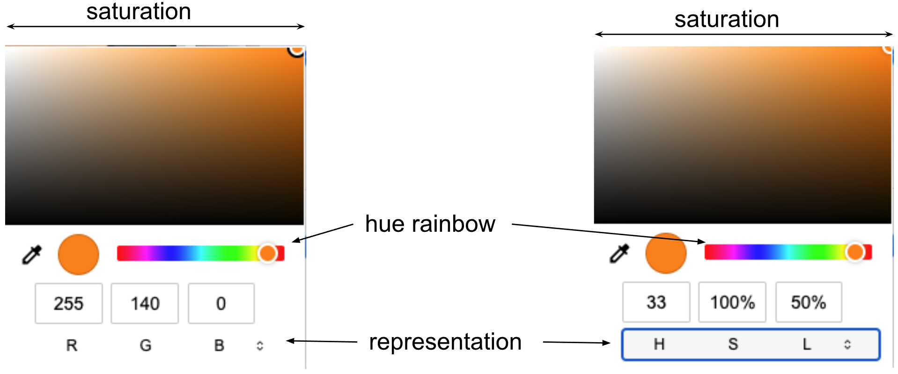
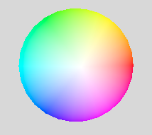

# Computer Graphics Basics

We want to start building real scenes as quickly as possible, so this
reading will cover a number of related topics. Some of this we've seen
before, but we'll discuss again, since it's relatively new to us.

- GUI controls for our scenes
- basic geometries: a few of the threejs built-in geometric objects
- basic material: directly specifying the color of an object
- material indexes: specifying the color of each *face* of an object
- the Instance Transform: placing your object in the scene
- Polygonal approximations
- Importing functions
- RGB color: how to choose one of 16 million colors
- Parametric equations: how to specify lines in 3D

That's a lot, but I think you can do it. Let's get started.

## Example Scene #1

Most of what we will discuss in this reading will help us to
understand the "figure" demo included in the "instanceTransform" exercises. Please download it, take a few minutes to play with
it, and look at the code. We will look more carefully at the code later
in this reading.

[figure](https://learn.sewanee.edu/d2l/le/content/43027/viewContent/399815/View)

Play with the GUI to adjust the sizes and colors.

## GUI

Having the GUI is super-helpful as we create our scenes. We can adjust
parameters to try a bunch of values before settling on the values we
like best. Then we can copy those "best" values to the parameters. At
that point, we can remove the GUI if we want, or keep it for others to
play with. Threejs used to use something called Dat.GUI (and you'll
still see that around, both in my examples and ones online). The
replacement is called Lil-GUI.

There is a [complete guide to
lil-GUI](https://lil-gui.georgealways.com/#Guide), but that's probably
more than we need right now. Here's part of the GUI code from the Figure demo:

```js
const params = {hatHeight: 4,
                headDim: 2,
                bodyHeight: 16,
                bodyWidth: 8,
                bodyColor: 0x228b22, // forestGreen
                ...
               };

...

const gui = new GUI();
gui.add(params, 'hatHeight', 1, 10).onChange(remakeFigure);
gui.add(params, 'headDim', 1, 10).onChange(remakeFigure);
gui.add(params, 'bodyHeight', 1, 20).onChange(remakeFigure);
gui.add(params, 'bodyWidth', 1, 10).onChange(remakeFigure);
gui.addColor(params, 'bodyColor')
    .onChange((val) => body.material.color.setHex(val));
```

This code assumes that the values to be modified are stored in a
dictionary (JS object). In the example above, that dictionary is the
variable `params`. To modify a value using the GUI, you give its *key*
to the `gui.add` method. For numeric values, you can optionally give a
*range*; above I've used 1-10 for most values. For example:

```js
gui.add(params, 'hatHeight', 1, 10)
```

Finally, given the new value, you'll want to update your scene. We can
tell the `gui` to call a function of our choosing by using the
`.onChange()` method. The argument to `.onChange()` is a *function*,
or the name of a function. For example:

```js
gui.add(params, 'hatHeight', 1, 10)
    .onChange(remakeFigure);
```

Here, we say to call the `remakeFigure` function whenever the
`hatHeight` value is changed. Note that there is no semicolon at the
end of the first line. We are *chaining* the methods together, so the code is, abstractly:

`gui.add(...).onChange(...)`

(Aside: in the reading on JavaScript, we mentioned that functions in
JS are *first-class*, which means that they can be passed as arguments
to other functions. Passing `remakeFigure` as an argument to the
`onChange` method is an example.)

Another way to pass a function as an argument is to give the function
*definition* as the argument. Here's an example:

```js
gui.addColor(params, 'bodyColor')
    .onChange((val) => body.material.color.setHex(val));
```

Here the argument is an [arrow
function](https://developer.mozilla.org/en-US/docs/Web/JavaScript/Reference/Functions/Arrow_functions)
definition:

```js
(val) => body.material.color.setHex(val)
```

That arrow function takes one argument, called `val` and does the code
on the other side of the arrow (`=>`). In this case, the code starts
with a global variable, `body` (which we will see created later, but
it contains a *mesh*), and then sets the color of the material of that
mesh using the `setHex()` method (a method of Threejs's `Color`
class).

We'll return to this later. For now, let's turn to the `remakeFigure` function.

## Re-Making the Figure

The `remakeFigure` function is pretty short but it does a few things
that need explaining:

```js
// Globals to store parts of the figure. Some of these are used in the GUI below.
// All are used when we re-make the figure, so we can remove the old figure

var body;
var head;
var hat;

function remakeFigure() {
    scene.remove(body);
    scene.remove(head);
    scene.remove(hat);

    makeFigureParams(scene, params);

    body = scene.getObjectByName("body");
    head = scene.getObjectByName("head");
    hat = scene.getObjectByName("hat");
}

// invoke this when the page loads, so that there's an initial figure
remakeFigure();
```

We start by declaring three globals. These will hold `Mesh` objects,
one for each part of the figure. The function will remove these
objects from the scene, and then call `makeFigureParams` to create a
new figure and add it to the scene. The function then sets the
globals, preparing for the next time we re-make the figure. It does
this by searching the scene for objects with the desired "name"
values. Our `makeFigureParams` function will have to set those names
so that this function can find the parts.

Note that we don't have to create globals or use names; there are
other ways to remove things. But this technique is easy and works
well.

Finally, we invoke the function at top-level in `main.js`, so that it
gets called when the page loads.

Now, it's time to get into making the figure.

## Making the Figure

For the sake of good modularity, I've defined the `makeFigureParams`
function in a separate file. It's easy to keep adding more and more
code to your `main.js` file, until it's hundreds or thousands of lines
long, and you can't find anything anymore. Better to define supporting
functions in other files and import them, keeping `main.js` relatively
clean and succinct. We'll talk about this later. Meanwhile, the code
for `makeFigureParams` is in the file `figure.js`.

It's about 80 lines of JS, but we can understand it one bite at a
time. Let's start with the first few lines:

```js
    const bodyGeom = new THREE.SphereGeometry(1);
    const bodyMat = new THREE.MeshBasicMaterial({color: params.bodyColor});
    const body = new THREE.Mesh( bodyGeom, bodyMat );
```

Threejs draws *mesh* objects, and a *mesh* is a combination of a
*geometry* (vertices, faces, etc) and a *material* (ways to define
color). Here, we've done it in three steps. It would be okay to do it
in one go:

```js
const body = new THREE.Mesh( new THREE.SphereGeometry(1),
                             new THREE.MeshBasicMaterial({color: params.bodyColor}));
```

Sometimes we'll do that, but very often we want to use a material or
even a geometry for several meshes, and so it's useful to have
variables that can be referred to elsewhere. Also, the right hand side
of the assignment gets long and cluttered.

A Threejs
[SphereGeometry](https://threejs.org/docs/#api/en/geometries/SphereGeometry)
takes up to 7 arguments, but we've just used the first, the
radius. Because the radius is 2, the coordinates where the sphere
intersects the X, Y and Z axes are all ±1.

Let's look at the next chunk:

```js
    // for brevity, define some constants
    const bh2 = params.bodyHeight/2;
    const bw2 = params.bodyWidth/2;
    /* 
       sphere of radius 1, so width of 2, from -1 to +1
       scale so that height is H and width is W
       that means center is at Y=H/2.
    */
    body.translateY(bh2);
    body.scale.set(bw2, bh2, bw2);
```

Look at the end of this code first. We'll be translating (moving) the
object up along the Y axis by `bh2` which is just the body height
divided by 2. Suppose the body height is 16, so `bh2` is 8. That means
the center of the body (sphere) will be at Y=8, equivalently, the 3D
point (0,8,0). The bottom of the sphere will be at Y=0 and the top of
the sphere at Y=16, giving us the desired height of 16 (and none of
the body below the Y=0 plane).

Then we scale the sphere *non-uniformly*: that means stretching it
more along some dimensions than other, so the result is no longer a
sphere. Here, we scale the sphere by `bw2` (body width divided by 2)
along the X and Z dimensions, and by `bh2` along the Y dimension.

Since we use these values a lot, the first few lines just pull them
out of the dictionary and assign constants for them.

We're almost done with the body. Just two lines:

```js
    body.name = "body";  // for help identifying it in the scene in the debugger
    parent.add(body);
```

As we saw in `remakeFigure`, we need to set a `name` value for the
parts. Finally, we `.add()` the body mesh to the scene (the value of
`parent`). The body is now done.

The head is similar, so let's read that in a larger chunk:

```js
    // build the head
    const hd = params.headDim;
    const headGeom = new THREE.BoxGeometry(hd,hd,hd);
    const headColor = new THREE.MeshBasicMaterial({color: params.headColor});
    const faceColor = new THREE.MeshBasicMaterial({color: params.faceColor});
    // index 4 is the "front" (+Z) according to GPT
    const headMat = [headColor,headColor,headColor,headColor,faceColor,headColor];
    const head = new THREE.Mesh(headGeom, headMat);
    // size is 2, so from -1 to +1. put it on top of the body
    head.translateY(params.bodyHeight + hd/2);
    head.name = "head";
    parent.add(head);
```

Here, we use a
[BoxGeometry](https://threejs.org/docs/#api/en/geometries/BoxGeometry)
which takes at least 3 parameters: the width (along the X axis),
height (along the Y axis) and depth (along the Z axis) of the box.

Next, we create *two* materials. There are 6 faces on a box, and we
can set them individually if we want. If you just want a black box
(black on all 6 sides), you can do that easily:

```js
const black = new THREE.MeshBasicMaterial({color: "black"});
const box = new THREE.Mesh( new THREE.BoxGeometry(), black );
```

But if, instead of creating a mesh with a box geometry and just one
material, we create a mesh with a box geometry and an *array* of **6**
materials, each face will use a different material.

Here, the Threejs documentation lets us down: it doesn't explain which
array element (index) corresponds to each face. We could read the
source code, but that's tedious and confusing. We could try an
experiment; that's easy and fun, but takes a little time. Or, we can
ask the [Threejs-trained ChatGPT](https://chatgpt.com/g/g-jGjqAMvED-three-js-mentor). I did that here, and it worked.

ChatGPT told me that the "front" (+Z) side of the cube has a
*materialIndex* of 4. That means its color is determined by the
material at index 4 in the array of materials. So, the code puts the
"face" color at index 4 and "black" at all the other indexes.

The rest of this code should be straightforward to understand. Take a
minute to be sure that's true; try to visualize or sketch where the
center of the cube will be using particular values, such as a body
height of 16 and a head size of 2. The center of the head should be at
17, right? The head is 2 units high, so its center is 1 unit above its
bottom side. So, the center should be at Y=17=16+1.

Finally, the hat. Again, it's similar, so let's read it in one chunk:

```js
    // build the hat
    const hh = params.hatHeight;
    const hatGeom = new THREE.ConeGeometry(hd, hh);
    const hatMat = new THREE.MeshBasicMaterial({color: params.hatColor});
    const hat = new THREE.Mesh(hatGeom, hatMat);
    hat.translateY(params.bodyHeight + hd + hh/2);
    hat.rotateZ(params.hatAngle);
    hat.name = "hat";
    parent.add(hat);
```

The first part is pretty much the same, except we are using a
[ConeGeometry](https://threejs.org/docs/?q=cone#api/en/geometries/ConeGeometry).
The cone takes two arguments: the radius of the circular face, and the
height of the cone.

The documentation lets us down here, too. How does the axis of the
cone correspond with the X, Y and Z axes? The documentation doesn't
say. Where is the origin? Again, the documentation doesn't say. It
turns out that the cone is constructed with the axis coinciding with
the Y axis, and the origin is at the middle of that line segment from
the tip of the cone to the bottom circle. In other words, if the cone
is of height H (let's say H=2), then the tip of the cone is a Y=1 and
the bottom circle is in the Y=-1 plane.

Note that I asked ChatGPT for this information and it got it
*wrong*. And this is very basic stuff. So, it's fine to ask ChatGPT,
but don't be surprised if it's wrong.

Here's the relevant code:

```js
    hat.translateY(params.bodyHeight + hd + hh/2);
    hat.rotateZ(params.hatAngle);
```

This moves the code up so that the center is half the cone height
(`hh/2`) above the body+head. Next, we'll do something a little
different here: we'll *rotate* the cone, like tipping a hat.

## Positioning/Translation

You can think of positioning an instance as drawing it in a coordinate system
where the *origin* has moved (been *translated*) relative to the scene origin.
Thus, none of the vertices needs to be changed, they are just *transformed*.
We'll look more at the mathematics of this in a future reading.


two blocks, the green one translated relative to the red one

## Rotation

With rotation, we have to consider what we mean. Also, the direction
of rotations is crucial. If you imagine that the Z axis is pointing
directly at your nose and you are looking at the XY plane, positive
rotations are *counterclockwise* and negative rotations are
*clockwise*. (This might remind you of high-school trigonometry, for
good reason. We'll get into the mathematics of this in an upcoming
reading.)

In the last paragraph, we said "rotations," but we really should have
said *rotations around the Z axis*. If you rotate an object around the
Z axis, the Z value of any coordinate is unchanged, while the X and Y
values change. For example, for the cone, if we rotate it around the
Z axis (which is what our figure
demo) does, the tip of
the cone, which starts at point (0,H,0) will continue to be in the Z=0
plane, meaning its Z coordinate will still be zero, even as its Y and
X values change. If you use the GUI to rotate it, you can see the tip
moving left and down with a positive rotation.

Note that the rotations are in *radians*. So, if you just want to rotate
something by a quarter turn around the x axis, you can use one of the
following:

- `obj.rotation.x = Math.PI/2`
- `obj.rotation.x = THREE.MathUtils.degToRad(90)`
- `obj.rotation.x = TW.degrees2radians(90)`


two blocks, the green one translated and rotated relative to the red one.

We can also rotate objects around the X or Y axes. We'll talk more
about that later.

## Scaling

Finally, we can scale the geometry system. Typically, this is just a positive
multiple, but by multiplying by a negative value, you can flip something
around (reflecting it across an axis).

Here, we translate, rotate, and then double the size of the green block:


two blocks, the green one translated, rotated and scaled.

## The Instance Transform

Let's return to our figure
demo. The code for each mesh (body, head, hat) followed a pattern:

- create the geometry
- create the material
- create the mesh
- place the mesh in the scene, using
  - translate
  - rotate
  - scale

These steps of placing the object using translate, rotate, and scale is
called the *instance transform*. In a later reading, quite soon, we'll
look more deeply into the mathematics of these transformations. For
now, just notice that pattern.

## Polygonal Approximations

The
[SphereGeometry](https://threejs.org/docs/#api/en/geometries/SphereGeometry)
has more than just the one argument to specify the radius. The next
two arguments are

- widthSegments -- number of horizontal segments. Minimum value is 3, and the default is 32.
- heightSegments -- number of vertical segments. Minimum value is 2, and the default is 16.

Let's see what these mean.

[sphere demo](https://rtsowell.sewanee.edu/courses/cs360/threejs/demos/sphere/main.html)

The ball starts with the default values and it looks fine. But try
sliding those sliders to the left nearer to the minimum values, and
you'll see that the ball starts looking less and less ball-like. If
both parameters are at their minimum values, the "ball" just has 6
faces, three above the "equator" and three below.

In short, smooth objects like spheres and cones are modeled with
*polygonal approximations*: that is, a multi-faceted polyhedron is
used to approximate the smooth 3D geometry. As long as there are
enough facets, it usually looks fine. If you are zoomed a lot, you
might see some non-smooth silhouettes.

The defaults are good for most purposes, but if the balls are small or
far away, you could save computation by using a coarser
approximation. If the balls are big or close, you may need to use
values higher than the defaults.

## Importing Functions

JavaScript's modern module system is similar in some ways to Python's
or Java's: your code "imports" code from another file and then has
access to those extra abilities. Let's see how that's done for our
figure.

The top of the file has some `import` statements:

```js
// import three js and all the addons that are used in this script 
import * as THREE from 'three';
import { TW } from 'tw';
import GUI from 'https://cdn.jsdelivr.net/npm/lil-gui@0.20/+esm';
import { makeFigureParams } from './figure.js';
```

The first few lines are standard; we'll use them in every
program. (Well, you might decide to omit the GUI if you want to.)

The last line is this:

```js
import { makeFigureParams } from './figure.js';
```

That says that we want to import the `makeFigureParams` name from the
file `figure.js` that is in the current folder (that's what the
dot-slash `./` means).

The `figure.js` file also has to *export* the name. The last line of
our `figure.js` file is the following:

```js
export { makeFigureParams };
```

Later in the course, we'll talk about ways to export lots of names and
gather them up in a dictionary, but for most purposes, exporting them
*a la carte* like this is simple and easy.

## RGB Color

Let's return to the GUI. When we first looked at it, we
omitted the colors. Let's look at those now:

```js
const params = {...
                bodyColor: 0x228b22, // forestGreen
                headColor: 0x000000, // black
                faceColor: 0xd2b28c, // tan
                hatColor: 0x008080, // teal
               };

gui.addColor(params, 'bodyColor').onChange((val) => body.material.color.setHex(val));
gui.addColor(params, 'headColor').onChange(remakeFigure);
gui.addColor(params, 'faceColor').onChange(remakeFigure);
gui.addColor(params, 'hatColor').onChange((val) => hat.material.color.setHex(val));
```

First, Threejs allows you to use named colors when creating
materials. For example, you can do:

```js
const faceColor = new THREE.Color("tan");
```

So, if you want to stick to named colors, you can. There are lists of
valid names out there on the internet, but not every color name is
going to work. Threejs only supports [140 color names](https://www.w3schools.com/tags/ref_colornames.asp).

```js
const boxColor = new THREE.Color("tiffanyblue"); // this does NOT work
```

But the GUI requires you to use hex values, and the color picker it
supplies allows you to specify colors using RGB (red, green and blue)
values. Furthermore, the underlying Threejs and WebGL system uses RGB
color. So, let's detour into RGB color.

## Color Models

Several color models are common in CG, for example:

- RGB: Red, Green, Blue. *This is what OpenGL and Threejs uses*; other
  color models are translated into it.
- CMYK: Cyan, Magenta, Yellow, Black. This is a subtractive color
  system that is used for color printing, such as inkjets. We won't
  talk more about this in CS 360.
- HSV: Hue, Saturation, Value. This model is closer to the way humans
  think about color. For example, "hue" is like the color wheel that
  we're familiar with from elementary school art. The color wheel is a
  2D cross-section of a cone.
- HSL: Hue, Saturation, Lightness. This model is very similar to HSV,
  except that instead of a single-hexcone, colors are represented in a
  double-hexcone. Three.js has support for HSL, so we can use it if we
  want.

Let's start with RGB, since that's what underlies online (non-print)
color graphics.

## Color Vision

Our retinas have rod-shaped cells that are sensitive to all light, and
cone-shaped cells that come in three kinds: red-sensitive,
green-sensitive, and blue-sensitive. Analogously, there are three
(additive) primary colors: Red, Green, and Blue, or RGB. All visible
colors are seen by exciting these three types of cone cells in various
degrees. (Take a look at the Wikipedia page on
[Trichromacy](http://en.wikipedia.org/wiki/Trichromacy) for a good
introduction.) The consequence is that almost any color can be
mimicked by combining some amount of Red, some amount of Green, and
some amount of Blue. Color monitors and TV sets use RGB to display all
their colors, including yellow, chartreuse, you name it. If we imagine
that the amount of a primary color (Red, Green, or Blue) is measured
by a number from 0 to 255 inclusive, we can represent a color by a
triple of numbers, such as (255,0,0), which is pure Red, and so
forth. Here are some more interesting examples:

- Cornflower = 100, 149, 237
- DarkOliveGreen = 85, 107, 47
- DodgerBlue = 30, 144, 255

You can find more examples of these in any of the zillions of color
reference pages on the web.

## Demo: RGB Color Cube

The RGB color system is three-dimensional. That is, you can think of it as
a cube with three perpendicular axes: Red, Green, and Blue. Because of the
way our eyes work, that is sufficient to capture nearly every color.

[An example of a color cube, built in Three.js](https://rtsowell.sewanee.edu/courses/cs360/threejs/demos/colorcube/main.html)

You can rotate it by dragging with the mouse, and view the coordinate
axes by typing 'a'. A screenshot from an earlier version:


a screenshot of the color cube seen from white vertex

In the picture above, the red vertex is color (1,0,0): 1 on the red
axis and zeros elsewhere. The green vertex is color (0,1,0) and the blue
vertex is color (0,0,1). These are the *primary* colors. Often,
we **normalize** the RGB coordinates to [0-1] instead of [0-255]. You can think of it as
a fraction of the maximum intensity. In the color cubes above,
the red axis is the same as the x axis, the green axis is the same as the y axis,
and the blue axis is the same as the z axis.

The magenta vertex at the bottom is color (1,0,1). The cyan vertex is
(0,1,1). The yellow vertex is (1,1,0). These are the *secondary*
colors.

The white vertex in the center is color (1,1,1). The black vertex that
we can see if we drag the color cube around to view the origin of the
coordinate axes, is color (0,0,0). Others of the millions of colors
correspond to points in the interior of the cube. For example,
Cornflower might be represented as:

```js
R = 100/255 = 0.39
G = 149/255 = 0.58 
B = 237/255 = 0.93
```

For more information, consult the [Wikipedia article on
RGB](http://en.wikipedia.org/wiki/RGB_color_model).

Historically, specifying a color in hexadecimal (base 16) is the
oldest representation of RGB color on the web and so is most widely
represented. To do that, just convert the decimal values from 0-255
into hex:

```
R = 100/255 = "64"
G = 149/255 = "95"
B = 237/255 = "ed"
```

So the hex string for cornflower is "#6495ed";

(See Wikipedia for more information about [hexidecimal numbers](https://en.wikipedia.org/wiki/Hexadecimal).)

## Specifying Colors in Threejs

The best source of information on specifying colors in Threejs is
their [Color](https://threejs.org/docs/#api/en/math/Color) class.

Here's an excerpt from that page, showing many ways to specify color:

```js
//empty constructor - will default white
const color1 = new THREE.Color();

//Hexadecimal color (recommended)
const color2 = new THREE.Color( 0xff0000 );

//RGB string
const color3 = new THREE.Color("rgb(255, 0, 0)");
const color4 = new THREE.Color("rgb(100%, 0%, 0%)");

//X11 color name - all 140 color names are supported.
//Note the lack of CamelCase in the name
const color5 = new THREE.Color( 'skyblue' );

//HSL string
const color6 = new THREE.Color("hsl(0, 100%, 50%)");

//Separate RGB values between 0 and 1
const color7 = new THREE.Color( 1, 0, 0 );
```

## HSL Color Space

All modern web browsers have built-in color pickers. Although I don't know what browser you are using, I'm guessing that
your color-picker does not use separate sliders for RGB
values. Instead, it probably gives you a way to choose *hue* and then
gives you a 2D space to choose *saturation* and *lightness*.

Here are two screenshots of a color picker like the one above, looking
at "orange":




Two screenshots of the color picker, one using an RGB representation and the other using a HSL representation.

You should think of the "hue rainbow" as like a color wheel, stretched
out into a line. Indeed, hue is measured as an *angle* with red at 0
degrees, green at 120 degrees, blue at 240 degrees, and wrapping back
to red at 360 degrees. Like this:





colorwheel with red at the right edge at an angle of zero degrees

You'll notice that our orange hue corresponds to an angle of 33 degrees.

Once you've chosen a hue, the 2D area lets you choose a *saturation*
and *lightness*. The saturation is essentially how far you are from
the center of that color wheel. (Notice in the picture above that the
colors near the center of the wheel are pastel and the center is
actually a shade of gray.) Since our orange has a saturation of 100%,
it's found on the rim of the color wheel.

The remaining dimension of *lightness* is how bright the color is: how
far from black. The vertical dimension of the 2D area is *lightness*
and you'll notice that the entire bottom edge is black. If lightness
is 0, the color is always black, regardless of hue or saturation.

Browsers use HSL color pickers because people find them more
intuitive. There are mathematical ways to convert HSL to the
underlying RGB representation. The bottom part of the picker allows
you to choose the representation.

If you'd like to learn more, the Wikipedia page on [HSL and
HSV](https://en.wikipedia.org/wiki/HSL_and_HSV) is a good starting
place.

## Naming Colors

One thing to consider is coding technique and how to name your
variables. It seems intuitive to use a variable like `cornflower`
above to hold an instance of `THREE.Color()` with the values for
cornflower, and then use that variable whenever you want something
that color, such as the sky or a barn. But suppose that later, you
want to make the sky a bit darker or the barn green. You could find
all the places in your program where you use the `cornflower` variable
and replace it with a variable name for a different color, *or* you
could adjust the values in the variable. But then `cornflower`doesn't
mean cornflower any more, which is very weird.

An alternative is to name the variable by what its *purpose* or *use*
is. Such as:

```js
var skyColor = new THREE.Color( 0.39, 0.58, 0.93 ); // use cornflower for the sky
```

Later, if you decide to change the color of the sky, you can change
the definition of `skyColor` and everything adjusts correctly. This
is a powerful idea. We saw that in the "figure" demo: I named things
like `hatColor`, so the code makes sense even as we adjust the
particular color of the hat.

You can even combine these approaches, by defining some of the colors
you will use and then assigning them to various uses:

```js
var cornflower = new THREE.Color( 0.39, 0.58, 0.93 );
var skyColor = cornflower;  // use cornflower for the sky
...
```

## Parametric Equation for a Line

In the color cube demo, we saw many colors being interpolated between
the colors specified by the vertices. (We didn't look at that code,
but trust me that I only specified the colors of the 8 vertices of the
cube.)

Intuitively, we can see that Threejs (actually, WebGL) also has to
interpolate to find the *positions* of points between the 8 vertices
of the cube.

To learn how OpenGL/WebGL does this linear interpolation, we first
need to understand how OpenGL represents lines. It uses **parametric
equations**. Parametric equations are an important building block for
much of the math involved in Computer Graphics, so this will be a
lengthy discussion. The arithmetic involved will all be easy; the
point is understanding the concepts. Hang in there and be
patient. I think it will be worth it.

Suppose we want to define a line from point A to point B. (Points A
and B could be in 2D or 3D; everything works the same.) The *vector*
from A to B we will call **v**. All the following are equivalent:

> P(t) = A + vt  
> P(t) = A + (B-A)t  
> P(t) = A(1-t) + B\*t

All of these equations generate a point on the line given the value of
t. The parameter t can be any real number. Any value of t generates a
point on the line. Thus, the 3D line is like the number line, with t=0
at A and t=1 at B.

The first equation form above defines the line using point **A** and
a *vector*, **v**. Thinking visually, A is a dot and v is an arrow:
point A is the starting point and vector v is the direction. For
example, A might be "the center of Manigault Park," and v might be
"north" or "south by south west." If you start at A and go in
direction v, your path will be a line. If we imagine that you start at
A at time 0 and you move with constant velocity, any point on the line
is defined just by the time. For example, P(4.5) would be your
location 4.5 hours after you started.

The second equation uses two points, A and B, and substitutes B-A for
the vector v. This is because one way to define a vector is to
subtract two points. For example, if point B is "Nashville International Airport," we
can define a line from point A to point B and we only implicitly know
the compass heading, but we know that we're heading directly to the
airport (as the crow flies). Interestingly, because of the way the
vector is defined, we know we'll reach the airport exactly when
t=1. As with the first form of the equation, any value for t
generates exactly one point on the line.

The third form of the equation is just a bit of algebraic
rearrangement of the second form. It emphasizes the idea that any
point on the line segment from A to B can be defined as a mixture of A
and B in some proportion. The midpoint is a 50/50 mixture (a parameter
value of 0.5), but a 25/75 mixture is a point three fourths of the
way towards B. (The greater the proportion of B, the closer we are to
B.)

We can define lines that go through the same points but have
different equations. For example, a line from B to A. In that case, the
equation looks like:

> Q(s) = B + (A-B)s

With this line, s=0 is at B and s=1 is at A, so the line starts at B
and goes through A. It generates the same points as P(t), but the
interpretation of the parameter is different. In this case, the parameter
goes in the opposite direction. (Someone driving on route 95 from Boston to New
York City drives the same road as someone driving on route 95 from New York City
to Boston, so it's the same line, but a different journey.)

## Parametric Line Metaphor: Bug Paths


figure 1: a line in a 2D coordinate system

The math above works fine, but might be a little dry. Let's explore
some metaphors for parametric equations. To start with, consider the
picture in Figure 1. The coordinates of the points are:

> A = (2,2)  
> B = (4,3)  
> C = (8,5)

Suppose we have an ant crawling along the line. The ant starts at
point A at time 0 and proceeds in a determined, steady, ant-like way
to the upper right, arriving at B at time 1. Let's measure time in
minutes and position in meters. We can say that

- The ant is moving along the vector V=B-A=(2,1). This means it's
  moving to the right twice as fast as it's moving up: the slope of
  the line is 1/2.
- The parametric equation of the line is P(t)=A+V\*t.
- The ant's height as a function of time is y(t)=2+t, because it
  starts at A at time 0, and A's height is 2, and the ant's height
  increases at 1 meter per minute.
- The ant's horizontal position as a function of time is x(t)=2+2t,
  because it starts at A at time 0 and A's x coordinate is 2, and the
  ant's x coordinate increases at 2 meters per minute.
- The points A and B differ by 2 along the x direction and by 1
  along the y direction. Their total distance is
  sqrt(2\*2+1\*1) or sqrt(5).
- The ant's velocity along the line is sqrt(5) meters per minute.
  Sqrt(5) is the distance between A and B, and also the length of the
  velocity vector, since the way that we defined the parametric equation
  means that, by definition, the ant takes 1 time unit to get from A to
  B. That's because P(0)=A and P(1)=B.

Suppose we have a different bug, maybe a beetle, that starts at B at
time zero and gets to C at time 1. We can make corresponding
observations:

- The beetle is moving along the vector W=C-B=(4,2). This means
  that, like the ant, it's moving to the right twice as fast as it's
  moving up. The velocity vector of the beetle, W, is exactly twice
  that of the ant, V, so the beetle is moving twice as fast as the
  ant.
- The parametric equation of the line is Q(t)=B+W\*t.
- The beetle's height as a function of time is y(t)=3+2t, because it
  starts at B at time 0, and B's height is 3, and the beetle's height
  increases at 2 meters per minute.
- The beetle's horizontal position as a function of time is
  x(t)=4+4t, because it starts at B at time 0 and B's x coordinate is 4,
  and the beetle's x coordinate increases at 4 meters per minute.
- The points B and C differ by 4 along the x direction and by 2
  along the y direction. Their total distance is
  sqrt(4\*4+2\*2) or sqrt(20). Note that
  sqrt(20)=2\*sqrt(5), which isn't too surprising, since C is twice as
  far from B as A is.
- The beetle's velocity along the line is sqrt(20) meters per
  minute. Sqrt(20) is the length of the velocity vector and the
  distance between B and C. Once again Q(0)=B and Q(1)=C.

But wait, you say. These stories of ants and beetles are all very good,
but *it's the same darn line*. Are there two different equations
for this one line? Yes. One feature of parametric equations is that there are infinitely
many equations for a particular line. We can choose one that is
convenient for the problem we want to solve and the points we are given.

Also, we can ask questions like:

> Suppose a centipede starts at C at time 0 and gets to A
> at time 1. At what time does it meet (and eat) the ant? Where does this
> gruesome event occur?

Before we answer that question, let's look at another situation, this
with two lines:


figure 2: two lines in a 2D coordinate system

We now have two lines, the cyan one and the magenta one. We can see
that they intersect, but where? Do the bugs meet? Convince yourself of
the following:

- The cyan line has an equation like:
  > P(t) = A + (B-A)t  
  > P(t) = (2,2)+(2,1)t
- The magenta line has an equation like:
  > Q(s) = D + (E-D)s  
  > Q(s) = (9,1)+(-2,2)s
- The lines meet at (6,4). You can decide that just by looking at
  the graph. Later, we'll learn how to solve problems like this.
- The parameter on the cyan line is t=2 and, substituting t=2 into
  the earlier equation for P(t), we see:
  > P(2) = A + (B-A)2  
  > P(2) = (2,2)+(2,1)2  
  > P(2) = (6,4)
- Similarly, the parameter on the magenta line is s=1.5 and, substituting s=1.5 into
  the earlier equation for Q(s), we see:
  > Q(1.5) = D + (E-D)(1.5)  
  > Q(1.5) = (9,1)+(-2,2)(1.5)  
  > Q(1.5) = (6,4)
- Because P(2)=Q(1.5), that means the lines do intersect at that
  point (the value of both the left and right hand sides of the
  equation).
- The parameters are not equal, which means that the bugs arrive at
  the intersection point at different times, so they don't collide.

In a way, I find the parameter somewhat reassuring, because a line is,
intuitively, a one-dimensional thing, so a single, one-dimensional
number should be sufficient for specifying a location on the line.
That's exactly what the parameter does: it specifies where on the line
a point is.

## Parametric Line Metaphor: Mixtures

Forget about bugs crawling through a 2D Cartesian grid, or even flying
through a 3D Cartesian space. Let's think about parametric lines in a
different way, namely as a *weighted average* or as
a *mixture*.

To start, I'm going to repeat figure 1, now as figure 3:


figure 3: a line in a 2D coordinate system

Let's think about a line from A to C:

```
P(t) = A + (C-A)t
P(t) = A + Ct - At
P(t) = A(1-t) + Ct
```

Intuitively, the point B is 1/3rd of the way from A to C, so we can
make the following observations:

- B = (4,3)
- The parametric equation evaluated at 1/3 gives us B:
    > P(1/3) = A(2/3) + C(1/3)  
    > P(1/3) = (2,2)(2/3) + (8,5)(1/3)  
    > P(1/3) = (4/3,4/3) + (8/3,5/3)  
    > P(1/3) = (12/3,9/3)  
    > P(1/3) = (4,3)
- We can view the following equation as a weighted sum: there's a
    weight on A and a weight on C, and we multiply the points by the weights
    and then add:
    > P(1/3) = A(2/3) + C(1/3)
- The weight on A is twice the weight on C, and the point B is twice
    as close to A as it is to C. That's why we used 2/3 as the weight
    instead of 1/3.

Thus, points on the line segment from A to C can be viewed as weighted
averages of the two endpoints. For example, if a course's grade
depends only on a midterm and a final, and the final counts twice as
much as the midterm, you'd compute the course grade as:

> grade = midterm \* (1/3) + final \* (2/3)

That's exactly the kind of equation we have for this line!

We can also think of the points on the line segment as different
*mixtures* of the endpoints. For example, when cooking rice, we need
to get the right balance of rice and water. If the point A represents
100% water and the point C represents 100% rice, the parameter of any
point on the line segments represents a ratio of rice to water.

The point B has a parameter of 1/3, so that means it's a mixture of
2/3 of A (the water) and 1/3 of C (the rice). Remember the parameter
and the weights are inversely related: the parameter tells how far we
are from the starting point, and the weight is proportional to how
near we are to an endpoint.

- Rice made in a 2:1 proportion of water to rice (point B) will be good.
- Rice that has too much water (the segment from A to B) will be runny and yucky.
- Rice that has too little water (the segment from B to C) will be crunchy and unpalatable.

Note that the "mixture" metaphor doesn't work so well for points on
the line but outside the line segment (110% rice and -10% water?),
but it works very well for points on the interior of the line segment,
and computer graphics is usually more concerned with line segments
than infinite lines. So this is a useful metaphor.

In particular, if points A and C are different colors and the line
segment is being drawn with interpolated color, the points on the line
segment can be colored using the mixture idea. If A is red (1,0,0) and
C is green (0,1,0), the point B will be:

```
B = A(2/3) + C(1/3)
B = (1,0,0)(2/3) + (0,1,0)(1/3)
B = (2/3,1/3,0)
```

## 3D Parametric Line Example

Let's do one concrete example of a line in 3D space. Suppose we want a line from A through B, with:

```
A = (1,2,3)
B = (2,5,1)
```

We can write down the following equations:

```
P(t) = A+(B-A)t
P(t) = (1,2,3)+(1,3,-2)t
P(t) = (1+t, 2+3t, 3-2t)
```

The last equation gives another way to think about parametric equations:
by introducing a parameter (in this case, "t"), we write an equation that
generates each coordinate independently. The equations in this example
are:

```
x(t) = 1+t
y(t) = 2+3t
z(t) = 3-2t
```

This makes it easy to see why parametric equations work so well in 3D:
each spatial coordinate (x, y, and z) is generated by a simple linear
function of just a single parameter, namely t. None of this y=mx+b stuff
that doesn't work in 3D.

## Features of Parametric Equations of Lines

I think parametric equations are really cool. Why do I think so?

- No special cases! Unlike "y=mx+b," which we all learned in high
  school, parametric equations work just fine for all lines. (Where does
  "y=mx+b" fail?)
- They work in 3D! Each coordinate gets its own equation!
- Lines and segments have **direction**, because vectors do. This is
  useful for rays of light, for example.
- Special values of t: 0, 1, between 0 and 1. For example, if you know
  that the parameter of a point on line from A to B is t=0.3, you know that
  the point is *between* A and B, and is closer to A.
- It's easy to generate a point on the line: any value of the parameter will work
- We can think of this as a mixture (that is, as a *convex sum* or a
  *weighted average*) of the endpoints. So, if one vertex is red and the
  other is yellow, all the points on the line segment connecting them
  are mixtures of red and yellow in different proportions.

## Example: Finding a Point on a Parametric Line

Problem: Find the coordinates of a point 2/3 of the way from A=(2,3,4)
to B=(5,9,1)

Solution: Since the point is 2/3 of the way from A to B, our parameter
is 2/3 and our starting point is A. Our vector v is (B-A).

> v = B-A = (5-2, 9-3, 1-4) = (3,6,-3)

Now, we can substitute into our equation and solve

| P(2/3) | = A+v(2/3) |
| --- | --- |
|  | = (2,3,4) + (3,6,-3)(2/3) |
|  | = (2,3,4) + (2,4,-2) |
|  | = (4,7,2) |

So, the point 2/3 of the way from A to B has coordinates (4,7,2). Done!

Note that we could have solved this problem slightly differently,
using the mixture equation. We compute a mixture of two parts B to one
part A:

| P(2/3) | = A(1/3)+B(2/3) |
| --- | --- |
|  | = (2,3,4)(1/3) + (5,9,1)(2/3) |
|  | = (2/3,1,4/3) + (10/3,6,2/3) |
|  | = (4,7,2) |

This may seem weird at first, because we're using a weight of 1/3 on A
and a weight of 2/3 on B, but the point is closer to B, so the weight on B
has to be greater. Problem: Suppose that vertex A is red (1,0,0) and vertex B is magenta
(1,1,0). What is the color of the point that is 2/3 of the way from A to
B? Solution: We can use the same mixture equation that we just used to
find coordinates:

```
P(2/3) = A(1/3) + B(2/3)
P(2/3) = (1,0,0)(1/3) + (1,1,0)(2/3)
P(2/3) = (1,2/3,0)
```

**Note** if a problem calls for more than one line, each
line gets its own parameter, such as r, s, or u. This makes sense because
the parameters have meaning: t=0 means the initial point of the line, so
s=0 would be the initial point of the other line.

## Summary

We've covered a lot of ground in this reading.

- GUI controls:
  - create a dictionary (or several) to store the adjustable values
  - create a GUI object
  - `gui.add(dic, key).onChange(func)`
- Making a mesh:
  - create a geometry
  - create a material
  - combine them into a mesh
- Placing a mesh using the *instance transform*:
  - *Translate* to the desired place in the scene
  - *Rotate* as desired around various axes
  - *Scale* to the desired dimensions
- Polygonal Approximations are used for smooth or curved geometries
  - the defaults are usuall good, but
  - increase the approximation if you notice non-smooth angles
  - decrease the approximation if you are concerned about performance
- Modularity:
  - divide your program into conceptual chunks
  - keep the `main.js` relatively uncluttered
  - put major building blocks in module files
  - use `import` and `export` statements
- RGB color:
  - fundamental to all computer imagery
  - three additive color primaries: Red, Green and Blue
  - three secondaries
    - Yellow = Red + Green
    - Cyan = Green + Blue
    - Magenta = Red + Blue
  - white = Red + Green + Blue
  - can be specified on 0-1 scale, 0-255 scale, or in hex from #00-FF
- Naming colors:
  - It's a good idea to name the colors you want to use in adjustable parameters
  - Good idea to name them by *purpose* or *usage* rather than by the *color*
- Parametric equations for a line:
  - t is a new parameter, with P(0)=A and P(1)=B
  - P(t) = A + (B-A)t
  - Also weighted mixtures: P(t) = A(1-t) + Bt
  - shorthand for scalar equations like x(t) = Ax + (Bx-Ax)t
  - Many advantages over y=mx+b