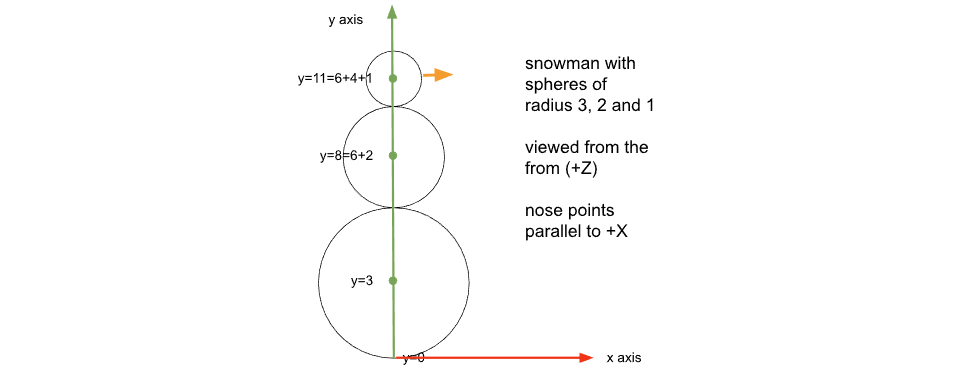
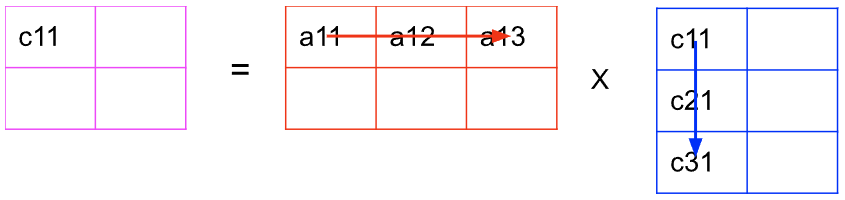

# Chained Transformations

Last time, we learned about the *instance transform*. Basically, we
create a mesh and then place it in the scene using operations like

- translate
- rotate
- scale

We typically do the operations in that order, though not always.

In this reading, we will kick that up a notch by looking at

- grouping multiple meshes into a single thing
- transforming the group as a single thing
- creating layers of grouping
- doing *sequences* (chains) of transformations
- the mathematics of these so-called *affine transformations*

## Composite Objects

When building a complex object (like a bicycle or a teddy bear) or a complex
scene, we rarely want to build it out of low-level vertices and faces.
Instead, we'd like to build it out of high-level components, maybe cubes,
spheres and cylinders, or even higher-level things, like wheels, trees, arms
and legs, and so on. In this reading, we'll learn about building complex
objects out of components.

Let's take a snowperson as our basic example. A snowperson is a composite
object comprised of three or four components: three white spheres and an
optional orange cone for the nose. (No, we're not doing anything as
complicated as Olaf.)

Our basic strategy will be to:

- Create a "container" object that will be the representation of our
  snowperson. The spheres and such that make up the snowperson are put
  in this container.
- The container will be an instance of `THREE.Group`, which is the
  parent class of `THREE.Mesh`. See
  [`THREE.Group`](https://threejs.org/docs/index.html#api/en/objects/Group),
  This class has (well, inherits) the attributes and methods we need
  for the instance transform (so we can place our snowperson in the
  scene), but doesn't need vertices and faces, like a `THREE.Geometry`
  object.
- The container has methods to add components, using the same `.add()`
  method we know from adding things to the scene. It also has
  properties that include the list of components (`.children`) and
  methods to find a particular component.
- We can use the instance transform to place our components into the
  container. That is, we decide where the origin and axes will be for
  our container (snowperson) and arrange the components within that
  structure.

Technically, a *coordinate system* is the directions that the x, y, and z axes
point, and a *frame* is a coordinate system plus a location for the origin.
Thus, a snowperson can have its own *frame* and we position the components in
that frame.

You should usually choose frames for your composite objects that make it easy
to position them within your scene (or a larger composite object that they are
components of). For the snowperson, we'll make the frame be:

- origin at the bottom of the bottom sphere
- y-axis going through the axes of all three spheres

That will be convenient because we can easily place a snowguy onto a
surface (the ground) by positioning its origin, which is a simple
*translate* operation.

## Demo: A Snowperson

Consider the following demo:

[compositeObjects/snowperson](https://learn.sewanee.edu/d2l/le/content/43027/viewContent/400072/View)

Here is the code in `main.js` that makes the two snowfolk:

```js
function remakeScene() {
    scene.remove(olaf);
    scene.remove(frosty);

    olaf = SP.makeSnowPerson(params);
    olaf.rotateY(-Math.PI/4);  // 45 degrees towards us
    frosty = SP.makeSnowPerson({botSize: 4});
    frosty.translateXposition.set(10,0,0);

    scene.add(olaf);
    scene.add(frosty);
}
```

The helper function, `makeSnowPerson` returns an object consisting of
3 spheres and a cone, and the main code can just place it in the
scene, using instance transformations on the entire composite
(multi-part) snowperson. Notice that the `olaf.rotate` rotates the
whole snowman, including the nose (which is the only way you can tell,
since rotating a sphere doesn't make a visible difference). Similarly,
`frosty.translateX` moves the whole group, all three spheres and the
cone.

Our goal is to understand that helper function and how everything
works. But first, let's start even simpler, with a bell.

## Demo: Rotating a Cone like ringing a Bell

Most Threejs geometries have the origin at the center. A sphere has
the origin at the center (making it convenient to calculate vertices
with simple sine and cosine functions). A cube of size 2x2x2 has
coordinates that go from -1 to +1 on each axis, and the origin is in
the center of the cube. Cones and cylinders are similar.

Suppose we want a cone of height H. A cone geometry from Threejs is
built so that the tip of the cone is on the positive Y axis at
(0,H/2,0). The other end of the cone is a circle in the plane
Y=-H/2. The origin is at the center of the cone. It might look
something like this:


A threejs cone as a black triangle against the XY axes,
where the red arrow shows the positive X axis and the green arrow
shows the positive Y axis. The center of the cone (triangle) is at the
origin.

If we *rotate* this cone, it always rotates around the *origin*. So,
if we were to rotate this cone 90 degrees counterclockwise around the
Z axis, the result might look like this:


A threejs cone as a black triangle against the XY axes
after rotating by 90 degrees counterclockwise. Now the peak of the
cone is on the negative X axis. The center of the cone (triangle)
remains at the origin.

This might be what you want, but often it is not. Often, we want to
rotate around a different point. Rotations, for mathematical reasons
that we'll see soon, are always performed around the origin. That's
fine for certain kinds of rotations, but not so great for
others. However, we can use composite objects to rotate around
whatever location we want.

Suppose, for example, we want to rotate the cone around its tip, as we
would if we wanted it to swing like a bell. We could do that thus:

- create a `Group` object
- create a `Cone` object
- move the cone *down* by half its height, so that the tip of the cone is at the origin
- add the cone to the *group*

Now, if we rotate the *group* around its origin, which corresponds to
the tip of the cone, we get the effect we want. Check out this demo:

[compositeObjects/bell](https://learn.sewanee.edu/d2l/le/content/43027/viewContent/400072/View)

- the `frameAngle` is the rotation around the *point* of the cone
- the `coneAngle` is the rotation around the *center* of the cone

As you can see, to make the cone seem like a bell, the angle we *want*
is the `frameAngle`, not the `bellAngle`.

Now, let's take a look at the code, after removing the black wireframe
box to mark the origin of the frame:

```js
function makeBell(params) {
    const bellFrame = new THREE.Group();

    // Now, the bell itself. Very sparse, so we can see inside
    const coneGeom = new THREE.ConeGeometry(params.bellWidth,
                                            params.bellHeight,
                                            6, // hexagonal end
                                            true, // open-ended
                                           );
    const coneMat = new THREE.MeshBasicMaterial({color: "brown",
                                                 wireframe: params.wireBell});
    const coneMesh = new THREE.Mesh(coneGeom, coneMat);
    // move it *down* by half its height
    coneMesh.translateY(-1*params.bellHeight/2);
    // this rotates around the bell's center. Delete it:
    coneMesh.rotateZ(params.coneAngle);

    bellFrame.add(coneMesh);

    return bellFrame;
}
```

That's it! We create a `Group`, add things to the group, positioning
them relative to the origin of the group (here, we move the cone down
so that its tip is at the origin of the group), and return the group.

Now, let's look at the caller:

```js
function updateScene() {
    scene.remove(bell);
    bell = makeBell(params);
    // this rotates around the origin of the frame,
    // which corresponds to the peak of the cone
    bell.rotateZ(params.frameAngle);
    scene.add(bell);
}
updateScene();
```

This code uses `makeBell` to return a group, and then uses `rotateZ`
to rotate the entire group around the origin of the group. That swings
our bell as we wanted to.

Another way to phrase this idea: The code just creates a cone, which is the
*inner* object, and the *outer* object is just a `THREE.Group`. The
inner one is placed inside the outer, but with an *offset*. If we
rotate the inner one, the cone rotates around its center, as we
expected. If we rotate the outer one, the offset cone rotates around
the origin of the container.

If you offset the cone downward by half its height and set the inner rotation
to zero, the point of the cone is at the origin of the outer frame, and we can
rotate the cone around its apex. Very cool!

## The SnowPerson Code

We're now ready to take on the slightly more complex example of making
snow people. Let's start by repeating our code from main:

```js
function remakeScene() {
    scene.remove(olaf);
    scene.remove(frosty);

    olaf = SP.makeSnowPerson(params);
    olaf.rotateY(-Math.PI/4);  // 45 degrees towards us
    frosty = SP.makeSnowPerson({botSize: 4});
    frosty.translateXposition.set(10,0,0);

    scene.add(olaf);
    scene.add(frosty);
}
```

The first thing we need to explain is the handling of parameters. That
topic is not really about computer graphics, but is a useful
programming technique in this course.

## Dictionaries of Parameters

Notice the call that makes `frosty`. It has just a small dictionary
that sets just one parameter, the size of the bottom. All the other
parameter values use defaults. Those defaults are specified in the
other module, which we imported like this:

```js
import * as SP from './snowperson.js';
```

This trick gathers up every *exported* name from `./snowperson.js` and
puts them into a dictionary called `SP`. That's how we are able to
call `SP.makeSnowPerson`. The other file has:

```js
export function makeSnowPerson(params) {
    ...
}
```

So function name `makeSnowPerson` gets added to the list of exported
names, which eventually ends up in `SP`.

The `./snowperson.js` file also has a dictionary of defaults:

```js
export const snowParameters = {
    wireFrame: true,
    snowColor: 0xffffff,        // white
    noseColor: 0xff8c00,        // orange
    botSize: 3,                 // bottom ball
    midSize: 2,                 // middle ball
    topSize: 1,                 // top ball
    noseSize: 0.5,              // length of nose
};
```

Our code needs to combine these two dictionaries so that we have
values for every parameter. TW has a helper function to do that, and
that's how our function code begins:

```js
export function makeSnowPerson(params) {
    const p = TW.combineDictionaries(params, snowParameters);

    ...
```

In summary:

- the module defines a function that takes a dictionary of parameters
- the module also defines a dictionary of default values
- the caller passes in a dictionary of parameters, omitting any that should use their default values
- the function uses `TW.combineDictionaries` to combine the given parameters with the defaults

## Building the Snowperson

Let's continue with our snowperson code. The next few lines of code
are things we've seen before:

```js
    const snowMat = new THREE.MeshBasicMaterial({color: p.snowColor,
                                                 wireframe: p.wireFrame});
    const noseMat = new THREE.MeshBasicMaterial({color: p.noseColor,
                                                 wireframe: p.wireFrame});

    // details for the geometries.
    // Bumped them down a bit, so we can see through the wireframe
    const ballDetail = 10;
    const noseDetail = 10;

    ...
```

We now have two materials, with the colors and whether it's wireframe
or not, coming from the parameters. We also have two constants for the
polygonal approximation for our ball and nose.

The next step is interesting. We define a function *inside* our main
function. JavaScript allows this, and the nice thing about the
technique is that the inner function can refer to earlier code in our
outer function, like the `snowMat` and `ballDetail` without the caller
having to pass those values in. Makes for succinct coding. The
downside is that no one else can use this helper function, since it
exists only inside this function. So, don't use it for general-purpose
helpers; use it only for very narrow cases.

```js
    // Helper function that can access those values above
    // Adds a sphere of given radius to the container, at y=ypos. 

    function addSphere(container, radius, ypos) {
        const geom = new THREE.SphereGeometry(radius, ballDetail, ballDetail);
        var mesh = new THREE.Mesh(geom, snowMat);
        mesh.position.y = ypos;
        container.add(mesh);
    }
```

Okay, enough preamble. Let's start building our snow person. Remember
that our strategy is to (1) create a group, (2) create three spheres
(using our special helper function), (3) add the three spheres to the
group, but at different locations.

Calculating the locations of the three spheres isn't always
obvious. This diagram may help:



A snowman built with 3 spheres of radius 3, 2 and 1. The
figure shows the centers of the spheres at heights of 3, 8=6+2 and
11=6+4+1.

The code will calculate the positions for the centers of the spheres
(the variable `ypos`) as it builds the snowman up from the base:

```js
    // the container for the whole snowperson
    const snowPerson = new THREE.Group();
    // build the body from the bottom up, keeping track of ypos as we go up
    let ypos = p.botSize;       // location of center of ball
    addSphere(snowPerson, p.botSize, ypos);
    ypos += p.botSize + p.midSize;
    addSphere(snowPerson, p.midSize, ypos);
    ypos += p.midSize + p.topSize;
    addSphere(snowPerson, p.topSize, ypos);
```

In several of those lines, we are adding the radius of two different
spheres to `ypos`: the radius of the one where `ypos` currently is the
center, and the one above, to get to the center of that one.

## Adding the Nose

Now let's add the nose, which is a little tricky. Our snowperson will
have a cone nose at the the right hand (+X) pole of the top sphere. In
other words, if the sphere (radius RTOP) were still centered at the
origin and the cone had height NL (for "nose length"), the point of
the cone would be on the +X axis, with the base of the cone at X=RTOP,
the center of the cone at X=RTOP+NL/2 and the point of the cone at
X=RTOP+NL.

Of course, the sphere is not at the origin, but at `ypos`, so just
modify the Y coordinate of all those points.

Programmatically, we'll accomplish this by setting the position of the
cone (its center) at the desired location, and then rotating by -90
degrees around the Z axis. (Rotating by -90 degrees is the same as a
clockwise rotation of 90 degrees.)

```js
    const rtop = p.topSize;
    const nl = p.noseSize;
    const noseGeom = new THREE.ConeGeometry(rtop/5, nl, noseDetail);
    const noseMesh = new THREE.Mesh(noseGeom, noseMat);
    // position nose cone along Y and Z axes
    noseMesh.position.set(rtop+nl/2,ypos,0);
    // rotate cone -90 deg around Z axis to point horizontally
    noseMesh.rotateZ(-0.5*Math.PI);
    snowPerson.add(noseMesh);
```

Finally, we return the `snowPerson` (the group):

```js
     return snowPerson;
}
```

The main caller is then able to treat the entire snowman as a single
thing, translating, rotating, and scaling it as a single object. Note
the *meaning* of those transformations, though. They are all defined
with respect to the *object's* origin, which in this case is at the
bottom pole of the bottom sphere.

- if we use `position.set(x,y,z)` to move the snowman, we are setting
  the position of *its* origin
- if we rotate the snowman, it rotates around *its* origin
- if we scale the snowman, we scale it using *its* axes. Only its
  origin doesn't move.

## Transformations of the Barn

Let's look at an example with simpler geometry but more
transformations (translate, rotate, and scale). This demo is just a
simple barn with demo material (MeshNormalMaterial), but with GUI
parameters for

- translation along X, Y, and Z
- rotation around X, Y, and Z
- scaling along X, Y, and Z

[compositeObjects/barn](https://learn.sewanee.edu/d2l/le/content/43027/viewContent/400072/View)

Play around with it a bit. Try negative scaling, just for fun!

Below is the function to transform the existing barn based on the
parameters. Note that we don't have to remove and re-create the barn,
since we are not changing the geometry or the material, so we can save
a little bit of work.

```js
function transformBarn1() {
    barn.position.set(params.translateX,
                      params.translateY,
                      params.translateZ);
    barn.rotation.set(params.rotateX,
                      params.rotateY,
                      params.rotateZ);
    barn.scale.set(params.scaleX,
                   params.scaleY,
                   params.scaleZ);
}
```

It's important to notice that the order of these operations
matters.

For example, translating the barn along the X axis (say, moving it to
the right), and then rotating it around Z, rotates it around its own
Z, not the scene's Z axis. Try this! We discussed this in the context
of the snowman. This is the same idea.

As another, more complicated example, let's consider two
rotations. The rotation around Y is around the *current* orientation
of the *object's* Y axis (not the *scene*'s Y axis), so if you rotate
the barn around its Y axis by +90 degrees, the barn's Z axis is now
facing to the right (aligned with the scene's X axis), so that
rotating around the barn's Z now tips it over. Try this!

Everything else in the code is pretty straightforward, given what we
already know.

## Setting versus Accumulating

You'll note that in the function above, `transformBarn1`, we are using
the `set` method on three properties of the barn mesh: `position`,
`rotation` and `scale`, rather than using methods like `translateX` or
`rotateY`. These properties and methods are actually inherited from
[Object3D](https://threejs.org/docs/#api/en/core/Object3D).

Alternatively, we could have used a function like this:

```js
function transformBarnAccumulate() {
    barn.translateX(params.translateX);
    barn.translateY(params.translateY);
    barn.translateZ(params.translateZ);
    barn.rotateX(params.rotateX);
    barn.rotateY(params.rotateY);
    barn.rotateZ(params.rotateZ);
    barn.scale.set(params.scaleX,
                   params.scaleY,
                   params.scaleZ);
}
```

This doesn't have the same effect because the transformations
*accumulate* rather than *replacing* the current settings, as
`transformBarn1` does. Thus, calling `transformBarnAccumulate` twice
would take the current barn, transform it, and then transform it
again. And we just saw that context matters, so the second
transformation would, for example, do the tranformation in a rotated
coordinate system.

There are two more examples I want to discuss, very briefly, before we
get into the mathematics of all this.

## Fence

How is the barn like a picket of a fence? They're certainly different in size,
and of course a picket is tall and skinny, while a barn is relatively squat.
But these are just scalings. In other words, given a scale transformation, the
barn is the same as a picket. So, we can make a picket fence by drawing the
barn many times!

Here's a demo that creates a fence:

[compositeObjects/fence](https://learn.sewanee.edu/d2l/le/content/43027/viewContent/400072/View)

Here's the main code:

```js
function remakeFence() {
    scene.remove(fence);
    fence = new THREE.Group();
    const geo = TW.barnGeometry(params.picketWidth,
                                params.picketHeight,
                                params.picketDepth);
    // we will be modifying this variable
    let picket = TW.createMesh(geo);
    fence.add(picket);
    for(let i = 0; i < params.numPickets; i++ ) {
        picket = picket.clone();
        picket.translateX(params.picketWidth*1.1);
        picket.rotateY(params.picketTurn);
        fence.add(picket);
    }
    scene.add(fence);
}
```

Much of this code should make sense already: we create a group, create
meshes, placing them in the group using the instance transform, and
add the group to the scene. New tricks are using cloning to make a
copy of a mesh.

Notice the transformations in the code. By the time we get to the end
of the fence, that picket has been translated and rotated `numPickets`
times (default 30). The result of all those transformations have
somehow accumulated in our basic picket.

How is all transformation done? Is there a list of transformations
inside the picket that we are appending to? How is each transformation
represented? Is there a standard representation? Answering those
questions will take up the rest of this reading, and we'll get there
in a number of steps, starting with how a transformation is
represented. But we'll have to work up to that in a few steps. Please be patient.

## Linear Combinations

The transformations we've been using — translate, rotate and
scale — are all *affine transformations*. The basic idea of an
affine transformation is that if something is a line before the
transformation, it's still a line afterwards. Let's get slightly more
mathematical about that before go on.

To understand the power of an affine transformation, it's helpful to
understand the idea of a *linear combination*. Suppose we have two
things A and B. Furthermore, suppose that it makes sense both to
multiply them by scalars and to add them together. Then a linear
combination of A and B is any expression like the following:

$$ \alpha A + \beta B $$

where $\alpha$ and $\beta$ are any real numbers. In other words, a
*linear combination* of A and B is the sum of a scalar multiplied by A
and a scalar multiplied by B. For example,

$$ 3A-2B $$

is a linear combination of A and B.

We've seen this kind of expression before, when we looked at parametric
equations of lines; any point on a line between A and B is a linear
combination of A and B. In that case, A and B were points, and the two
weights add to 1:

$$ \alpha A + (1-\alpha) B $$

## Affine Transformations

The essential power of affine transformations is that we only need to
transform the endpoints of a segment, and every point on the segment
is transformed, because lines map to lines. Hence, the transformation
must be linear. What *linear* means in this context is the following
statement about the function $f$:

$$ \mathbf{f}(\alpha p +\beta q) = \alpha \mathbf{f}(p) + \beta
\mathbf{f}(q) $$

What this equation means is that the function $f$, applied to a linear
combination of $p$ and $q$, is the same as the linear combination of $f$
applied to the $p$ and $q$. Thus,

> In order to transform every point on a line segment, it's sufficient to
> transform the endpoints. In particular, to transform a line drawn from
> A to B, it's sufficient to transform A and B and then draw the line
> between the transformed endpoints.

This idea is incredibly powerful in Computer Graphics. We can
transform the endpoints of a line segment or the vertices of a
triangle many times, and then just render the result. The interior of
those figures come along for the ride.

Fortunately, matrix multiplication has this property of being linear,
and so computer graphics uses matrices to represent transformations
like translate, rotate, and scale and uses matrix multiplication to do
the work of transforming vertices.

## Matrix Multiplication

Matrix multiplication is a shorthand for equations with just adding and
multiplying. The following is the product of a matrix and a (column)
vector.

$$
\begin{pmatrix} ax+by \\ cx+dy \end{pmatrix}
=
\begin{pmatrix} a & b \\ c & d \end{pmatrix}
\begin{pmatrix} x \\ y \end{pmatrix}
$$


Matrix multiplication is done in an odd way. You go *across* the rows
of the matrix on the left and *down* the columns of the matrix on the
right, multiplying matching elements. Then add up the products of the
matching elements. So, multiplying a $2\times3$ matrix by a
$3\times2$ matrix, we get a $2\times2$ matrix. Here's a general picture:



So, the upper left cell of the result, cell $c\_{11}$, is computed from
the first row of matrix A and the first column of matrix B. In
general, any cell $c_{ik}$ (row $i$ and column $k$) is computed as:

$$
c_{ik} = \sum_{j=1}^{n} a_{ij} * b_{jk}
$$

Let's walk through a 2x2 example. Here are the equations written out
with symbols.

$$
\begin{pmatrix}
c_{11} & c_{12} \\
c_{21} & c_{22}
\end{pmatrix}
=
\begin{pmatrix}
\sum_j a_{1j} b_{j1} & \sum_j a_{1j} b_{j2} \\
\sum_j a_{2j} b_{j1} & \sum_j a_{2j} b_{j2}
\end{pmatrix}
=
\begin{pmatrix}
a_{11} & a_{12} & a_{13} \\
a_{21} & a_{22} & a_{23}
\end{pmatrix}
\begin{pmatrix}
b_{11} & b_{12} \\
b_{21} & b_{22} \\
b_{31} & b_{32}
\end{pmatrix}
$$


Let's do an example with actual numbers:

$$
\begin{pmatrix}
1\cdot2 + 3\cdot6 + 5\cdot10 &
1\cdot4 + 3\cdot8 + 5\cdot12 \\
7\cdot2 + 9\cdot6 + 11\cdot10 &
7\cdot4 + 9\cdot8 + 11\cdot12
\end{pmatrix}
=
\begin{pmatrix}
1 & 3 & 5 \\
7 & 9 & 11
\end{pmatrix}
\begin{pmatrix}
2 & 4 \\
6 & 8 \\
10 & 12
\end{pmatrix}
$$


So, finishing the arithmetic, the matrix product is

$$
\begin{pmatrix}
70 & 88 \\
178 & 232
\end{pmatrix}
$$

I won't ask you to do any matrix multiplication in CS 360. We have
graphics cards to do matrix multiplication for us, in mind-boggling
amounts and at extreme speeds. Let's turn to some particular matrices
used for representing affine transformations, like translation,
rotation, and scaling.

## Scaling Matrix

We can easily do scaling with a matrix multiplication.

$$
\begin{pmatrix}
s_x x \\
s_y y \\
s_z z
\end{pmatrix}
=
\begin{pmatrix}
s_x & 0 & 0 \\
0 & s_y & 0 \\
0 & 0 & s_z
\end{pmatrix}
\begin{pmatrix}
x \\
y \\
z
\end{pmatrix}
$$

This matrix results in the $x$ coordinate being multiplied by $s_x$,
$y$ by $s_y$ and $z$ by $s_z$.

It may seem silly to do a big matrix multiplication instead of three
simple multiplications, but it's really useful to be able to do everything
with matrix multiplications, as we'll see by the end of this reading.

## Rotation Matrix

Rotation changes only the directions of the coordinate system (these
are called *basis vectors* in linear algebra) but rotation does not
move the origin. We'll rotate *vectors* but the math is the same as
"rotating" a point. You can think of rotating a point as rotating the
vector from the origin to the point.


Rotating two vectors (the pink W arrow and the purple V
arrow) around the origin of a 2D coordinate system by angle θ¸ (roughly
30 degrees in this picture) to create two transformed vectors W' and
V'.

You may be able to figure out from your knowledge of trigonometry that
the new vectors are:

$$
v' =
\begin{pmatrix}
\cos\theta \\
\sin\theta
\end{pmatrix}
\quad \text{and} \quad
w' =
\begin{pmatrix}
-\sin\theta \\
\cos\theta
\end{pmatrix}
$$

We can express this computation using *matrix multiplication*:

$$
v' =
\begin{pmatrix}
\cos\theta \\
\sin\theta
\end{pmatrix}
=
\begin{pmatrix}
\cos\theta & -\sin\theta \\
\sin\theta & \cos\theta
\end{pmatrix}
\begin{pmatrix}
1 \\
0
\end{pmatrix}
$$

and

$$
w' =
\begin{pmatrix}
-\sin\theta \\
\cos\theta
\end{pmatrix}
=
\begin{pmatrix}
\cos\theta & -\sin\theta \\
\sin\theta & \cos\theta
\end{pmatrix}
\begin{pmatrix}
0 \\
1
\end{pmatrix}
$$

Thus, we can determine the rotated form of the basis vectors by
multiplying them by this rotation matrix. Since every vector can be
defined by a linear combination (there's that terminology again) of the
basis vectors, and matrix multiplication is linear, this rotation matrix
will work for any vector.

Thus, the general 2D rotation matrix is the following. It can be used
to rotate any vector or point.

$$
\begin{pmatrix}
\cos\theta & -\sin\theta \\
\sin\theta & \cos\theta
\end{pmatrix}
$$

We can also think of this as a 3D rotation around the $z$ axis, using the
following $3\times3$ matrix. This is, in fact, the way that OpenGL does
rotations around the $z$ axis.

$$
\begin{pmatrix}
x' \\
y' \\
z'
\end{pmatrix}
=
\begin{pmatrix}
\cos\theta & -\sin\theta & 0 \\
\sin\theta & \cos\theta & 0 \\
0 & 0 & 1
\end{pmatrix}
\begin{pmatrix}
x \\
y \\
z
\end{pmatrix}
$$


There are similar $3\times3$ matrices for rotation around the X and Y
axes, and indeed there is a general matrix to rotate around any
vector.

## Translation Matrix

Our goal is a uniform representation and computation for our affine
transformations and we currently have scaling and rotation represented
as $3\times3$ matrices that can transform points by matrix
multiplication. Unfortunately, translation can't be done with matrix
multiplication (without a trick). Just as a reminder, here's what we mean:

$$
\begin{pmatrix}
x + \Delta x \\
y + \Delta y
\end{pmatrix}
=
\begin{pmatrix}
\Delta x \\
\Delta y
\end{pmatrix}
+
\begin{pmatrix}
x \\
y
\end{pmatrix}
$$


But we *really* want to use multiplication so we'll switch our
representation of points and vector to use *homogeneous coordinates*.

## Homogeneous Coordinates

Homogeneous coordinates add an extra component, conventionally called
$w$, to each vector or point. You can try to think of it as a spatial
dimension, with the usual points and vectors being a subspace of it,
but I find that difficult and unhelpful. I get a headache trying to
think in 4D. I think it's easier to just think of it as a
representational trick.

Using homogeneous coordinates, a *point* has $w=1$, while a *vector*
has $w=0$. This lets us tell points and vectors apart, which is
pretty cool. Here's an example. If we have points $P=(7,6,5)$ and
$Q=(1,2,3)$, we can give the homogeneous coordinates thus:

$$
\begin{aligned}
P &= (7, 6, 5, 1)\\
Q &= (1, 2, 3, 1)\\
v &= P - Q = (6,4,2,0)
\end{aligned}
$$

But, how can you remember which has $w=0$ and which has $w=1$? I find it
easier to recall that a vector, $v$, from $Q$ to $P$ is defined as follows:

$$ v = P - Q $$

Whatever the $w$ component of the points $P$ and $Q$ are, the $w$
component of the vector $v$ has to be zero. Therefore, the $w$
component of any vector is zero and the $w$ component of a point is 1.

How do homogeneous coordinates help us with translation? If we want to
translate something by $(\Delta x, \Delta y, \Delta z)$, we can use the
following matrix:

$$
\begin{pmatrix}
x + \Delta x \\
y + \Delta y \\
z + \Delta z \\
w
\end{pmatrix}
=
\begin{pmatrix}
1 & 0 & 0 & \Delta x \\
0 & 1 & 0 & \Delta y \\
0 & 0 & 1 & \Delta z \\
0 & 0 & 0 & 1
\end{pmatrix}
\begin{pmatrix}
x \\
y \\
z \\
w
\end{pmatrix}
$$

Assuming that $w=1$, which it will be for points, you can see that
this matrix multiplication does indeed translate the point.

Now we can do translation by matrix multiplication by a $4\times 4$
matrix. If we add another row and column to our rotation and scaling
matrices, making them $4\times 4$ as well, we can do all our
transformation with a single kind of representation ($4\times 4$
matrix) and a single operation (matrix multiplication).

## Concatenation of Matrices

In this section, we'll finally learn why we've gone to such lengths to
turn every affine transformation into a matrix multiplication, instead of
representing each transformation in a more direct way.

Suppose our program, such as the Fence program, has used a large number of
transformations and then sends a bunch of vertices down the pipeline. How
is this computed?

One way to compute is to take a vertex and apply one matrix, then
another, then another, and so forth. To compute the transformed
vertex, $v'$, from the original vertex, $v$, the computation looks
something like this, where each $T_i$ is a translation matrix and each
$R_i$ is a rotation matrix and the $S$ is a scaling matrix, which we
do last.

$$ v' = S(R(T_1(T_2(T_3(R_2(T_4( v))))))) $$

If you're doing this on many vertices, there's a better way. First,
combine all the matrices into one.

$$ M = (SRT_1T_2T_3R_2T_4) $$

Then the computation above becomes:

$$ v' = M v $$

In other words, the OpenGL pipeline represents *all* of the
transformations in one $4\times4$ matrix. A single matrix can
represent any sequence of any number of translations, rotation,
scalings, in any order. (Think of the transformations applied in our
picket fence.) This is a *tremendous* simplification. That's why
OpenGL (and every graphics system) uses homogeneous coordinates and
represents every transformation using a matrix.

Not only is this simpler to represent and store, but pre-computing the
matrix M means that we can transform many vertices with less
computation. Suppose there are 1000 vertices in some object (a sphere,
barn, or car). Suppose we have 10 transformations we want to apply in
order to place it in our scene. A matrix multiplication of a
$4\times4$ matrix with a $4\times1$ point in homogeneous coordinates
is 16 scalar multiplications. A matrix multiplication of two
$4\times4$ matrices is 64 scalar multiplications. So, the first
computation does $1000\times 10\times 16$ or 160,000
multiplications. The second does $640=10\times 64$ multiplications to
pre-compute M and then $1000\times 16$ multiplications for the
vertices, for a total of 16,640 multiplications. Much faster! Even for
blindingly fast modern graphics cards, saving time is good. And the
more complex the scene, the more vertices and the more this matters.

The concatenation (product) of all transformation matrices are
captured in a matrix, sometimes called the *current transformation
matrix* (CTM). It's also called the `modelMatrix` in Three.js.

You can think of this matrix as converting from *world space* (the
coordinate system for the `scene` object) to *object space* (the
coordinate system where the object, such as a cube or a sphere, is
defined):

- **local space (or object space)**: this is the coordinate system where
  it's convenient to define the vertices and faces of the
  geometry. For example, a sphere is easily defined if the origin is
  at the center and all the vertices just use sines and cosines to
  compute their coordinates.
- **world space**: this is the space where all the stuff in our scene
  lives.

## Why Math?

In the past, some students have wondered why we're learning the matrix stuff
and how that connects with the Graphics stuff. It's a legitimate question. It
doesn't seem to be necessary to using the Three.js functions. Here are some
reasons:

- Practical: While it may not be strictly necessary, it can be helpful
  to have an intuition of what goes on behind the scenes. It can help
  to explain why certain Three.js properties and methods exist, such
  as `_modelViewMatrix` and `updateMatrix()`, and help you to
  understand the terminology of the reference books, such as the
  OpenGL function, `glTranslatef()`, which "multiplies the current
  matrix by a translation matrix." It will make you better graphics
  programmers.
- Conceptual: OpenGL has been the standard in graphics APIs for at least
  25 years. Will it still be the standard in another 25 years?
  Maybe. Probably not. However, whatever the new standard, it will
  almost certainly use homogeneous coordinates and affine
  transformations, defined as matrices or quaternions. We try to teach
  you concepts that will last.
- Standard: As much as this course has been redesigned so that we can
  get to more fun things faster, there's still an expectation about
  what a computer graphics course is about, and the math is an
  important component. Some of you may go on in this field, go to grad
  school or work for Pixar, and we want you to have the solid ground
  that will take you there.
- Rigor: Learning the math can be hard, but undertaking intellectually
  demanding tasks is part of what college is about. So, even if this
  is the last experience you have with computer graphics, it's still
  good for you to have grappled with difficult concepts. (This is the
  "eat your broccoli" reason.)

## Summary

We covered a lot of ground. Here's a brief reminder:

- The snowman code showed how to use `THREE.Group()` to group a bunch
  of related meshes into something that can be treated as a single
  thing for placing in the scene.
- The bell code showed how putting something (like a cone)
  *off-center* in a group allows us to rotate it around a point other
  than the object's origin. We can rotate all the objects in the group
  around the axes of the group, whether they are at the origin of the
  group or not.
- We took a little aside to talk about passing in dictionaries of
  parameters and filling in other parameters from a dictionary of
  default values.
- We looked at different ways to do
  - translation:
    - `obj.translateX(deltaX)`
    - `obj.position.set(x,y,z)`
  - rotation:
    - `obj.rotateZ(deltaAngleAroundZ)`
    - `obj.rotation.set(xAngle,yAngle,zAngle)`
  - scale:
    - `obj.scale.set(xScale,yScale,zScale)`
    - I'm not sure why there isn't a relative version of this
      method, but I asked ChatGPT and it gave a reasonable
      answer. Basically, scaling is trickier, because the size of
      subsequent operations changes a lot.
- The Fence demo shows applying lots of transformations to an object,
  which raised the question of how they are represented and computed.
- Lines and Triangles are linear combinations of vertices and so if we
  transform the endpoints, we can compute any point on the interior.
- Matrix multiplication is linear.
- We can do translation, rotation, and scaling by matrix
  multiplication, though doing translation requires using
  *homogeneous* coordinates.
- The collection of all the transformation matrices can be multiplied
  together to create a single *model* matrix that maps from *object
  space* to *world space*.
- Object space is the coordinate system where it's convenient to build
  the object.
- World space is the coordinate system where all the objects in the
  scene live.
