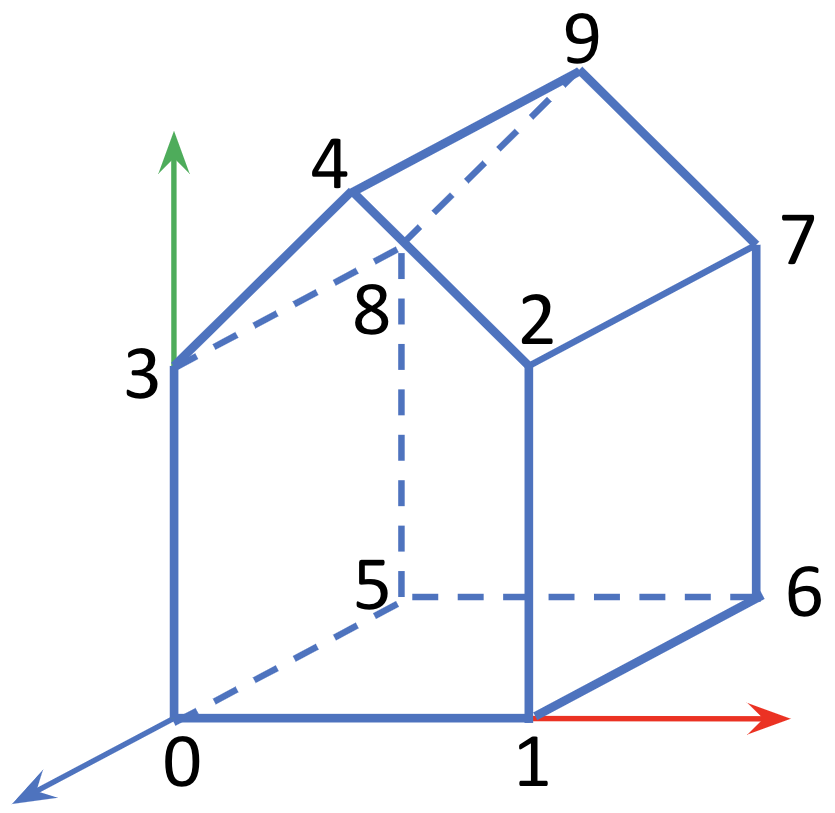
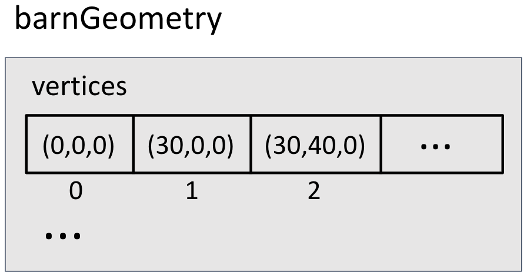
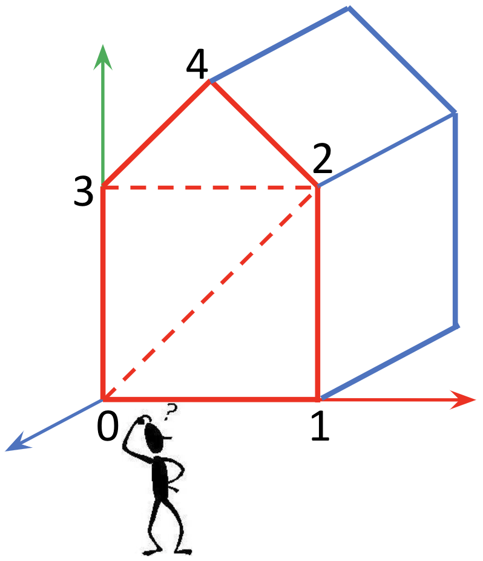
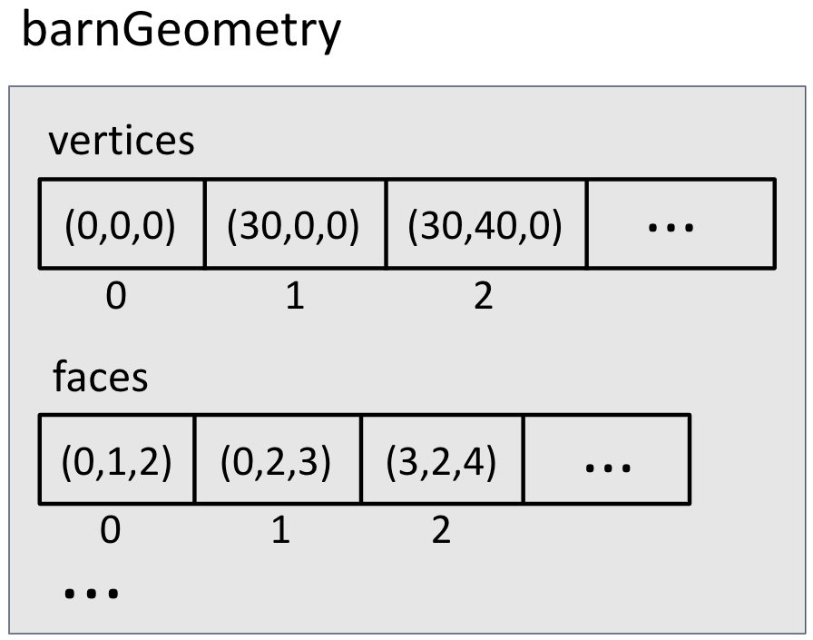
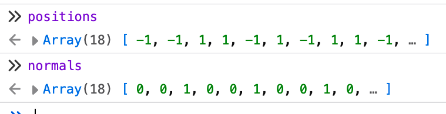
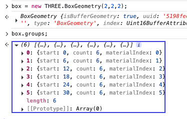
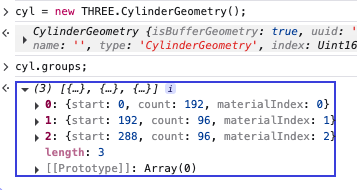

$$
\newcommand{\vecIII}[3]{\left[\begin{array}{c} #1\\\\#2\\\\#3 \end{array}\right]}
\newcommand{\vecIV}[4]{\left[\begin{array}{c} #1\\\\#2\\\\#3\\\\#4 \end{array}\right]}
\newcommand{\Choose}[2]{ { { #1 }\choose{ #2 } } }
\newcommand{\vecII}[2]{\left[\begin{array}{c} #1\\\\#2 \end{array}\right]}
\renewcommand{\vecIII}[3]{\left[\begin{array}{c} #1\\\\#2\\\\#3 \end{array}\right]}
\renewcommand{\vecIV}[4]{\left[\begin{array}{c} #1\\\\#2\\\\#3\\\\#4 \end{array}\right]}
\newcommand{\matIIxII}[4]{\left[
\begin{array}{cc}
#1 & #2 \\\\ #3 & #4
\end{array}\right]}
\newcommand{\matIIIxIII}[9]{\left[
\begin{array}{ccc}
#1 & #2 & #3 \\\\ #4 & #5 & #6 \\\\ #7 & #8 & #9
\end{array}\right]}
$$

# Custom Geometry

The built-in geometry objects (spheres, boxes, cones, cylinders, etc)
can do a lot of work for us, but it's important to be able to build a
custom object if we choose.

In Revision 125 of Three.js, they made a radical change to the
representation of geometry. The result is less intuitive for human
programmers, but faster for the graphics card to process: performance
won over ease of coding.

In CS 360, we will use the new way; since (as of Spring 2026), we
are using R179. It's time.

I have a working example, below, of the new way.

But starting with the old way will clarify many concepts, so let's
start there.

## Custom Geometry the Old Way

Programming the old way, we

- create a `THREE.Geometry` object
- create a list of vertices as objects; e.g. `new THREE.Vector3()`
- create a list of *faces* (triangles) also as objects; that is, `new THREE.Face3(v1,v2,v3)`
- assign a surface normal to each vertex
- assign texture coordinates to each vertex.

The `Geometry` and `Face` classes have been removed from
Threejs. However, all the same *information* and *concepts* are there,
so let's make sure we understand those first.

## Vertices

We start by listing the vertices of our figure. Here's the beginning
of defining the barn:

<figure>


<figcaption><p>The barn and some vertices. Thanks to Ellen Hildreth for the figure.</p></figcaption>
</figure>

- vertex 0 is the lower left front corner of the barn, at the origin (0,0,0)
- vertex 1 is the lower right front corner of the barn, at coordinates (30,0,0)
- vertex 2 is the upper right front "shoulder" of the barn, at coordinates (30,40,0)
- vertex 4 is the front "peak" of the barn, at coordinates (15,55,0)
- etc

We can create these vertices like this:

```js
var barnGeometry = new THREE.Geometry();
// add vertices to the barnGeometry.vertices array -
// indices of this array correspond to the above labels 
barnGeometry.vertices.push(new THREE.Vector3(0, 0, 0));
barnGeometry.vertices.push(new THREE.Vector3(30, 0, 0));
barnGeometry.vertices.push(new THREE.Vector3(30, 40, 0));
...
```

## Faces

A *face* is a triangle. It is created by listing three vertices, which
is done by giving the *index* of each vertex in the array of vertices.

Keep in mind:

- each triangular face has a *front* and *back* side
- by default, Three.js only renders the front side (the back side is not rendered, for speed)

So how do you define which side is the front?

- imagine you're looking at the side you want to define as the front side...
- ... and list the three vertices in a **counterclockwise** order, as viewed from this side
- Three.js will interpret this side as the front side

<figure>
 


<figcaption><p>The front of the barn as viewed from outside has faces
like (0,1,2), which is vertices 0 (the origin), 1 (the lower right
corner) and 2 (the upper right shoulder). Thanks to Ellen Hildreth for the figure.</p></figcaption>
</figure>

```js
// front side of each of these faces is outside the barn
barnGeometry.faces.push(new THREE.Face3(0, 1, 2));
barnGeometry.faces.push(new THREE.Face3(0, 2, 3));
barnGeometry.faces.push(new THREE.Face3(3, 2, 4));
...
```

There are other steps, such as defining material indexes and such, but
let's put that off for now and talk about defining geometry the new
way. Fortunately, the concepts are all the same, but the
implementation is different.

## Transitioning

The following website explains the transition from [geometry to
buffergeometry](https://sbcode.net/threejs/geometry-to-buffergeometry)

The page is not very long and has some good explanation and nice
examples; highly recommended. Indeed, wherever I've visited the
<https://sbcode.net/threejs/> website,
I've found good information (I have *not* read the whole thing yet).

## Custom Geometry the New Way

Now, instead of the `Geometry` and `Face` classes, which have been
removed from Threejs, there's `BufferGeometry`, where all the
representations are *buffers*, each of which is a flat, typed array of
numbers. (By "typed" I mean that the datatype of the elements is
specified and uniform, say `Float32`, which is a 32-bit floating point
number.) Since the graphics card *knows* the datatype of all the
elements in the array, it can skip checking the type and dispatching
to code that is specific to a particular datatype.

The strategy for building a custom geometry is to:

- build an array of JS dictionaries, where each dictionary represents
  all the information about a particular *vertex*. This allows us to
  put related information together in a way that is (usually) more
  intuitive than these flat typed arrays. Then,
- iterate over the array of vertex information, transferring the information into separate arrays
  - an array for the *position* of the vertex
  - an array for the *normal* for the vertex
  - an array for the *uv* (texture coordinates) of the vertex
- Finally, the data in these flat arrays gets transferred to typed
  buffer arrays.

> An aside: remember that a particular vertex, say the lower left
> front vertex of a cube or the barn can have different surface
> normals, different color, etc, depending on whether it is
> participating as part of the front of the barn or the left side of
> the barn or the bottom of the barn. In this representation, those
> are *different* vertices. They happen to have the same *position*,
> but they differ in other properties.

## Threejs Document on Custom Geometry

You're now ready to read the the [Threejs information on custom buffer
geometry](https://threejs.org/manual/#en/custom-buffergeometry). It
has some excellent pictures, and a good explanation about what makes a
vertex different from another vertex, as in that aside above. That
page is part of the required reading for this topic. Please read it
carefully.

You can stop (if you want) when you get to the paragraph starting:

> We can use TypedArrays from the start instead of native JavaScript Arrays.

Hopefully, most of that code is clear to you. There are some JS tricks
that you might not be familiar with. Let's discuss one trick.

## Flatten

The Threejs reading about custom geometry used some coding that I will
call *flattening*. It takes a data structure where all the information
about a vertex (position, normal, and UV coordinates) is in one place
(a dictionary) and distributes that data to separate, flat arrays.

The following code (taken from that page) iterates over the array
`vertices`, each element of which is a dictionary. The code indexes
into each dictionary, gets a sub-array and *spreads* the sub-array
into separate components (numbers in this case), and *pushes* the
components onto different arrays like `positions` and `normals`.

```js
    const positions = [];
    const normals = [];
    const uvs = [];
    for (const vertex of vertices) {
      positions.push(...vertex.pos);
      normals.push(...vertex.norm);
      uvs.push(...vertex.uv);
    }
```

Suppose we have an array of dictionaries like this:

```js
const vertices = [
  // front
  { pos: [-1, -1,  1], norm: [ 0,  0,  1], uv: [0, 0], },
  { pos: [ 1, -1,  1], norm: [ 0,  0,  1], uv: [1, 0], },
  { pos: [-1,  1,  1], norm: [ 0,  0,  1], uv: [0, 1], },

  { pos: [-1,  1,  1], norm: [ 0,  0,  1], uv: [0, 1], },
  { pos: [ 1, -1,  1], norm: [ 0,  0,  1], uv: [1, 0], },
  { pos: [ 1,  1,  1], norm: [ 0,  0,  1], uv: [1, 1], },

  // left
  { pos: [-1, -1, 1], norm: [ -1, 0, 0], uv: [1, 1], }
  ...
];
```

Notice that the first vertex and the last vertex have the same
position (`pos`), but the first is part of the *front* and so has
`[0,0,1]` as its surface normal while the last one is part of the
*left* and so has `[-1,0,0]` as its surface normal.

If we "flatten" that array of dictionaries into separate arrays, the
result is 3 *"flat"* arrays of numbers. Printing them in the JS
console looks like this:



The last step is to take the flat arrays and copy them into *typed
arrays*, and make those typed arrays into *buffer attributes* of the
geometry object. That code looks like this:

```js
// create the buffer attributes
const positionNumComponents = 3;
geometry.setAttribute(
    'position',
    new THREE.BufferAttribute(new Float32Array(positions), positionNumComponents));
```

All that code has been implemented into TW as
`TW.setBufferGeometryFromVertices`. I won't show its code, because
it's a copy of the code you already read in the Threejs
document. We'll use it in a moment, after a brief detour to talk about
reversing the flattening.

## Reversing the Flattening

One way to understand the Threejs geometry is to reverse it: taking
the buffer attributes and turning them back into collected
information. TW also has a function to do that,
`TW.geometryInfo`. Let's try it on a plane, first:

```js
gi = TW.geometryInfo(new THREE.PlaneGeometry(2));
```

That function returns a JS dictionary with a `vertices` key that is
like the `vertices` array of dictionaries that we saw in the last
section. The return value also has an array of *indices*, as described
in the Threejs reading.

If we pretty-print the geometry info, as follows,

```js
TW.printGeometryInfo(gi);
```

the result could look like this:

```js
vertices
0: {pos: -1,+1,0, norm: 0,0,1,    uv: 0,1}
1: {pos: +1,+1,0, norm: 0,0,1,    uv: 1,1}
2: {pos: -1,-1,0, norm: 0,0,1,    uv: 0,0}
3: {pos: +1,-1,0, norm: 0,0,1,    uv: 1,0}
indices
0 2 1
2 3 1
```

The "vertices" part should be intuitive. The vertices look like this:

<p></p>

You'll notice that they all have the same z coordinate (zero), the
same normal (0,0,1) but their UV coordinates differ. Note that the UV
value of (0,0) is at the *lower* left corner; when `flipY` is true,
the image is inverted so that the image's upper left will be at the
upper left corner.

If we were to build this plane geometry by hand, we could do it as follows:

```js
function makePlaneGeometry(width, height) {
    const w = width/2;
    const h = height/2;
    const norm = [0,0,1];
    const vertices = [
        {pos: [-w,+w,0], norm: norm, uv: [0,1]},
        {pos: [+w,+w,0], norm: norm, uv: [1,1]},
        {pos: [-w,-w,0], norm: norm, uv: [0,0]},
        {pos: [+w,-w,0], norm: norm, uv: [1,0]},
    ];
    const geometry = new THREE.BufferGeometry();
    TW.setBufferGeometryFromVertices(geometry, vertices);
    geometry.setIndex([
        0, 2, 1,
        2, 3, 1
    ]);
    return geometry;
}
```

Notice the call to `TW.setBufferGeometryFromVertices` which we talked
about at the end of the last section. It's the code that was copied from
the Threejs custom geometry page.

Here's a demo that shows two planes, one using the builtin geometry
object and the other which we built using the custom geometry
techniques.

[geometry/plane](https://learn.sewanee.edu/d2l/le/content/43027/viewContent/404054/View)


## Custom Geometry Box

The code described in the Threejs page about custom geometry is very
cool, but it doesn't have all the features we want. In particular,
there are lots of *triangles*, but no *sides*, so we can't have, say,
a cube with sides that are different colors. (Recall that with Threejs
boxes, we can supply a different material for each side of the box.)

Here's what we might want:

[geometry/box](https://learn.sewanee.edu/d2l/le/content/43027/viewContent/404054/View)

Be sure to click and drag with the mouse, to look at the box from
multiple directions. (You'll notice that I omitted the bottom; we'll
do that in class.)

In the case of a box, each side is a pair of triangles, and each side
can get a different material. However, in general, a group of
triangles might not be something that we would call a "side," so
Threejs uses a different terminology: *groups*.

So, the geometry object can also have a list of groups. Fortunately,
these are not "flattened" like the vertex information, so we can
easily just create a geometry and then look at the `groups`
property. For example, for a box:

```js
box = new THREE.BoxGeometry();
box.groups;
```

Try copy/pasting that into a JS console and looking at the resulting
array. Here's a screenshot of what you might see:



The `start` property is the first index in the `indices` array. The
`count` property is how many consecutive indexes belong to the
group. Here, they are all 6 because we have two triangles of three
vertices each in every group. The `materialIndex` is, as you've
probably guessed, the index of this group in the list of materials
supplied to the mesh. So, above, we can see there are six materials,
and the first material goes on the first 6 vertices, which are the
first two triangles. You'd have to look at the vertex information to
figure out where this is on the cube, so it's not that everything is
clear. But sometimes we can make some good guesses.

For example, if we did that with a cylinder, we see:



For the cylinder, we see that there are three groups: the first is the
side of the cylinder (192 vertices), and the rest are the two circular
ends of the cylinder (96 vertices each).

So, sometimes it's fairly easy to infer the material groups for a
geometry object.

If we are ever puzzled, we can also just do an experiment: supply an
array of materials, each of different color, create a mesh, and look
at where the colors land on the rendered object.

## Fancier Coding

The coding we've developed so far for custom geometry is
straightforward, simple, but tedious, because there are so many
vertices and so much repetition. For example, many vertices have the
same *normal*. (All four front vertices of a box.) Many vertices have
the same *position* as other vertices. (The front upper left vertex
of a box occurs three times.) We could copy/paste/edit these vertices
but typos will be hard to debug.

It would be nice to take advantage of these repetitions to make the
code more robust.

In the code for the custom box

[geometry/box](https://learn.sewanee.edu/d2l/le/content/43027/viewContent/404054/View)

I introduce a few ideas:

- A list of *positions*, so I can get the spatial coordinates right
  and then just use indexes into this array for the positions.
- A *quad* is a side of the box, which will also be a *material group*. It has:
  - four positions, which are given as indexes into the list of positions
  - a normal, which is applied to all four vertices
  - a material index, which is used for its group
- we'll build the array of vertex indexes as we go along, building
  each quad, rather than listing them all at the end.

I also used the Threejs `.addGroup()` method, which adds a group to
the geometry object.

The resulting code looks like this:

```js
import * as THREE from 'three';
import { TW } from 'tw';

export function boxGeometryWithMaterialGroups (xsize, ysize, zsize) {
    const x2 = xsize/2, y2 = ysize/2, z2 = zsize/2;
    // eight locations. The first four are given long-winded names, to
    // make the code easier to read, and corresponding to the names in
    // the reading.
    const v0_upper_left = [ -x2, +y2, z2 ];
    const v1_lower_left = [ -x2, -y2, z2 ];
    const v2_lower_right = [ x2, -y2, z2 ];
    const v3_upper_right = [ x2, +y2, z2 ];
    // array of 8 locations/points
    const p = [ v0_upper_left,
                v1_lower_left,
                v2_lower_right,
                v3_upper_right,
                // the ones in the back
                [ +x2, +y2, -z2 ],
                [ +x2, -y2, -z2 ],
                [ -x2, -y2, -z2 ],
                [ -x2, +y2, -z2 ]];

    // We'll fill these arrays with our helpers
    const vertices = [];
    const indices = [];

    // group code modeled on BoxGeometry
    // https://github.com/mrdoob/three.js/blob/master/src/geometries/BoxGeometry.js
    // Each group corresponds to a "face" (flat surface of the
    // object), which consists of a set of triangles.  We need to
    // count the number of triangles in each group, and then do
    // addGroup() at the end of a face.  Each face/group will have its
    // own normal and materialIndex

    let bg = new THREE.BufferGeometry();
    bg.type = 'BarnGeometry';

    let groupStart = 0; 

    // let's use quad with the corners starting at the upper left of
    // the texture and going counterclockwise
    function quad(i1, i2, i3, i4, normal, materialIndex) {
        let v1 = { pos: p[i1], norm: normal, uv: [0, 0] };
        let v2 = { pos: p[i2], norm: normal, uv: [0, 1] };
        let v3 = { pos: p[i3], norm: normal, uv: [1, 1] };
        let v4 = { pos: p[i4], norm: normal, uv: [1, 0] };
        let n = vertices.length; // index of v1
        vertices.push(v1, v2, v3, v4);
        // these are the two triangles
        indices.push(n, n+1, n+2);
        indices.push(n, n+2, n+3);
        let numVertices = 6;
        bg.addGroup(groupStart, numVertices, materialIndex);
        groupStart += numVertices;
    }
        
    quad(0, 1, 2, 3, [0,0,1], 0); // front side (+z side)
    quad(3, 2, 5, 4, [+1,0,0], 1); // +x side
    quad(0, 3, 4, 7, [0,+1,0], 2); // top (+y side)
    quad(7, 6, 1, 0, [-1,0,0], 3); // -x side
    quad(4, 5, 6, 7, [0,0,-1], 4); // back

    // Whew! Now, build the rest
    TW.setBufferGeometryFromVertices(bg, vertices);
    bg.setIndex(indices);
    return bg;
}
```

We'll discuss this more in class.

## Summary

If we need to create a custom geometry, Threejs has tools to do so,
using many of the concepts we understand, but the implementation is
designed for speed and efficiency of execution, not the convenience of
the programmer.

- create a `THREE.BufferGeometry` object
- populate its *attributes* with flat *typed* arrays of numbers
  - `position`
  - `normal`
  - `uv`
- optionally, populate its `index` property with an array of indexes
  into the arrays of vertex information

One strategy is to start with structured data about *vertices* and
then *flatten* that data into these buffers.

The geometry object can also have a `groups` property if different
materials can be applied to different groups of triangles.