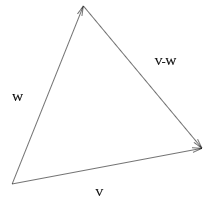
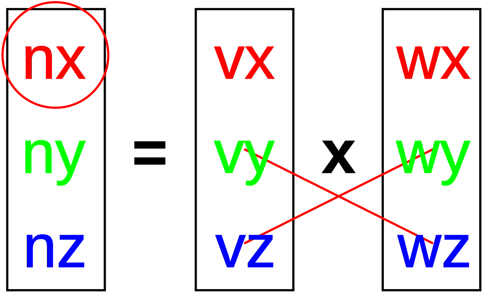
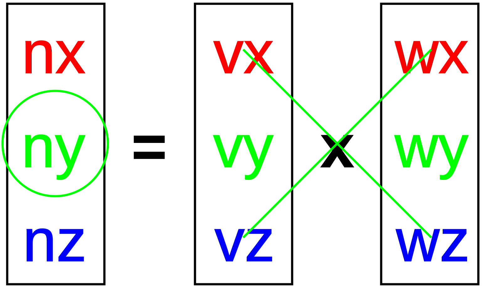
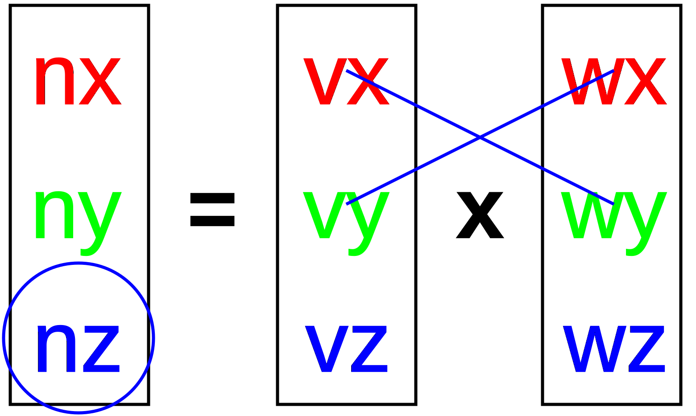

# Geometry Math

A fair amount of 3D geometry is involved in automatically setting up the
camera. (Even more is involved in using the mouse to drag the camera to a
different viewpoint, but we will defer that for now.) We also need to
understand some geometry of vectors to do the computations for material and
lighting.

So, we're going to attack that now. This reading file explains the relevant
math. The most important part of the following is understanding the dot
product. The dot product is used in several ways in the lighting model, so the
more comfortable you are with it, the better. We won't use cross-products in
material and lighting, but we will later in the semester, and it fits
reasonably well here, but if you get lost in understanding the cross-product,
don't worry.

## Vector Math

Intuitively and geometrically, a vector is an *arrow*. It has *length* and
*direction*. In a coordinate system, we can represent a vector as a triple of
numbers $(\Delta x, \Delta y, \Delta z)$.

Of course, a triple of numbers is also used to represent *points*. Is there
any difference? Yes. A point has *location* but not *length* , and a vector has
*length* but not location. You can get one from the other, though. If we have
two points, A and B, we can find the vector from A to B by using
subtraction:

$$
\vec{v} = B - A
= \begin{pmatrix} \Delta x \\ \Delta y \\ \Delta z \end{pmatrix}
= \begin{pmatrix} b_x \\ b_y \\ b_z \end{pmatrix}
- \begin{pmatrix} a_x \\ a_y \\ a_z \end{pmatrix}
= \begin{pmatrix}
b_x - a_x \\
b_y - a_y \\
b_z - a_z
\end{pmatrix}
$$

## Vectors and Points in Homogeneous Coordinates

Interestingly, we can tell the difference between vectors and points in
*homogeneous coordinates* , which we learned about in the context of affine
transformations. Points have $w=1$, and (as you can see from the subtraction
above) vectors have $w=0$:

$$
\begin{pmatrix}
\Delta x \\
\Delta y \\
\Delta z \\
0
\end{pmatrix}
=
\vec{v}
= B - A
=
\begin{pmatrix}
b_x \\
b_y \\
b_z \\
1
\end{pmatrix}
-
\begin{pmatrix}
a_x \\
a_y \\
a_z \\
1
\end{pmatrix}
$$

## Dot Product

The notation $v\cdot w$ means the *dot product* or *scalar product* or
(sometimes) *inner product* of two vectors, $v$ and $w$. In abstract
mathematics, we can talk about choosing an inner product on a vector space,
and that inner product has to satisfy certain properties:

- $v\cdot w\in\Re$ That is, the dot product of two vectors is just a real number, a scalar (not a vector).
- $\forall\ v, v\cdot v=0 \mathrm{~iff~} v=\vec{0}$. That is, the dot product of a vector with itself is zero if and only if the vector is the zero vector. In 3D, the zero vector is (0,0,0).
- (commutativity) $v \cdot w = w \cdot v$. That is, the order of the vectors doesn't matter.
- (linearity) $v \cdot (au+bw) = a(u\cdot v) + b(v \cdot w)$. That is, the dot product of a vector $v$ with the linear combination of two other vectors, $u$ and $w$, is the same as the linear combination of the two dot products.

But in this course, we're going to be very concrete. We will define the dot
product as the sum of products:

$$ v \cdot w = \sum_{i=0}^{n} v_i w_i $$

In fact, since we only are using 3 dimensions, $x$, $y$ and $z$:

$$ v \cdot w = v_x w_x + v_y w_y + v_z w_z $$

You can easily check that this definition of a dot product satisfies the
required properties.

Note that calculating one element of a matrix multiplication is the
same thing as a dot product: the result element is the dot product of
a row from the first matrix with a column from the second matrix.

## Dot Product Example

Suppose we have the following two vectors:

$$ \begin{array}{rcl}
v &=& (1,2,3) \\
w &=& (6,5,4) \\
\end{array} $$

The dot product of those vectors is:

$$ v \cdot w = 1\ast6+2\ast5+3\ast4 = 6+10+12 = 28 $$

Note that the dot product of two vectors is a *scalar* : a real
number, not a vector.

## Vector Length

Given the dot product, we can define the length of a vector:

$$ |v| = \sqrt{v\cdot v} $$

This is just our old friend the Pythagorean theorem in disguise! Why? Because
the dot product of a vector with itself ends up squaring each element and
adding them up.

Note that we can rescale (shrink or grow) any vector (except the zero vector)
to have unit length. This is called *normalizing*.

$$ w = \frac{v}{|v|} $$

$$ |w| = 1 $$

The result is called a *unit vector*. We often will use unit vectors
in computer graphics. For example, normal vectors (vectors
perpendicular to a surface) are usually specified as unit vectors. See
the last section, below.

## Vector Example

What is the length of the vector $v=(2,3,6)$?

$$ |v|
= \sqrt{2^2+3^2+6^2}
= \sqrt{4+9+36}
= \sqrt{49}
= 7 $$

If we *normalize* $v$, what do we get? Let $w=v/|v|$, we get

$$ w = (2,3,6)/7
= (2/7,3/7,6/7)
\approx (0.28,0.43,0.86) $$

You can easily check that $|w|=1$. The vector $w$ is in exactly the same
*direction* as $v$, but it's one unit long.

## Angles Between Vectors

The angle between two vectors $v$ and $w$ can be found using the following
formula. Amazing, but true.

$$ \cos(\theta) = \frac{v\cdot w}{|v||w|} $$

which I like to also think of as:

$$ \cos(\theta) = \frac{v}{|v|} \cdot \frac{w}{|w|} $$

In other words, it's just the dot product of the two unit vectors. That is, if
both of two vectors $v$ and $w$ are normalized (a length of one unit), the
formula for the cosine of the angle between them becomes the following, which
is remarkably simple:

$$ \cos(\theta) = v\cdot w $$

This is good news, because a dot product is very quick to compute: in
3D, it's just 3 multiplies and 2 adds. It turns out that the cosine of
an angle is often desired in computer graphics, so being able to
compute it so simply is enormously valuable. In fact, there are
occasions when the tail wags the dog: the cosine of the angle is used
because it's so quick to compute. It's used a lot in lighting
calculations.

### Example 1

Given the following vectors, what is the cosine of the angle between them?

$$ \begin{array}{rcl}
v &=& (2,3,6)\\
w &=& (9,6,2)\\
\end{array} $$

Since we already know the length of $v$, let's first find the length of $w$:

$$ |w|
= \sqrt{w\cdot w}
= \sqrt{9^2+6^2+2^2}
= \sqrt{81+36+4}
= \sqrt{121}
= 11 $$

Therefore, the cosine of the angle between $v$ and $w$ is:

$$ \cos(\theta)
= \frac{v\cdot w}{7\ast 11}
= \frac{2\ast9+3\ast6+6\ast2}{77}
= \frac{18+18+12}{77}
= \frac{48}{77}
\approx 0.62 $$

If, for some reason, we needed the actual angle, we could compute the
arc cosine, but we'll almost never need that. (This angle is about 51
degrees.)

### Example 2

Suppose we have the vectors $x=(1,0,0)$ and $y=(0,1,0)$. That is, these are
unit vectors that point in the direction of the X and Y axes. It's easy to see
that the dot product between these is zero.

What does this mean? If the cosine of an angle is zero, that means the angle
is a right angle (ninety degrees). That is, these two vectors are
*perpendicular*. (We're not surprised that they're perpendicular, but it's
nice to see that the calculation confirms it.) In linear algebra, the term
*orthogonal* is used for vectors that are perpendicular. In geek-speak, we say
that two things are "orthogonal" if one doesn't affect the other. This makes
sense because we can translate an object by multiples of the vector $x$
without affecting its Y coordinate, and translate it by multiples of the
vector $y$ without affecting its X coordinate.

### Example 3

What can we say about the angle, $\theta$ between the vectors:

$$ \begin{array}{rcl}
v &=& (2,3,6)\\
u &=& (-6,10,-3)\\
\end{array} $$

The cosine of the angle is found by:

$$ \cos(\theta)
= \frac{(2,3,6)\cdot(-6,10,-3)}{|v||u|}
= \frac{-12+30-18}{|v||u|}
= \frac{0}{|v||u|}
= 0 $$

So, these vectors are perpendicular (orthogonal).

## Applying the Law of Cosines

This section proves that the dot product of normalized vectors is the angle
between them. You can skip it if you're not interested.

two vectors, v and w, and their difference, v-w, which is an
arrow between the endpoints

According to the law of cosines, from trigonometry: $$ |v-w|^2 = |v|^2 +
|w|^2 - 2 |v| |w| \cos(\theta) $$

Where $\theta$ is the angle between $v$ and $w$. With some algebra, we get:
$$ \cos(\theta) = \frac{|v|^2 + |w|^2 - |v-w|^2}{-2 |v| |w|} $$

All the terms in $v-w$ are of the form $$(v_0-w_0)^2$$ multiplying out to $$v_0^2-2 v_0 w_0+w_0^2$$ 

That means that all the squared terms in the
numerator disappear, the $-2$ cancels with the denominator, and we are left
only with the cross terms: $$ \cos(\theta) = \frac{\sum_{i=0}^n v_i w_i}{|v|
|w|} $$

but that numerator is just the dot product of $v$ and $w$, so $$ \cos(\theta)
= \frac{v\cdot w}{|v| |w|} $$

## Cross Product

As we know, the dot product of two vectors produces a *scalar*. The cross
product produces a *vector* : one that is perpendicular to *both* of them. In
3D, the cross product is:

$$
\begin{aligned}
\vec{n} &= \vec{v} \times \vec{w} \\
        &= \begin{pmatrix} v_x \\ v_y \\ v_z \end{pmatrix}
           \times
           \begin{pmatrix} w_x \\ w_y \\ w_z \end{pmatrix} \\
        &= \begin{pmatrix}
             v_y w_z - v_z w_y \\
             v_z w_x - v_x w_z \\
             v_x w_y - v_y w_x
           \end{pmatrix}
\end{aligned}
$$

Note that order matters: $v \times w = - w \times v$. Notice also that in
computing $n_x$, you use only terms from the Y and Z components, and similarly
for $n_y$ and $n_z$. There's a nice graphical way to remember the way to
compute this. Looking at the following figures, multiply the terms connected
by lines, and subtract one line from another. For the X and Z, you subtract
the major diagonal (sloping down to the right) from the minor diagonal, and
for Y, you subtract them in the opposite order (or just negate the result).

  
  

How to compute the three components of a cross-product

In this course, I will not ask you to compute a cross-product, but you
should understand the basic idea.

## Direction of the Cross Product

What direction does the vector go in? For that, we need the
*right-hand rule*: point the fingers of your right hand in the
direction of the first vector, sweep them towards the second, and your
thumb points in the direction of the cross product. Alternatively,
point your thumb in the direction of the first vector, your index in
the direction of the second, and your middle finger in the direction
of the cross-product.

Interestingly, $z=x\times y$, $x = y \times z$ and $y = z \times
x$. That is, a normalized vector parallel to the $z$ axis, (0,0,1) is
the cross product of vectors for the $x$ axis, (1,0,0), and the $y$
axis, (0,1,0).

### Length of the cross product

The length of the cross-product divided by the lengths of the two vectors
gives the sine of the angle between the two vectors:

$$ \sin(\theta) = \frac{|v\times w|}{|v| |w|} $$

### Cross-Product Example

Find the cross product of the following two vectors:

$$ \begin{array}{rcl}
v &=& (2,3,6)\\
w &=& (9,6,2)\\
\end{array} $$

We'll write the vectors vertically in order to find the result.

$$
\begin{aligned}
\vec{n} &= \vec{v} \times \vec{w} \\
        &= \begin{pmatrix} 2 \\ 3 \\ 6 \end{pmatrix}
           \times
           \begin{pmatrix} 9 \\ 6 \\ 2 \end{pmatrix} \\
        &= \begin{pmatrix}
             3\cdot2 - 6\cdot6 \\
             6\cdot9 - 2\cdot2 \\
             2\cdot6 - 9\cdot3
           \end{pmatrix} \\
        &= \begin{pmatrix}
             6 - 36 \\
             54 - 4 \\
             12 - 27
           \end{pmatrix} \\
        &= \begin{pmatrix}
             -30 \\
             50 \\
             -15
           \end{pmatrix}
\end{aligned}
$$

We already know from previous examples that $|v|=7$ and $|w|=11$. The sine of
the angle between $v$ and $w$ is

$$ \sin(\theta) = \frac{|n|}{|v||w|} = \frac{\sqrt{900+2500+225}}{77} = \frac{\sqrt{3625}}{77} \approx 0.78 $$

Earlier, in the example above, we found that the cosine of the angle between
$v$ and $w$ is 48/77. Therefore, we should be able to confirm that:

$$ 1 = \cos^2(\theta)+\sin^2(\theta) = (48/77)^2+(\sqrt{3625}/77)^2 = (2304 + 3625)/77^2 = 5929/5929 $$

Whew!

### Normal Vectors

A vector that is perpendicular to a surface, such as a plane or a sphere, is
said to be *normal* to it. It's therefore called a normal vector. (Other
vectors are not *abnormal*.)

Normal vectors for surfaces are crucial in lighting calculations, because the
normal vector tells us the orientation of the surface, and the orientation is
important to how light falls on the surface and where it reflects to.

A common way to find a normal vector for plane is to find two vectors that lie
in the plane and take their cross product. To find a normal vector for a
surface, find a plane that is tangent at the desired point, and find the
normal vector for that plane. We'll see examples of this later in the course.

You'll want to convert that normal vector to unit length when
specifying the surface normal in OpenGL. However, a hidden pitfall is
that if you scale the coordinate system, these normal vectors will get
scaled as well, and no longer have unit length, which is why in OpenGL
there is a setting `glEnable(GL_NORMALIZE)` telling the software to
*normalize* the normal vectors, thereby using the word "normal" in
two different ways in the same sentence.