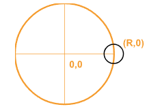

# Nested Transformations

Last time, we learned about *chained transformations*. That's not a
technical term; I just made it up to describe sequences of
transformations. The picket fence is an example of a chain of
transformations, where the base picket is transformed (translated and
rotated) many, many times.

In this reading, we will continue to discuss how to model complex
objects out of basic shapes, without having to either dive into custom
geometry or some kind of GUI-based modeling program such as Maya or
Blender. This reading will focus on these demos: [leg, snake, mobile, teddybear](https://learn.sewanee.edu/d2l/le/content/43027/viewContent/400882/View).


## Demo: The Leg

Rotating around something other than the center of an object is very
useful. We saw that with the bell, but that was just one layer. Here
is a demo of how we might model a leg:

[nestedFrames/leg](https://learn.sewanee.edu/d2l/le/content/43027/viewContent/400882/View)

Please download and play with that a bit.

The code is a bit longer (but only about 40 lines of code) and more
complicated than the fence or the bell, but it's not conceptually much
harder. Still, it can help to visualize the various parts. Here's an
annotated screen shot.


a leg with components lower-leg and foot, nested within
the lower-leg.

The yellow highlighting indicates the higher-level components,
starting from the inner-most:

- foot: the object containing the "shoe". Yes, this seems backwards,
  but I wanted the foot component to have the "ankle" joint, and, to
  avoid confusion, I wanted to give a different name for the
  component. The origin is the ankle.
- lower leg: the object containing the calf and the foot. The origin is the knee.
- leg: the object containing the thigh and the lower leg. The origin
  is the hip.

Consider just one part, the outermost group, which I've called the
leg. The origin of the leg is the big yellow dot at one corner of the
leg frame in the picture above. The leg group contains two things:

- a cylinder that has been translated so that one end is at the origin (the hip, in this case)
- another group that contains the rest of the leg, translated to be at
  the other end of the cylinder (the knee, in this case)

Recursively, we can do the same thing with the lower leg, and even the
foot, though I have omitted the toes in this model, which would be at
the other end of the foot.

## Building the Leg

Let's look at how the leg is built. First, some orientation. (This
should be part of the documentation for the complex objects that you
build, so that others can understand your code.)

- The origin of the leg Group will be at the hip joint. This makes it
  easy for a caller to attach the leg to something, similar to putting
  the origin of the snowperson at the base of the bottom sphere.
- The thigh will have one end at the hip joint.
- The thigh (at zero rotation) will be going down the -Y axis.
- All the joint rotations are around the Z axis, so we are seeing
  the leg from the *side* (its right side)

This should seem intuitive given the demo above, but when reading
someone else's code, you won't always have a demo handy. Though demos
are really useful and should be supplied whenever possible.

Our approach will be to build the composite structure "bottom up" or
from innermost to outermost. That is, we'll start with the foot,
attach it to the lower leg, and finally attach the lower leg to the
leg.

Since we'll be building the leg out of cylinders, it helps to remember
that in *object space*, a cylinder is wrapped around the Y axis, with
the origin at its center.

Also, remember that I needed a different names for both the lowermost
mesh and the frame that contains it. I wanted to call the frame the
"foot," since that seemed intuitive. So I called the mesh the "shoe",
which means that the foot contains the shoe. I acknowledge that's
weird, but it's what I have. If you have better ideas, let me know!

So, the first few lines of the code are:

```js
export function makeLeg(parameters) {
    const p = parameters;

    const shoe = TW.createMesh(new THREE.CylinderGeometry(2, 1, p.footLength));

    const foot = new THREE.Group();
    foot.name = "foot";
    foot.add(shoe);
    shoe.position.x = p.footLength/2;
    shoe.rotation.z = Math.PI/2;

    foot.rotation.z = parameters.ankleRotation;
```

Notice how the shoe cylinder is moved along the X axis by half its
length, so that one end of the cylinder is at the origin of the "foot"
group. Also, we rotate around Z by $\pi/2$ so that foot axis is
parallel with the X axis.

Now, let's look at the next joint:

```js
    const calf = TW.createMesh(new THREE.CylinderGeometry(3, 2, p.calfLength));

    const lowerleg = new THREE.Group();
    lowerleg.name = "lowerleg";
    lowerleg.add(calf);
    calf.position.y = -p.calfLength/2;
    foot.position.y = -p.calfLength;
    lowerleg.add(foot);

    lowerleg.rotation.z = p.kneeRotation;
```

This is very similar. Again, we create a mesh and a group, add the
mesh to the group, and move it so that one end is at the origin of the
group. We add the foot group to lowerleg group but at the *other* end
of the mesh.

Finally, let's finish up the leg:

```js
    const thigh = TW.createMesh(new THREE.CylinderGeometry(5, 4, p.thighLength));

    const leg = new THREE.Group();
    leg.name = "leg";
    leg.add(thigh);
    thigh.position.y = -parameters.thighLength/2;
    lowerleg.position.y = -parameters.thighLength;
    leg.add(lowerleg);

    leg.rotation.z = parameters.hipRotation;

    return leg;
}
```

No surprises here: we create a mesh and a group, add the mesh to the
group, add the lower leg into the group at the other end of the mesh,
make some rotations, and we are done.

## Adjusting Angles

When we use the GUI to adjust the scene, we often remove the current
mesh (`scene.remove(...)`) and build it again from scratch. We did
that with leg:

```js
function remakeLeg() {
    scene.remove(leg);
    leg = LEG.makeLeg(parameters);
    scene.add(leg);
}

gui.add(parameters,'footLength', 1, 20).step(1).onChange(remakeLeg);
gui.add(parameters,'calfLength', 1, 40).step(1).onChange(remakeLeg);
gui.add(parameters,'thighLength', 1, 50).step(1).onChange(remakeLeg);
```

However, when we are adjusting the joint angles, there's no need to
discard all that geometry. Instead, we can reach into the object and
adjust the settings. Like this:

```js
function moveLeg() {
    LEG.adjustJointAngles(leg, parameters);
}

gui.add(parameters,'ankleRotation',-Math.PI/3,Math.PI/3).step(0.001).onChange(moveLeg);
gui.add(parameters,'kneeRotation', -2*Math.PI/3, 0.1).step(0.001).onChange(moveLeg);
gui.add(parameters,'hipRotation', -Math.PI/6,Math.PI).step(0.001).onChange(moveLeg);
```

This reduces memory usage and work for the garbage collector. This
efficiency doesn't matter much for the GUI, since we're not doing that
many adjustments and we're doing them at human speed. But when we get
to animations, where we are rendering the scene in a loop as fast as
possible, it's good to avoid unnecessary waste.

## Kinematics and Inverse Kinematics

Programming with nested frames is not necessarily easy, but it is
amazingly easier than if we did not have nested frames. Imagine trying
to position a soccer ball near the end of the foot: You need to know
the (x,y,z) coordinates (in the *world* or *scene* coordinates) of the
end of the foot, so that you can position the soccer ball there. So,
all you have to do is calculate the end point of the foot, given the
lengths of the limbs and the joint angles. An hour or so of
trigonometry should do the trick....

The problem of figuring out where the endpoint is given a set of limb
lengths and joint angles is called a *kinematics* problem.

Aside: Note that your body/mind is amazingly good at calculating the joint
angles necessary to put your feet and hands where they need to be. Roboticists
call that the [inverse
kinematics](http://en.wikipedia.org/wiki/Inverse_kinematics) problem, and it's
not easy! It also comes up in 3D Graphics and Animation, as we try to have
graphical objects interact with each other.

## Scene Graphs

The data structure we are building here eventually is added to the
`THREE.Scene` object (itself an instance of `THREE.Object3D`), along
with other graphical objects. The entire scene, then, is a *graph* of
objects. (A *directed, acyclic graph* or DAG.) It is therefore called
the *scene graph*. The "scene graph" actually *is* a standard bit of
terminology in computer graphics.

The scene graph for the leg example looks like this:


Scene graph for the leg. Object3D is essentially equivalent to a Group.

In the last reading, we looked at *chained transformations*. Each node
in the scene graph is an opportunity to set some transformations. The
chain of transformations is essentially the sequence of
transformations from the *root* of the scene graph to the meshes that
are the leaves of the scene graph.

## Snake

The chain of transformations for the leg is important because the
transformation at each joint affects the rest of the leg: rotating the
hip doesn't just move the thigh, but the calf and foot as
well. Nevertheless, this is a fairly short chain. Let's look at a
slightly longer chain. I've called this demo

[nestedFrames/snake](https://learn.sewanee.edu/d2l/le/content/43027/viewContent/400882/View)

Play with it for a moment. Like the leg, each joint is also the top of
a subgraph of the scene graph, so it affects the whole rest of the
snake. Note that later in the semester, we'll see how to make nice
smooth tubes, which will make better-looking snakes. Think of this
snake as one of those jointed toy snakes.

Looking at the code, let's start with the parameters. One of those
parameters is an array of up to 10 joint angles.

```js
const parameters = {
    numSegments: 10,
    segmentLength: 1,
    jointAngles: new Array(10).fill(0),
};
```

Adjusting the `numSegments` doesn't change the length of the array;
that's left as an exercise for the reader. Since the array has 10
elements, we can't have more than that many segments for our snake,
but you could easily make the code a bit more flexible.

BTW, the GUI for updating those jointAngles uses a bit of a
trick. ChatGPT wrote this for me, but the idea is straightforward: the
array is like a dictionary indexed by `i`, so we set up a bunch of
sliders, one for each index.

In this case they are all gathered up in a folder, but they could just
as easily have been added directly to the `gui` object.

```js
const gui = new GUI();
gui.add(parameters, 'numSegments', 1, 10).step(1).onChange(updateScene);
gui.add(parameters, 'segmentLength', 1, 5).step(1).onChange(updateScene);
const jointsFolder = gui.addFolder('Joint Angles');

// Limit rotations to 60 degrees
// These variables aren't great names, but they are just used below.
const a0 = TW.degrees2radians(-60);
const a1 = TW.degrees2radians(60);

const ja = parameters.jointAngles;
ja.forEach((_, i) => {
    jointsFolder.add(ja, i, a0, a1).name(`Joint ${i}`).onChange(updateScene);
});
```

## Building a Snake Iteratively

Let's look at the code to build a snake. Let's first look at an
iterative (loop) approach. Conceptually, the code is straightforward:
in each loop iteration, create a new segment (an instance of `Group`)
and add the mesh to it, adjust the angle of the segment, and add the
segment to the previous segment. Finally, return the first
segment. Here's the code:

```js
export function makeSnake(parameters) {
    const p = parameters;

    const snake = new THREE.Group();
    let prevseg = snake;
    for( let i = 0; i < p.numSegments; i++ ) {
        const seg = new THREE.Group();
        const geo = new THREE.CylinderGeometry(1,1, p.segmentLength);
        const mesh = TW.createMesh(geo);
        seg.add(mesh)
        mesh.position.y = -1 * p.segmentLength/2;
        seg.rotation.z = p.jointAngles[i];
        seg.position.y = -1.2 * p.segmentLength;
        prevseg.add(seg);
        prevseg = seg;
    }
    return snake;
}
```

Unfortunately, there's some kind of off-by-one error in the code
above, so it's not 100% great. But, rather than fix that error, I
wrote a simpler recursive version:

```js
export function makeSnakeRec(parameters) {
    const p = parameters;
    const n = p.numSegments;

    function rec(i) {
        const seg = new THREE.Group();
        const geo = new THREE.CylinderGeometry(1,1, p.segmentLength);
        const mesh = TW.createMesh(geo);
        seg.add(mesh);
        mesh.position.y = -1 * p.segmentLength/2;
        seg.rotation.z = p.jointAngles[i];
        if(i < n-1) {
            const rest = rec(i+1);
            rest.position.y = -1.2 *p.segmentLength;
            seg.add(rest);
        }
        return seg;
    }
    return rec(0);
}
```

Here, the local function `rec` is the recursive one. It returns a
snake starting at joint `i` and going until the end, so a snake of
length `n-i`. This code works perfectly.

## The Mobile

The snake demo makes it easy to imagine the chain of
transformations. Now, let's turn to an example that is a little more
complex, in that there are *branches* in the chain of transformations. I call this

[nestedFrames/mobile](https://learn.sewanee.edu/d2l/le/content/43027/viewContent/400882/View)

As always, take a few minutes to play with this. As with the snake,
rotating things higher in the structure affect everything below
them. The scene graph for this demo is essentially exactly what you
see in the mobile. It's a very short binary tree, which is a kind of
directed acyclic graph (DAG).

Every group in the mobile is an opportunity to apply a transformation
matrix (the product of translations, rotations and scaling) to
everything below it.

## Mobile Code

Let's look at the code. We'll review the code "bottom up," meaning
that we'll start with the low-level functions and gradually built up
towards the function that builds the mobile. The advantage of
reviewing the code bottom-up is that you are always looking at code
defined in terms of things you know. The disadvantage is that you
don't always see where these functions are going and how they will be
used. So, if this presentation is confusing, that might be part of the
reason. I suggest reading it twice, since on the second reading,
you'll know where we are going.

## Leaves

First, the leaves of the tree (mobile) are simple geometrical objects:
a barn, a cube and a octohedron, which I'm going to call a "gem,"
since that's much easier to type. However, as we know, the built-in
geometries have their origins at the center or, in the case of the
barn, at the lower left front corner, so we need to create groups that
have the origin at the center of the top, so we can hang these groups
from our mobile.

Here's the barn group:

```js
export function barn(width, height, depth) {
    const geo = TW.barnGeometry(width, height, depth);
    const mesh = TW.createMesh(geo);

    const grp = new THREE.Group();
    const top = height + width/2;
    mesh.position.set(-width/2, -top, depth/2);
    grp.add(mesh);
    return grp;
}
```

Pretty simple. If the barn is 1x2x3 (as it is in the demo), the peak
of the barn is 2.5 units high, because the top triangle is an isoceles
right triangle, so its height is half the width of the barn. So, this
function places the barn at (-0.5,-2.5,-1.5) in the group's coordinate
system, which means that the origin of the group is at the center of
the top of the barn.

Let's see this same idea again with the box and the gem:

```js
export function box(width, height, depth) {
    const geom = new THREE.BoxGeometry(width, height, depth);
    const mesh = TW.createMesh(geom);
    mesh.position.set(0,height/2,0);
    const grp = new THREE.Group();
    grp.add(mesh);
    return grp;
}

export function octahedron(radius) {
    const geom = new THREE.OctahedronGeometry(radius);
    const mesh = TW.createMesh(geom);
    mesh.position.set(0,radius/2,0);
    const grp = new THREE.Group();
    grp.add(mesh);
    return grp;
}
```

We could add additional helper functions for other possible
leaves of the mobile, or we could write a more abstract helper
function that takes an object and puts the origin at the center top,
but that's left as an exercise for the reader.

## Branches

Let's turn to functions that take parts of the mobile and create bigger
parts. We'll start with a simple one that creates a "string" (a white
cylinder) with the origin at the top of the string and some kind of
object at the other end of the string. Since cylinders are already
around the y axis, we don't have to do any rotations.

```js
export function string(length, obj) {
    const radius = 0.04;
    const geo = new THREE.CylinderGeometry(radius, radius, length);
    // default color is white
    const mesh = new THREE.Mesh(geo, new THREE.MeshBasicMaterial());
    const grp = new THREE.Group();
    mesh.position.set(0,-length/2,0);
    grp.add(mesh);
    obj.position.set(0,-length,0);
    grp.add(obj);
    return grp;
}
```

Okay, now brace yourself. The next function is a bit more complicated,
because it takes *two* objects as arguments, which we will cleverly
call "leftObj" and and "rightObj". We'll create a cylinder to be the
horizontal bar to hang them from, and we'll attach the objects to the
ends of the cylinder. We have to rotate the cylinder to make it
horizontal.

```js
export function branch(color, length, leftObj, rightObj) {
    const radius = 0.2;
    const geo = new THREE.CylinderGeometry(radius, radius, length);
    const mat = new THREE.MeshBasicMaterial({color: color});
    const mesh = new THREE.Mesh(geo, mat);

    const grp = new THREE.Group();
    mesh.rotation.z = Math.PI/2;
    grp.add(mesh);

    leftObj.position.x = -1 * length/2;
    rightObj.position.x = 1 * length/2;
    grp.add(leftObj);
    grp.add(rightObj);
    return grp;
}
```

Hopefully, that wasn't so bad.


## Main Code

Now let's look at how the main code can create a mobile like the one
in the demo. We'll build the substructure before the higher-level
structure. The final result is the group that holds the entire mobile.

Note that the helper functions are in a separate file. The main code,
which builds the mobile, imports that file as follows:

```js
import * as MOB from './mobile.js';
```

We could name the dictionary of imported helper functions anything we
want, but I chose `MOB` because it is concise but somewhat
mnemonic. Here's how we use those functions to build the actual
mobile:

```js
function makeMobile(parameters) {
    const p = parameters;

    // build the leaves, left to right
    const barn = MOB.barn(1,2,3);
    barn.rotation.y = p.barnAngle;
    const box = MOB.box(2,1,2);
    box.rotation.y = p.boxAngle;
    const gem = MOB.octahedron(1);
    gem.rotation.y = p.gemAngle;

    // Now, build the right branch
    const rightBranch = MOB.branch("red",
                                   p.rightLength,
                                   MOB.string(3, box),
                                   MOB.string(3, gem));
    rightBranch.rotation.y = p.rightAngle;
    // and the top
    const topBranch = MOB.branch("blue",
                                 p.topLength,
                                 MOB.string(4, barn),
                                 MOB.string(4, rightBranch));
    topBranch.rotation.y = p.topAngle;
    return MOB.string(5,topBranch);
}
```

Thanks to the helper functions in our module, none of which was long
or complex, it only takes about 25 lines of code to build the mobile!

## The Teddy Bear

Let's build a moderately complex object using simple geometries and
lots of nested coordinate systems. I call this demo

[nestedFrames/teddybear](https://learn.sewanee.edu/d2l/le/content/43027/viewContent/400882/View)

As always, play around with it a bit. If you toggle the "wireframe"
checkbox in the "basic" folder, you can see into the objects, which
makes it easier to understand some of the positioning.

We won't go through all of the code in detail, since this reading is
long enough, but I encourage you to read over it to see if anything is
puzzling or surprising. We can take class time to answer those
questions.

There is one technique that I want to describe. The eyes and nose are
spheres that are moved so that they are just on the surface of the
head. The ears are done the same way, except that they are flattened
(by a non-uniform scaling) so that they are more like disks than
spheres. To put a sphere on the surface of another sphere is another
use of the idea of nested coordinate systems (frames). Here's a
drawing:




The origin of the large brown circle with radius R is at
its center. The origin of the small black circle is at (R,0) in the
brown coordinate system.

To put the black circle on the surface of the brown circle, we just
place its origin (its center) at (R,0) in the brown coordinate
system. By "brown coordinate system", I mean the coordinate system
that has the brown circle at its center. A coordinate system need not
have any object at its origin, but in this case it does.

But actually, we introduce a little bit of indirection. We create a
*group*, we put the black circle in the group and we add the group to
the brown coordinate system. You can picture it like this:


A Group is introduced between the brown coordinate system
(also a group) and the black circle (a mesh).

 

The origin of the black frame is the same as the origin of the brown
frame. Now, if we *rotate* the black frame, the small black circle
contained in that group will move, but it will continue to be at
distance R from the center, so it will stay on the surface of the
brown circle.

In 3D, we can rotate the black coordinate frame around X, Y and Z
axes, and the black sphere, say a nose, stays on the surface of the
brown sphere (the head).

With that in mind, let's look at how the nose is created and added to
the head:

```js
/* adds a nose to the head. It's placed by creating a composite object
 * centered in the middle of the head, and positioning the nose at the
 * head radius on +Z, then rotating around X by a little. */

export function addNose(head,params) {
    const noseframe = new THREE.Group();
    const nose = makeNose(params);
    const radius = params.headRadius;
    nose.position.z = radius; // within the noseframe
    noseframe.add(nose);
    const angle = params.noseRotation;
    noseframe.rotation.x = angle;
    head.add(noseframe);
    return head;
}
```

The eyes and ears work similarly, but because there are two of them,
symmetrically arranged on the head, we use a trick so that a single
function can generate both objects. Let's just look at the code for
the ears.

First, the mesh itself:

```js
export function makeEar(params) {
    // side is 1 (right) or -1 (left)
    const sd = params.sphereDetail;
    const radius = params.earRadius;
    const earGeometry = new THREE.SphereGeometry(radius,sd,sd);
    const ear = new THREE.Mesh(earGeometry, params.bodyMaterial);
    // Flattens the sphere to make it look more like a flat disk
    ear.scale.z = params.earScale;
    return ear;
}
```

Nothing fancy there, just the flattening into a disk. Next the
positioning, where we see the trick:

```js
/* adds an ear to the head on the right (side=1) or left
 * (side=-1). The center of the ear is flush with the surface of the
 * head by moving it out by the radius, and rotating it around the z
 * axis to get it to the desired height. */

export function addEar(head, params, side) {
    const earframe = new THREE.Group();
    const ear = makeEar(params); // a mesh
    const radius = params.headRadius;
    const angle = params.earAngle;
    ear.position.x = side * radius; // within the earframe
    earframe.rotation.z = side * angle;
    earframe.add(ear);
    head.add(earframe);
    return head;
}
```

Notice the `side` argument which is either -1 or +1. Here's how we add
the ears:

```js
export function makeHead(params) {
    const head = new THREE.Group();

    const sd = params.sphereDetail;
    const radius = params.headRadius;
    const headGeometry = new THREE.SphereGeometry(radius, sd, sd);
    const headMesh = new THREE.Mesh(headGeometry, params.headMaterial);
    head.add(headMesh);
    if(params.nose) {
        addNose(head,params);
    }
    if(params.ears) {
        addEar(head,params,1);
        addEar(head,params,-1);
    }
    if(params.eyes) {
        addEye(head,params,1);
        addEye(head,params,-1);
    }
    return head;
}
```

## Transformation Matrices

Last time, we learned about the connection between affine
transformations and matrices. The chain of transformations can be
summarized by a single $4\times4$ transformation matrix.

With the scene graph, we have lots of chains, one for each distinct path
from the root to a mesh. At each step along that path, there is
typically a group, which may have additional transformations.

When the scene graph is rendered, those transformation matrices are
computed and applied to all the vertices of the meshes at the leaves
of the graph. As a reminder, that computation might look like:

$$ v' = S(R(T_1(T_2(T_3(R_2(T_4( v))))))) $$

The $v'$ is a vertex in *world coordinates* while the original $v$ is
a vertex in *object coordinates*. Of course, for efficiency, Threejs
precomputes a single matrix that maps from the object's coordinate space
to world coordinates. That $4\times4$ matrix is stored in the mesh or
group as `.matrixWorld`. Let's call it $M$:

$$ M = (SRT_1T_2T_3R_2T_4) $$

Then the computation above becomes:

$$ v' = M v $$

This matrix maps from *object space* to *world space*, in the context
of its nested transformations.

## Summary

This reading focussed on a series of increasingly complex models
illustrating *nested* coordinate frames.

- A *frame* is a coordinate system and its origin.
- If we translate, rotate, or scale a frame, everything in it is affected.
- The Threejs `Group` class gives us a container/frame which we can
  add things to and also transform, affecting everything in the group.
- The *leg* demo showed that rotating, for example, the knee rotated
  everything in the entire "lower leg" frame/group.
- The *scene graph* is a data structure of all the objects to be
  rendered, and includes groups as well as meshes.
- The *snake* demo showed a long chain of groups, where each rotation
  affected everything after it in the chain.
- The *mobile* demo showed branching nested groups.
- The *teddy bear* showed deeper, more complex modeling.