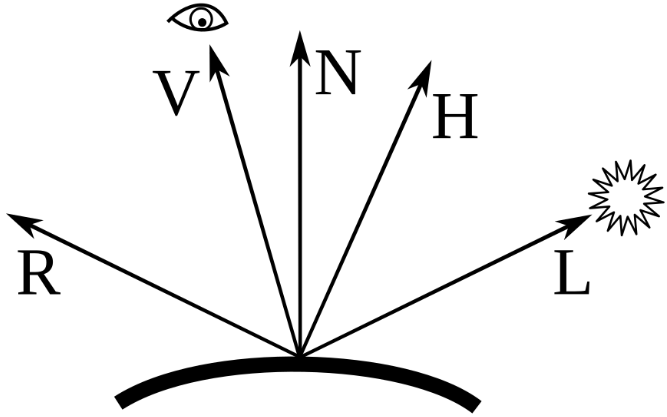

$$
\newcommand{\vecIII}[3]{\left[\begin{array}{c} #1\\\\#2\\\\#3 \end{array}\right]}
\newcommand{\vecIV}[4]{\left[\begin{array}{c} #1\\\\#2\\\\#3\\\\#4 \end{array}\right]}
\newcommand{\Choose}[2]{ { { #1 }\choose{ #2 } } }
\newcommand{\vecII}[2]{\left[\begin{array}{c} #1\\\\#2 \end{array}\right]}
\renewcommand{\vecIII}[3]{\left[\begin{array}{c} #1\\\\#2\\\\#3 \end{array}\right]}
\renewcommand{\vecIV}[4]{\left[\begin{array}{c} #1\\\\#2\\\\#3\\\\#4 \end{array}\right]}
\newcommand{\matIIxII}[4]{\left[
\begin{array}{cc}
#1 & #2 \\\\ #3 & #4
\end{array}\right]}
\newcommand{\matIIIxIII}[9]{\left[
\begin{array}{ccc}
#1 & #2 & #3 \\\\ #4 & #5 & #6 \\\\ #7 & #8 & #9
\end{array}\right]}
$$

# Physically Based Rendering

A few years ago, and over the course of quite a few versions, Threejs
transitioned from the Phong model and the material and lighting that
we learned to a more complex, sophisticated set of models under the
umbrella of Physically Based Rendering (PBR). Some of the changes:

- The material class `MeshStandardMaterial` was introduced as the "standard" PBR style material (metalness/roughness).
- The renderer gained support for "œphysically correct"€ lighting (e.g.,
  attenuation, correct light intensity models).
- There is `MeshPhysicalMaterial` which extends `MeshStandardMaterial`
  with more advanced PBR-‘features (clearcoat, transmission, etc).

Here are some documents that introduce the ideas. Please read them:

- [Wikipedia page on Physically-Based Rendering](https://en.wikipedia.org/wiki/Physically_based_rendering) This is short and gets us started.
- [Basic Theory of Physically-Based Rendering, by Jeff Russell](https://marmoset.co/posts/basic-theory-of-physically-based-rendering/) This discusses some of the ideas, but without math or code.
- [Physically-based Rendering in Discover threejs
  book](https://discoverthreejs.com/book/first-steps/physically-based-rendering/). This
  appears to be a bit old, so you should only skim this, but this
  article explains that we should be using
  - meters for units
  - lumens for light source brightness
  - `MeshStandardMaterial`
- [Threejs.org manual on Materials](https://threejs.org/manual/#en/materials)

## PBR Theory

If you are interested in the theory behind PBR, please consider reading this:

[PBR Theory from Learn OpenGL](https://learnopengl.com/PBR/Theory)

The document is terrifying in its complexity! I don't yet understand
all of it, and I don't expect you to. But you might read part of it
and try to get what you can from it. However, we can pull out a few
ideas, which I will describe below.

We start with the following, that PBR:

1. Be based on the microfacet surface model.
2. Be energy conserving.
3. Use a physically based BRDF (bi-directional reflection diffusion function)

The following subsections describe some of those ideas.

### Microfacets

The idea is that rough surfaces scatter the light in lots of
directions (chaotically), while smooth surfaces scatter the light in
fewer directions (more like a mirror). This determines the *specular
reflection*, very much like our Phong model.

### Energy Conservation

Light is split into two parts:

- *refraction*, which behaves differently for metals versus non-metals:
  - for non-metals, it is *scattered*, contributing to the diffuse color
  - for metals, it is completely absorbed
- *reflection*, which goes into specular reflection

These have to add up to 1, to preserve energy. Of course, if the
energy is completely absorbed by the material (converted to heat in
the real world), it's as if the light is simply lost, so I don't see
that energy conservation makes a big difference in PBR. However, they
do ensure that as specular highlights spread out, the amount of
reflected light stays the same, just spread thinner.

### Radiance

Light energy (radiant flux Φ) is measured in Watts (contrast this with
the Phong model, where it was just a number in some arbitrary units)
and ideally is broken up into the amount of energy at each wavelength,
but in practice just RGB wavelengths are used.

Radiant intensity is the amount of flux in a given solid angle
(cutting a 2D square out of a sphere).

All of this is used to compute the amount of light energy falling on a
surface, taking into account the surface normal and again using the
cosine function (dot product) to scale the energy based on its angle
with the surface. You'll notice this is similar in spirit to the Phong
model, but more physically accurate.

Here's a quote:

> This way, we can directly use radiance in our shaders to calculate a single light ray's per-fragment contribution.

The shader sums (integrates) the contributions of all the light rays
on a single fragment. (See next section for more about fragments).

### Fragments

A fragment is a potential pixel generated during rasterization that
holds all the data needed to compute the final color of that pixel on
screen.

Each fragment includes info like:

- Its screen position
- Depth value
- Interpolated attributes (like normals, UVs, etc.)
- Material and lighting inputs

The fragment shader processes each fragment to determine its final
color, possibly discarding it or modifying its depth. There are
several reasons a fragment might get discarded, but one we've already
discussed is the depth test that is part of the z-buffer algorithm.

So: Vertices --> triangles --> fragments --> pixels. Fragments are like "pixel candidates" that shaders color.

## Bidirectional Reflective Distribution Function (BRDF)

A key part of PBR is how light reflects off the surface. I can't
improve on their first paragraph, so I'll just repeat it:

> The BRDF, or bidirectional reflective distribution
> function, is a function that takes as input the incoming (light)
> direction $\omega_i$ , the outgoing (view) direction $\omega_o$ , the surface normal $n$
> , and a surface parameter $a$ that represents the microsurface's
> roughness. The BRDF approximates how much each individual light ray $\omega_i$
> contributes to the final reflected light of an opaque surface given
> its material properties. For instance, if the surface has a perfectly
> smooth surface (~like a mirror) the BRDF function would return 0.0 for
> all incoming light rays $\omega_i$ except the one ray that has the same
> (reflected) angle as the outgoing ray $\omega_o$ at which the function returns
> 1.0.

There are several possible BRDF's, but Threejs uses the Cook-Torrance
model. That divides into two parts: diffuse and specular. The diffuse
part is similar to the Phong model. The specular part is very
complicated. We should first talk about the halfway vector.

### Halfway Vector

For the specular part of the Phong model, we compute the direction of
reflection, $\vec{R}$ and the direction to the eye, $\vec{V}$ and we
see how well they line up: $\vec{R}\cdot\vec{V}$. Then we raise that
to a power based on the shininess:

$$ (\vec{R}\cdot\vec{V})^e $$

The halfway vector allows for an approximation to that computation
that has some advantages in calculation: cheaper and numerically more
stable. The halfway vector is halfway between the light and view
directions:

$$ \vec{H} = \frac{\vec{L} + \vec{V}}{||\vec{L}+\vec{V}||} $$

You can learn more and see some pictures in the Wikipedia page on
[Blinn-Phong](https://en.wikipedia.org/wiki/Blinn%E2%80%93Phong_reflection_model). I've
borrowed one picture here:




Vectors used in the Blinn-Phong model. R is the vector of perfect reflection, V is the vector to the viewer (eye), N is the surface normal, H is the halfway vector (halfway between V and L), and L is the vector to the light

Image by [Martin Kraus](https://commons.wikimedia.org/wiki/User:Martin_Kraus "User:Martin Kraus") - Own work, [CC0](http://creativecommons.org/publicdomain/zero/1.0/deed.en "Creative Commons Zero, Public Domain Dedication"), [Link](https://commons.wikimedia.org/w/index.php?curid=15534756)

In short, the halfway vector is halfway between the View direction
(direction to the eye) and the Light (light source). It's used to
compute specular highlights, by seeing how well it lines up with
$\vec{N}$, using the dot product.

### The Cook-Torrance

Returning to the specular part of the Cook-Torrance BRDF, it computes
three aspects of the reflection:

- **D**: Normal distribution function, which is how the surface
  microfacets align with with the halfway vector, which depends on the
  *roughness* of the surface. This is similiar in spirit to the
  computation of specular highlights in Blinn-Phong
- **G**: The geometry function, which has to do with how the roughness of
  the surface causes self-shadowing from various angles.
- **F**: The Fresnel function describes how much light is reflected at
  very low angles, when almost every surface is highly reflective.

We won't dig deeper than this. Let's come up for air and see some
practical stuff.

## Key PBR Parameters:

Despite the greater physical accuracy of the modeling equations, the
`MeshStandardMaterial` doesn't have a lot more parameters than the
Phong material. (Though there are some *maps* we'll discuss later.)

- roughness:
  - This is kind of the opposite of the Phong shininess.
  - It ranges from 0.0 (super smooth and shiny, like a mirror) to 1.0 (very rough, completely matte).
  - Low roughness = tight, sharp reflections.
  - High roughness = blurry or diffused reflections.
- metalness:
  - Also a value from 0.0 to 1.0, but often treated like a binary switch.
  - 0.0 = non-metal (dielectric: wood, plastic, cloth, skin, etc).
  - 1.0 = metal (iron, gold, copper, etc).
  - Values in between can work, but in real life, most materials are either clearly metal or not.
  - Values between 0 and 1 can model metals that have non-metal stuff on it, like dust, dirt, smudges

## Mesh Standard Material in Threejs

Use the demo in this

[MeshStandardMaterial reference page](https://threejs.org/docs/#MeshStandardMaterial)

to play with

- color
- roughness
- metalness

to get a sense of what we can do with Mesh Standard Material

## Lighting

We've talked a lot about the modeling of material, but another aspect
of PBR is that light is modeled more accurately. In particular, point
lights *attenuate* with distance, following the inverse square law:
that is, if a surface is twice as far from a point light, it receives
one quarter as much light. This makes physical sense, because the
light is spread over the surface of a sphere, and the surface area of
a sphere is proportional to the square of its radius.

This is the `decay` parameter for lights, which earlier in the course
I encouraged you to set to zero so that lights didn't fall off with
distance.

Here's how to create a point light in threejs:

```js
new PointLight( color : number | Color | string, 
    intensity : number, 
    distance : number, 
    decay : number )
```

- color: The light's color, Default is 0xffffff.
- intensity: The light's strength/intensity measured in candela (cd). Default is 1.
- distance: Maximum range of the light. 0 means no limit. Default is 0.
- decay: The amount the light dims along the distance of the light. Default is 2.

Notice that the intensity is measured in
[Candela](https://en.wikipedia.org/wiki/Candela) (cd). This is named
for candles, so 1 cd was roughly 1 candle-power (there's now a
fancier, more scientific definition).

The brightness of a light bulb you might buy and use are measured in
*lumens*, which is the *total* amount of light it puts out. An
ordinary "A19" bulb might be 480 lumens. (I looked one up on the Home
Depot website.)

Candela, on the other hand, is the *intensity* of the light: the
amount per unit of spherical area. If that ordinary bulb radiates
equally for an entire sphere (as a Threejs point source would), we
would divide by 4π. So the 480 lumens converts to about 38.2
candela. A bright, 1500 lumen light converts to about 120 candela.

See: [convert lumens to candela](https://www.omnicalculator.com/physics/lumen)

So, if you are modeling an indoor scene with point lights, you might
use numbers like those for each point light. But if your characters
are dining by candlelight, maybe only 1 or 2 candela.

## Demo

I made a very small demo. It needs more stuff in the scene to look
really good, but it has

- a "table" with a rough red "tablecloth"
- some "plates" on the cloth made of some smooth white material (china?)
- two candlesticks with orange flame
- a bright light in the center of the ceiling of a large "room" that has
  the table in it.
- there are walls, ceiling, and floor to the room

All the materials are `MeshStandardMaterial` with the exception of the
candle flames, since it didn't make sense to have them interact with
light. (I made them orange `MeshBasicMaterial`.) None of the materials
is metal, and they vary in roughness.

There are three lights: the ceiling light and two candles. The ceiling
light is bright (50 cd), while the candles are just 1 cd each.

You can use the GUI to turn off the ceiling light (turn down the
intensity to zero), and the effect of the candles is then obvious.

I think it looks okay, but it could use a lot of
tweaking. Nevertheless, it demonstrates the adjustments we make when
using standard materials.

[pbr/room](https://learn.sewanee.edu/d2l/le/content/43027/viewContent/406947/View)

## Summary

- Trying to model the actual physics of light and material, with no shortcuts and approximations as with the Phong model
- Energy conservation: a surface can't reflect more light than it receives
- Roughness: like shininess, but opposite and measured [0,1]
- metalness: whether a material is like metal (most are not).
- Use meters for distances and candela for the intensity of light sources