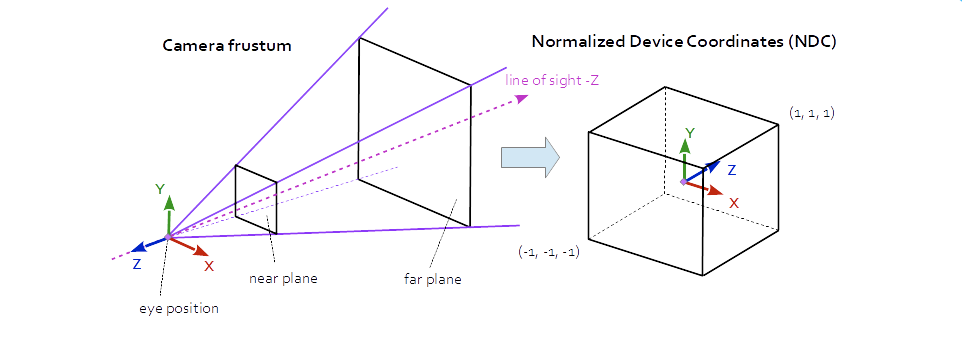
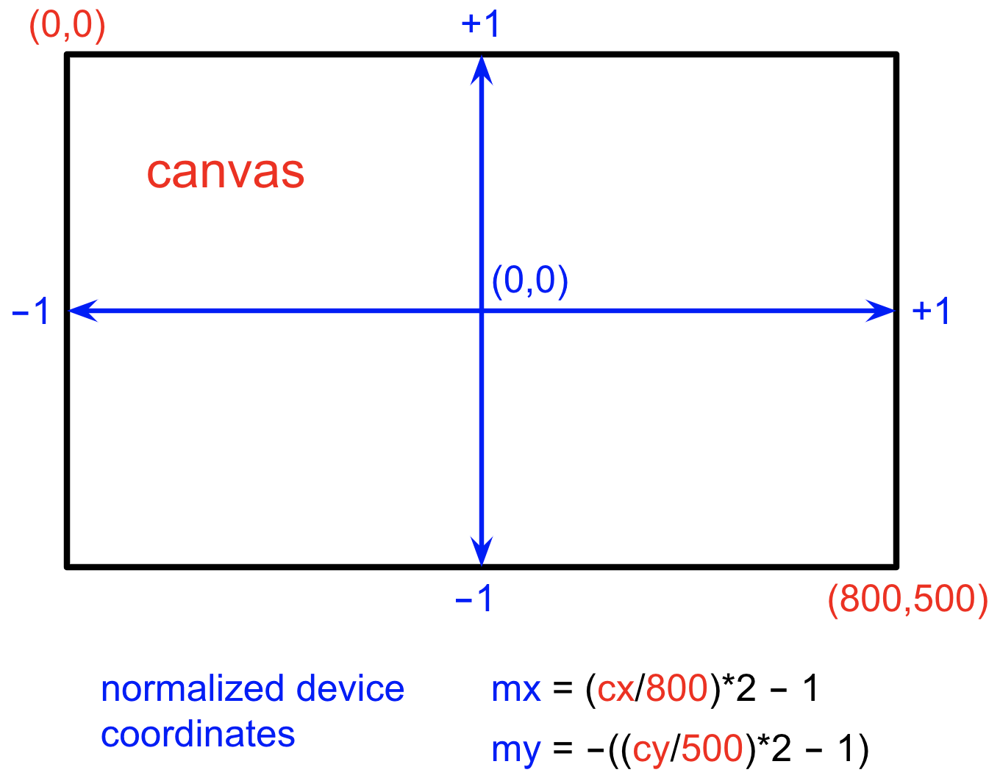

# Picking and Projection

In this reading, we'll look at how we can use mouse locations to
interact with the objects in our scene. But first, we'll finish up our
work with mouse motion.

## Mouse Movement; Click and Drag

We've looked at the `click` event and mapping the mouse coordinates in
the event object to locations on the canvas.

There are three other important events we can capture:

- [mousemove](https://developer.mozilla.org/en-US/docs/Web/API/Element/mousemove_event)
- [mousedown](https://developer.mozilla.org/en-US/docs/Web/API/Element/mousedown_event)
- [mouseup](https://developer.mozilla.org/en-US/docs/Web/API/Element/mouseup_event)

The combination of these allows us to handle click-and-drag, as MDN illustrates in their site:

[drawing with mouse events](https://developer.mozilla.org/en-US/docs/Web/API/Element/mousemove_event#examples)

This works because the code

- detects that a mouse button has gone down, and we record the start location
- detects that the mouse has moved, and draws a line from the start location to the current location
- detects that the mouse button has gone up, and we stop drawing

Their code is surprisingly compact. We can ignore the actual drawing code, which I've omitted:

```js
// When true, moving the mouse draws on the canvas
let isDrawing = false;
let x = 0;
let y = 0;

const myPics = document.getElementById("myPics");
const context = myPics.getContext("2d");

// event.offsetX, event.offsetY gives the (x,y) offset from the edge of the canvas.

// Add the event listeners for mousedown, mousemove, and mouseup
myPics.addEventListener("mousedown", (e) => {
  x = e.offsetX;
  y = e.offsetY;
  isDrawing = true;
});

myPics.addEventListener("mousemove", (e) => {
  if (isDrawing) {
    drawLine(context, x, y, e.offsetX, e.offsetY);
    x = e.offsetX;
    y = e.offsetY;
  }
});

window.addEventListener("mouseup", (e) => {
  if (isDrawing) {
    drawLine(context, x, y, e.offsetX, e.offsetY);
    x = 0;
    y = 0;
    isDrawing = false;
  }
});

function drawLine(context, x1, y1, x2, y2) {
  ...
}
```

I note that they use `e.offsetX` and `e.offsetY`, which is the offset
(coordinates) of the mouse relative to the event target, which in this
case is the canvas. That seems to be easier than using
`target.getBoundingClientRect()` like we did last time.

## Picking and Projection

So far, our interaction has been only to move the camera, but suppose we want
to interact with the objects in the scene. For example, we want to click on a
vertex and operate on it (move, delete, inspect, or copy it, or whatever). The
notion of "clicking" on a vertex is the crucial part, and is technically known
as *picking* , because we must pick one vertex out of the many vertices in our
scene. Once a vertex is picked, we can then operate on it. We can also imagine
picking line segments, polygons, whole objects or whatever. For now, let's
imagine we want to pick a vertex.

Picking is hard because the mouse location is given in window coordinates,
which are in a 2D coordinate system, no matter how we translate and scale the
coordinate system. The objects we want to pick are in our scene, in world
coordinates. What connects these two coordinate systems? *Projection*. The 3D
scene is projected to 2D window coordinates when it is rendered.

Actually, the projection is first to *normalized device coordinates* or NDC.
NDC has the x, y, and z coordinates range over [-1,1].

You might wonder about the existence of the z coordinate. Since we've
projected from 3D to 2D, aren't all the z values the same? Actually, the
projection process *retains* the information about how far the point is by
retaining the z coordinate. The view plane (the *near* plane) corresponds to
an NDC z coordinate of -1, and the *far* plane to an NDC z coordinate of +1.

The NDC coordinates are important because OpenGL will allow us to *unproject*
a location. To *unproject* is the reverse of the *projection* operation. Since
projecting takes a point in 3D and determines the 2D point (on the image
plane) it projects to, the *unproject* operation goes from 2D to 3D, finding a
point in the view volume that projects to that 2D point.

## Normalized Device Coordinates

Normalized Device Coordinates are near the end of a pipeline, where
world coordinates are at the beginning. Here's a nice picture:




The frustum or view volume is in world coordinates, but then they are projected to normalized device coordinates, or NDC

It's important to understand that the frustum (truncated pyramid) and
the cubes are the same scene. Objects towards the "far" plane shrink
when converting to clip space. That's what we mean by perspective:
things farther from the camera appear smaller.

The clip space is used by the graphics system to discard things that
are outside the frustum, or clip them off if they are partially
outside.

The coordinate system changes as well, for both clip space and
NDC. NDC doesn't depend on the world space units or the pixel
resolution of your screen: they are in a standardized (or normalized)
coordinate system.

It turns out, there are two standards in use. Some APIs have the z
coordinate of NDC ∈ [0,1] and some have it ∈ [-1,1]:

- [0,1] is the DirectX / Metal / Unity (and WebGPU) style NDC range.
- [-1,1] is the OpenGL / WebGL / Threejs range.

Threejs uses [-1,1].

## NDC and Canvas Coordinates

Objects in NDC are then mapped directly onto the canvas, in a
*parallel* projection, that just squeezes out the Z coordinate and
converts the (x,y) coordinates into pixels:




The NDC coordinates mapped onto an 800x500 canvas, and the computations to compute mouse coodinates from canvas coordinates

## Unprojecting

Obviously, unprojecting an (x,y) location (say, the location of a
mouse click) is an under-determined problem, since every point along a
whole line from the *near* plane to the *far* plane projects to that
point. However, we can *unproject* an (x,y,z) location in NDC to a
point in the view volume, essentially reversing the projection mapping
that we saw above. That z value is one we can specify in our code,
rather than derive it from the mouse click location.

Suppose we take our mouse click, (mx,my), and unproject two points,
one using z=-1, corresponding to the *near* plane, and one using z=+1,
corresponding to the *far* plane:

```js
var projector = new THREE.Projector();
var camera = new THREE.PerspectiveCamera(...);

function processMouseClick (camera, mx, my) {
    const clickNear = new THREE.Vector3( mx, my, -1 );
    const clickFar  = new THREE.Vector3( mx, my, 1 );
    clickNear.unproject(camera);
    clickFar.unproject(camera);
    ...
}
```

What this does is take the mouse click location, (mx,my), and find one point
on the near plane and another on the far plane. The Three.js `Projector`
object's `unprojectVector()` method *modifies* the first argument to unproject
it using the given camera.

Thought question: If we drew a line between those two *unprojected*
points, what would we see? Here's a demo that does exactly that:

[picking/unproject](https://learn.sewanee.edu/d2l/le/content/43027/viewContent/406357/View)

## Unproject Coding

Let's look carefully at the code for the unproject demo.

[picking/unproject](https://learn.sewanee.edu/d2l/le/content/43027/viewContent/406357/View)

First, there's the camera setup. Here, I've unpacked some of the
things that TW does for us. We'll need the actual camera object to do
the unprojection.

```js
import { OrbitControls } from 'three/addons/controls/OrbitControls.js';

const camera = new THREE.PerspectiveCamera(60, canvas.clientWidth/canvas.clientHeight, 1, 100);
camera.position.set(0, 2, 20);
const controls = new OrbitControls( camera, renderer.domElement );
```

At the end of the file, we have this animation loop:

```js
function animate() {
  requestAnimationFrame( animate );
  controls.update();
  renderer.render( scene, camera );
}

animate();
```

The `update` method updates the orbiting camera.

Now, let's look at how the mouse clicks are handled:

```js
function handleShiftClick(event) {
    if( ! event.shiftKey ) return;
    const ndc = convertMouseCoordsToNDC(event);
    console.log('click', ndc.x, ndc.y );
    drawLineThroughFrustum(ndc, camera);
}

document.addEventListener('click', handleShiftClick);
```

The actual event handler is very short. It returns immediately if the
shift key is not down. It then converts the mouse click x,y values to
normalized device coordinates (a `Vector2`) and then hands that to a
function to draw the line.

Here's the function to convert mouse coordinates to NDC:

```js
function convertMouseCoordsToNDC(event) {
    const rect = event.target.getBoundingClientRect();
    console.log('eventx', event.x, event.offsetX, event.x-rect.left);
    // Note the difference for converting Y. That's because Y goes from top to bottom
    const xNDC = ( (event.clientX - rect.left) / rect.width ) * 2 - 1;
    const yNDC = - ( (event.clientY - rect.top) / rect.height ) * 2 + 1;
    const ndc = new THREE.Vector2(xNDC, yNDC);
    return ndc;
}
```

That function is not easy, but it's essentially some linear mappings:

- `event.clientX` is in pixels measured from the upper left of the viewport (see below)
- subtract the left edge of the canvas so that the x value now starts at zero
- divide by the width of the canvas so we get a value between [0,1]
- multiply by 2 to get a value between [0,2]
- subtract 1 to get a value between [-1,+1]
- that's what we want for the x value of NDC

Computing the Y value is similar, but a little different because Y
increases as we go down, but we want the NDC value to increase from -1
to +1 as we go from the bottom of the window to the top.


This is a general picture of an element (such as a canvas) inside larger viewport (which is typically our browser window).

Figure from [MDN getBoundingClientRect](https://developer.mozilla.org/en-US/docs/Web/API/Element/getBoundingClientRect)

A (old) demo that may help:

[events](https://rtsowell.sewanee.edu/courses/cs360/threejs/demos/interaction/events.html)

## Raycasting

Our next step in picking is to take the line between those two points, and
*intersect* that line with all the objects in the scene. The Three.js library
has a `Raycaster` object that has a method that will take a point and a vector
and intersect it with a set of objects. It returns a list of all the objects
that the ray intersects, sorted in order of distance from the given point, so
the first element of the returned list is, presumably, the object we want to
pick.

The Threejs website has a nice live example:

[webgl\_interactive\_cubes](https://threejs.org/examples/#webgl_interactive_cubes)

You're encouraged to look at the code for that example.

Here are the key parts:

```js
const pointer = new THREE.Vector2();

function onPointerMove( event ) {
    pointer.x = ( event.clientX / window.innerWidth ) * 2 - 1;
    pointer.y = - ( event.clientY / window.innerHeight ) * 2 + 1;
}
```

This converts from x in pixels in the range [0,window.innerWidth] to x
in the range [-1,+1] and similarly for y. Those are the the NDC again,
but simplified because the code assumes the canvas is the entire
window. These NDC coordinates are stored in a global variable called
`pointer`.

Then, in the `render` function, we have:

```js
let INTERSECTED;

raycaster.setFromCamera( pointer, camera );

const intersects = raycaster.intersectObjects( scene.children, false );

if ( intersects.length > 0 ) {

    if ( INTERSECTED != intersects[ 0 ].object ) {

        if ( INTERSECTED ) INTERSECTED.material.emissive.setHex( INTERSECTED.currentHex );

        INTERSECTED = intersects[ 0 ].object;
        INTERSECTED.currentHex = INTERSECTED.material.emissive.getHex();
        INTERSECTED.material.emissive.setHex( 0xff0000 );

    }

} else {

    if ( INTERSECTED ) INTERSECTED.material.emissive.setHex( INTERSECTED.currentHex );

    INTERSECTED = null;

}
```

Let's walk through this.

- `INTERSECTED` is a global variable that will be set to the *closest* object to the viewer
- the `raycaster` is initialized based on the pointer location and the camera
- the raycaster returns a sublist of `scene.children` that the ray intersects,
  - sorted by distance, so
  - the first element is the closest
- If there are some intersected cubes
  - if it's the same one as last time, do nothing
  - if it's a new one
    - set the global `INTERSECTED` to the object
    - store its current emissive color in a new attribute called `currentHex`
    - set its emissive value to bright RED.

We also put in code to undo our changes to any former values of INTERSECTED.

Note that since the color is Lambert with no emissive value, we're
always storing and restoring 000000 or BLACK. But it's a good idea to
write robust code.

## Threejs article on Picking

The Threejs website has an excellent and thorough article on
[picking](https://threejs.org/manual/#en/picking) that you should
read. You can stop when you get to the part about GPU picking, though
you might find that interesting.

## Demo: Draggable Points

The example that allows you to click to create points and click-and-drag to
move them employs all of these techniques:

[picking/draggable-points](https://learn.sewanee.edu/d2l/le/content/43027/viewContent/406357/View)

Try it! Hold down the shift key and:

- click to create a point, and
- drag to move a point

The basic outline of the code is as follows:

1. Set up a camera; we'll need the camera object for the the `unproject` method.
2. Create the white plane that is our "paper", and add it to the scene
3. Define a function to create a point and add it dynamically to the scene, as well as to a list of intersectable objects
4. Define a function that uses a raycaster and a mouse click to determine what we have *picked*
5. Set up a mousedown handler that determines what we picked, and
   - if it's the paper, create a point, and
   - if it's a point, make it the `currentPointObject` which is the one we will drag
6. Set up a mousemove handler that
   - determines the new mouse location, and
   - moves the `currentPointObject` to that new location

Now let's work through the details of this.

## Camera Setup

Rather than use `TW.camera`, we'll pull apart some of these pieces,
because we want an explicit camera object (to use for the `unproject`
method). Here's the code:

```js
const cameraFOVY = 75;
const canvas = renderer.domElement;
const aspectRatio = canvas.clientWidth/canvas.clientHeight;

const sceneBoundingBox = {
    minx: -10, maxx: 10,
    miny: -10, maxy: 10,
    minz: 0, maxz: 0
};

var render;

function setupCamera(orbiting) {
    const cp = TW.cameraSetupParams(sceneBoundingBox, cameraFOVY);
    const camera = new THREE.PerspectiveCamera(cameraFOVY, aspectRatio, cp.near, cp.far);
    const at = cp.center;
    camera.position.set(at.x, at.y, at.z+cp.cameraRadius);
    render = function () { renderer.render(scene, camera); }
    globalThis.render = render;
    if(orbiting) {
        const oc = new OrbitControls(camera, canvas);
        oc.addEventListener('change', render);
        oc.target.copy( cp.center );
        oc.enablePan = false; // otherwise, dragging is panning, which we don't want.
        oc.update();
    }
    return camera;
}
const camera = setupCamera(true);
```

The `TW.cameraSetupParams()` function is how `TW.cameraSetup()` works:
it takes a bounding box for the scene and computes the center, and the
"camera radius", which is how far the camera needs to be from the
center so that the bounding box is inside the frustum.

The `OrbitControls` is a Threejs add-on that we've used all semester:
it sets up the mouse and keyboard callbacks to move the camera around,
dolly in/out, and so forth. Here, we've turned off the "pan" feature
so that we don't move the camera when we drag the points.

If you just want a fixed camera, you can do that.

## Paper Background

We don't have to have a piece of white "paper" to put the points on;
they could just be floating in space at Z=0, but I decided to put an
object there. It also is used in the raycaster when we decide where to
put a new point.

```js
const paper = new THREE.Mesh(new THREE.PlaneGeometry(20,20),
                             new THREE.MeshBasicMaterial({color: "white"}));
paper.name = "paper";
scene.add(paper);

// This is the list of objects we are interested in "picking"

const intersectionObjects = [paper];
```

Nothing really new here.

## Dynamic Points

Next, we need to be able to dynamically create points and add them to
the scene:

```js
const points = [];              // the points that have been dynamically added
var currPointObj = null;        // the current point, for moving

// useful if we want to print the points, maybe to use in another graphics project
function printPoints() {
    var i;
    console.log("[");
    // start at 1 to skip the paper plane
    for( let i=1; i<intersectionObjects.length; i++) {
        const p = intersectionObjects[i].position;
        console.log("["+p.x+","+p.y+","+p.z+"],");
    }
    console.log("]");
}
globalThis.printPoints = printPoints;

function addSphereAt(pt) {
    var sph = new THREE.Mesh( new THREE.SphereGeometry(0.5),
                              new THREE.MeshNormalMaterial());
    sph.position.copy(pt);
    scene.add(sph);
    return sph;
}
```

Again, nothing really new there. The `printPoints` function is put in
`globalThis`, so you can do it from the JS console. Or we could define
a keyboard handler to do it.

Now, let's turn to some more challenging parts of the code.

## Raycasting and Picking

Raycasting

```js
const raycaster = new THREE.Raycaster();

// Pick an object in the scene (among the pickable objects). Either
// (1) paper, (2) an existing point, or (3) null.
function pickPaperPoint(clickNDC) {
    const click = clickNDC;
    const clickNear = new THREE.Vector3( click.x, click.y, -1 );
    const clickFar  = new THREE.Vector3( click.x, click.y, +1 );
    clickNear.unproject( camera);
    clickFar.unproject( camera);

    // configure raycaster with origin and direction
    const dir = clickFar.clone();
    dir.sub(clickNear).normalize();
    raycaster.set( clickNear, dir );

    // console.log("looking for intersections");
    const intersects = raycaster.intersectObjects(intersectionObjects);
    // console.log("found "+intersects.length+" intersections");
    if(intersects.length == 0) {
        // console.log('no intersection');
        return null;
    } else {
        return intersects[0];
    }
}
```

The `pickPaperPoint` (say that three times fast!) function gets called
from the event handler with a click object in NDC (normalized device
coordinates). As with the "unproject" demo, we unproject the click to
the near and far planes. We then subtract those two points to give us
the *direction*.

Next, we *configure* the raycaster, specifying

- the *origin* of the ray — in this case `clickNear`, and
- the *direction* of the ray — in this case `dir`. This vector
  needs to be normalized, which we did just before.

Then, we use `raycaster.intersectObjects` and give it a list of
objects we are interested in. (You can also use the `scene`, if you
want.)

The return value of the raycaster is a list of intersections and
information about each one. Actually, a *lot* of [information about
each
intersection](https://threejs.org/docs/?q=raycaster#Raycaster.~Intersection). The
list element is a dictionary, some of whose keys are:

- `distance` from the ray's origin to the intersection point
- `point` the intersection point, in world coordinates
- `face` the face of the object that the ray intersected.
- `faceIndex` the index of the face
- `object` the object (e.g. a mesh) that was intersected

The function then returns the first element of the list of
intersections, which is the *closest* one.

## Mouse Down Handler

The code above is used by the handler for the mouse button going down
(a click or the beginning of a drag). Here's the code:

```js
function onMouseDown(evt) {
    if( ! evt.shiftKey ) return; // only handle shift-click
    isMouseDown = true;
    const click = convertMousePositionToNDC(evt);
    const pick = pickPaperPoint(click);
    if(pick == null) return;
    if(pick.object == paper) {
        console.log("picked the paper, so create a sphere there");
        const point = pick.point.clone(); // the point of intersection, in world coordinates
        if( Math.abs(point.z) > 0.000001 ) {
            console.log("Something is wrong in this intersection; z should be zero");
        }
        point.z = 0;                // in case there's a tiny, non-zero bit
        // create a new object and set the global
        currPointObj = addSphereAt(point);
        intersectionObjects.push(currPointObj);
        render();
    } else {
        console.log('picked a point; save it for dragging');
        currPointObj = pick.object;
    }
}
```

This first converts the click to NDC from the event object, then it
calls our `pickPaperPoint` function.

If the `object` that was picked was the paper, then we want to create
a new point. We do that with the `addSphere` function. We also make
the new sphere the value of a global variable, `currPointObj` which we
will use for dragging. Finally, we render the scene.

If the picked object isn't the paper, it must be one of our previously
created points (since those are the only things on the
`intersectionObjects` list). So we make the object the value of
`currPointObj`.

We add this handler in the usual way:

```js
document.addEventListener( 'mousedown', onMouseDown, true );
```

## Mouse Move Handler

The next thing to handle is dragging, which we will do with the
`mousemove` event. This event happens any time the mouse moves,
whether a button is down (dragging) or not. Here's our handler:

```js
function onMouseMove(evt) {
    if( ! evt.shiftKey ) return; // only handle shift-click
    if( ! isMouseDown ) return;
    // we're only interested in moving the currentPointObj
    if( currPointObj == null ) {
        return;
    }

    const click = convertMousePositionToNDC(evt);
    const pick = pickPaperPoint(click);
    if(pick == null) return;

    // move currentPointObj to new location, defined by pick.point;
    // To avoid moving it towards the camera, we zero out the z coordinate
    const tmp = pick.point.clone();
    tmp.z = 0;
    currPointObj.position.copy(tmp);
    render();
}
```

We begin by checking if the shift key is down and if the mouse button
is down. (The `isMouseDown` value was set in the `mousedown` event
handler.) If not, return. If there's no object, return.

If there's an object, we act similarly as before: we convert the mouse
coordinates to NDC, pick a location, and then move the
`currentPointObj` to the world coordinates of the picked location.

Since it's possible that the picked location might, for example, be
one of the spheres and not the paper, its z value might not be
zero. But we only want to move the current object on the paper, so we
keep its z coordinate at zero. Finally, we set the `position`
attribute of the object (one of our spheres) to a new value, just like
we did in the first two weeks of the course.

We can set up this event handler in the usual way. While we are at it,
we might as well handle the mouse button going up.

```js
document.addEventListener( 'mousemove', onMouseMove, true );

function onMouseUp(evt) {
    isMouseDown = false;
    currPointObj = null;
}

document.addEventListener( 'mouseup', onMouseUp, true );
```

That's it! That's how we can add spheres to a scene and drag them
around.

## Summary

We've covered a lot of ground and read a lot of code, but the concepts
are not too many.

- We can combine mousedown, mousemove, and mouseup to implement
  click-and-drag behavior. We started with the MDN 2D example, and by
  the end, we were able to drag spheres around in our Threejs scene.
- We learned about NDC: normalized device coordinates, where x, y and z are all ∈ [-1, +1].
- The `Vector3.unproject(camera)` method can *reverse* the projection
  from the scene to NDC, taking some coordinates in NDC and computing
  world coordinates for them.
- We learned about raycasting, where a ray is shot into the scene and
  returns a list of all the things the ray intersected with.
- Raycasting is critical for *picking* which is the ability to choose
  a scene object using the mouse, so that we can interact with it.

# Appendix

The following information is not central, but might prove useful in
some situations, particularly if your canvas is on a larger document
where there are other event handlers around.

## Event Bubbling

In this reading, we've always bound the listeners to the `document`,
but if your graphics application is running in a canvas on a larger
page that has other things going on, an issue that can arise is that
the other applications may also bind the `document` and then *both*
event handlers might get invoked. This is because both events can get
handled by the document in a technique called *event bubbling*. If you
want to learn more, you might start with the [Quirks Mode page on Event
Bubbling](http://www.quirksmode.org/js/events_order.html). There are,
of course, other explanations on the web as well.

One solution, is to bind the listener to some parent of the canvas
instead, and then stop the propagation to prevent the event from bubbling further.

```js
parent.addEventListener('click',
    function (event) { 
         event.stopPropagation(); // doesn't bubble farther up
         ...
    });
```