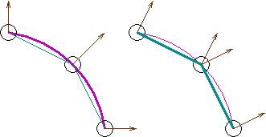
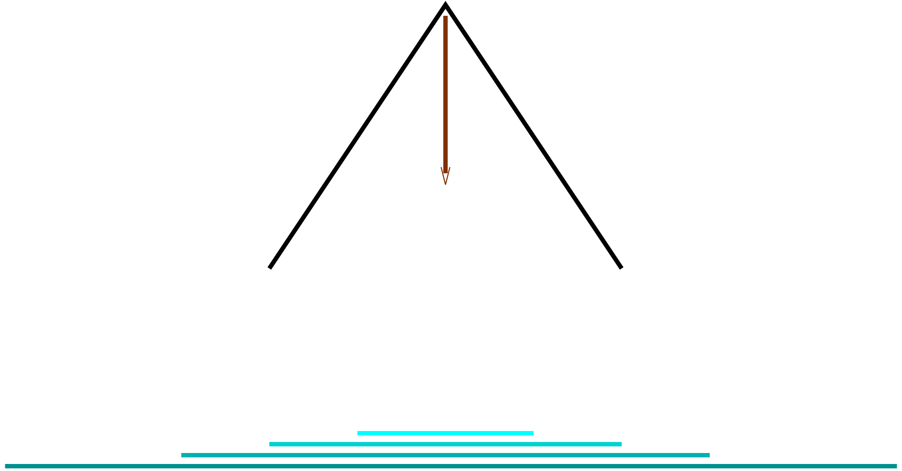

$$
\newcommand{\vecIII}[3]{\left[\begin{array}{c} #1\\\\#2\\\\#3 \end{array}\right]}
\newcommand{\vecIV}[4]{\left[\begin{array}{c} #1\\\\#2\\\\#3\\\\#4 \end{array}\right]}
\newcommand{\Choose}[2]{ { { #1 }\choose{ #2 } } }
\newcommand{\vecII}[2]{\left[\begin{array}{c} #1\\\\#2 \end{array}\right]}
\renewcommand{\vecIII}[3]{\left[\begin{array}{c} #1\\\\#2\\\\#3 \end{array}\right]}
\renewcommand{\vecIV}[4]{\left[\begin{array}{c} #1\\\\#2\\\\#3\\\\#4 \end{array}\right]}
\newcommand{\matIIxII}[4]{\left[
\begin{array}{cc}
#1 & #2 \\\\ #3 & #4
\end{array}\right]}
\newcommand{\matIIIxIII}[9]{\left[
\begin{array}{ccc}
#1 & #2 & #3 \\\\ #4 & #5 & #6 \\\\ #7 & #8 & #9
\end{array}\right]}
$$

# Spotlights

In this reading, we'll continue our work with material and lighting,
covering *spotlights* and a few other topics.

## Flat versus Smooth Shading

To begin, consider the following picture from the Wikipedia page on [Phong](https://en.wikipedia.org/wiki/Phong_shading):


On the left, a sphere with flat shading, looking very faceted; on the right, a sphere with the same geometry, looking very smooth.

The graphics card renders triangles (*fragments*) based on the properties of
its vertices. In particular, if the surface normals at the three vertices are
different, the lighting calculation will differ and the computed color at the
three vertices will be different.

You can request that all the pixels of the triangle be given the same color as
the first vertex, or the color can be *interpolated* across the triangle.
Giving all the pixels the same color is called *flat shading* and
interpolating the color is called *smooth shading*. That's because flat
shading is appropriate for a polyhedron that is modeling a polyhedral (flat-
sided) object, while smooth shading is appropriate for a polyhedron that is an
*approximation* of a smooth surface.

Consider the following picture:



The magenta and teal objects have the same three vertices and the same
geometry, but the teal object is intended to look flat-sided, like a
faceted jewel, while the magenta object is intended to look
smooth-sided, like a ball. The picture has curved magenta lines, but
that's not the actual representation.

The surface normals (brown arrows) would be *different* for the jewel
and the ball. More importantly, because the color between the pairs of
vertices on the magenta object are different (different normals), the
color will be interpolated between them. In the jewel, the normals are
the same (the middle point has two vertices: one belonging to the
upper face and one belonging to the lower face, each with a surface
normal that is correct for that face).

For the "smooth" object, the face normals at each vertex are
*averaged*. So the geometry starts with the normals on the right
above, but the two normals for the middle vertex are averaged, and the
vertex normal is replaced with the average. Similarly for the other
vertices.

The key code to achieve these different effects is shown in the two
material examples below, which are identical except for their
`flatShading` property:

```js
const ballMaterial = new THREE.MeshPhongMaterial(
    {color: color,
     specular: 0xffffff,
     flatShading: false });

const jewelMaterial = new THREE.MeshPhongMaterial(
    {color: color,
     specular: 0xffffff,
     flatShading: true });
```

Here is a demo using Three.js that contrasts smooth shading and flat shading:

[spotlights/jewel-and-ball](https://learn.sewanee.edu/d2l/le/content/43027/viewContent/402556/View)

Note that flat versus smooth shading is a property of the *material*
not the light.

The main differences:

With *smooth* shading (the Threejs default):

- Normals: Interpolated across the surface of the triangle.
- Lighting: Calculated per-vertex, then interpolated across the triangle per-pixel.
- Result: Creates a smooth gradient across surfaces. Adjacent faces blend seamlessly.

The vertex normals are averaged at shared vertices, creating smooth
transitions.

With *flat* shading:

- Normals: One normal per face. Each triangle has a single normal, typically perpendicular to the face.
- Lighting: Same across the entire triangle -- lighting is calculated using this face normal.
- Result: Each face is uniformly lit, creating a faceted, "low-poly"
  look -- even if there is some pixel-wise color difference due to
  screen-space interpolation or shaders.

Usually, we want smooth shading, but there may be times when you want flat shading.

## Spotlights

A spotlight is just a point source limited by a cone of angle $\theta$¸ (think of
those ["Luxo" lamps](https://en.wikipedia.org/wiki/Luxo_Jr.) made famous by
Pixar, or a flashlight). Intensity is greatest in the direction that the
spotlight is pointing and trails off towards the sides, dropping to zero when
you reach the cutoff angle $\theta$. Something like the following figure:



A spotlight has a cone and illuminates an area where it is facing. The
light is brighter towards the center.

The following is one way to implement the effect of a spotlight. Let $\alpha$ 
be the angle between the spotlight direction and the direction that
we're interested in. When $\alpha=0$, the intensity is at its maximum ($I=I_0$,
where $I_0$ is the intensity of the light source). The cosine function
has this property, so we use it as a building block. To give us
additional control of the speed at which the intensity drops off
(therefore, how concentrated the spotlight is), we allow the user to
choose an exponent, $e$, for the cosine function.
The resulting function is:

$$ I = I_0 \cos^e(\alpha)$$

(for $\alpha<\theta$, otherwise zero)

The newest version of Three.js replaces the *exponent* with a
*penumbra* percentage, but doesn't adequately define it. It has a
similar (though not identical) effect, but ranges from 0 to 1 instead.

To do this in Three.js, we create a
[THREE.SpotLight](https://threejs.org/docs/#api/en/lights/SpotLight)

```js
const spotlight = new THREE.SpotLight( color,       // rgb values
                                       intensity,   // a multiplication factor
                                       distance,    // where the light ends
                                       cutoffAngle, // in radians < pi/2
                                       penumbra,    // 0-1, default is 0
                                       decay        // how the light decays with distance
                                        );
spotlight.position.set( 1, 2, 3);
scene.add(spotlight);
```

The `decay` parameter is the same as for point lights, so we will
again use zero for that, unless and until we switch to physically
based rendering.

### Spotlight Direction

Aiming the spotlight is important. It could be done with a vector, but in
Three.js, they use the position of a *target*. The target is a property of the
spotlight, and is *also* an object in the scene. (It doesn't have to be a
visible object; it could just be an empty location.) Here's the code to aim
the spotlight at the origin:

```js
const spotlight = new THREE.SpotLight( color,       // rgb values
                                       intensity,   // a multiplication factor
                                       distance,    // where the light ends
                                       cutoffAngle, // in radians < pi/2
                                       penumbra,    // 0-1, default is 0
                                       decay        // 0
                                      );
spotlight.position.set( 1, 2, 3);
spotlight.target.position.set( 0, 0, 0);
scene.add(spotlight);
scene.add(spotlight.target);
```

From the docs: It is also possible to set the target to be another
object in the scene (anything with a position property), like so:

```js
const targetObject = new THREE.Object3D(); 
scene.add(targetObject);

light.target = targetObject;
```

## Spotlight Demo

Here is a demo that shows how to control a spotlight. Take a minute to explore and play with it now.

[spotlights/spotlight](https://learn.sewanee.edu/d2l/le/content/43027/viewContent/402556/View)

## Summary

In Three.js, you can have:

- Lights:
  - Point lights
  - Ambient light
  - Directional lights
  - Spotlights
- Spotlights have
  - a cutoff angle
  - a decrease in intensity as the direction to the pixel approaches the cutoff angle (exponent or penumbra)
  - a direction, defined by a *target* 's position.
- Materials can use either *smooth* or *flat* shading; this controls
  the interpolation of pixel colors across triangular facets