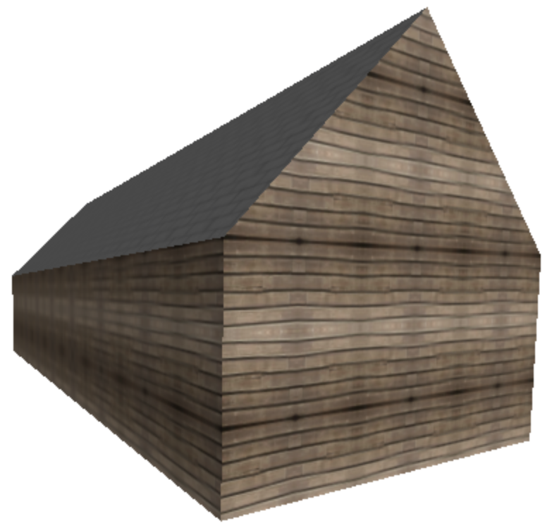
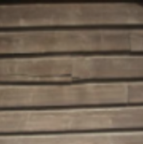
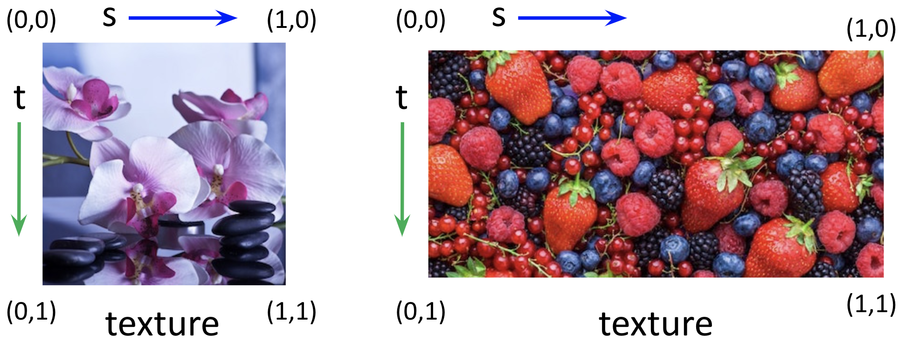
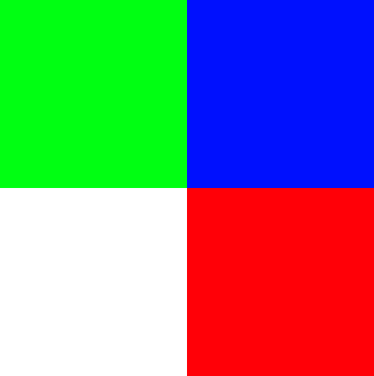
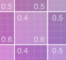
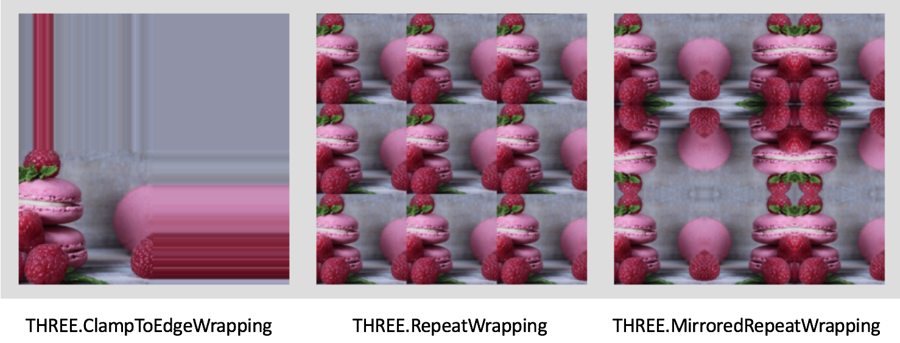

$$
\newcommand{\vecIII}[3]{\left[\begin{array}{c} #1\\\\#2\\\\#3 \end{array}\right]}
\newcommand{\vecIV}[4]{\left[\begin{array}{c} #1\\\\#2\\\\#3\\\\#4 \end{array}\right]}
\newcommand{\Choose}[2]{ { { #1 }\choose{ #2 } } }
\newcommand{\vecII}[2]{\left[\begin{array}{c} #1\\\\#2 \end{array}\right]}
\renewcommand{\vecIII}[3]{\left[\begin{array}{c} #1\\\\#2\\\\#3 \end{array}\right]}
\renewcommand{\vecIV}[4]{\left[\begin{array}{c} #1\\\\#2\\\\#3\\\\#4 \end{array}\right]}
\newcommand{\matIIxII}[4]{\left[
\begin{array}{cc}
#1 & #2 \\\\ #3 & #4
\end{array}\right]}
\newcommand{\matIIIxIII}[9]{\left[
\begin{array}{ccc}
#1 & #2 & #3 \\\\ #4 & #5 & #6 \\\\ #7 & #8 & #9
\end{array}\right]}
$$

# Texture Mapping Part 2

Last time, we learned how to load external image files into our JS
program, using `THREE.TextureLoader()` and a *callback* function that
takes the loaded texture and creates our texture-mapped object.

This reading covers several important issues:

- Repeating a texture
- Texture coordinates
- Combining (blending) color and texture. The color might be
  computed from material and lighting.

## Repeating Textures

Suppose we want to create the appearance of a natural repetitive texture, such
as that shown on the sides of the barn below. We can achieve this effect by
tiling the surface with multiple copies of a small snippet of texture, like
that shown to the right of the barn.

<figure>


<figcaption>the walls of the barn on the left were texture-mapped using the wood texture (image) on the right<figcaption>
</figcaption></figcaption></figure>


In general, it's useful to be able to use images as, well, *textures*,
like stripes, checks, polka dots, grass, wood-grain, etc. (That's
really where the name "texture mapping" comes from.)

In the following demo, the floral image is again mapped onto a plane, but
repeated four times in the horizontal direction and twice in the vertical
direction:

[texture2/repeating-flowers/](https://learn.sewanee.edu/d2l/le/content/43027/viewContent/403348/View)

Flowers are more obviously repeated than wood, which is useful for a
demo. You can think of this like wallpaper or something.

The code is not complicated. There's a `repeat(s,t)` method for a
texture and we can say that we want the texture to repeat in both
directions. Whenever we make this change to a texture, we have to set
`needsUpdate` to `true` so that certain things get updated. So, the
code is just:

```js
function displayPlane (texture) {
    const planeGeom = new THREE.PlaneGeometry(params.width, params.height);
    // specify repetitions texture
    texture.repeat.set(params.repeatS, params.repeatT);
    texture.wrapS = THREE.RepeatWrapping;
    texture.wrapT = THREE.RepeatWrapping;
    texture.needsUpdate = true;

    const planeMat = new THREE.MeshBasicMaterial({color: 0xffffff,
                                                  map: texture});
    scene.remove(plane);
    plane = new THREE.Mesh(planeGeom, planeMat);
    scene.add(plane);
}
```

We'll talk about these "directions" in just a moment.

## Texture Tutor

When we repeat a texture across a quadrilateral (quad) we have some
choices, which are the values of `wrapS` and `wrapT` (each has the
same choices). The are:

- `THREE.ClampToEdgeWrapping` (this is the default)
- `THREE.RepeatWrapping` (start over from the beginning)
- `THREE.MirroredRepeatWrapping` (go back to the beginning)

Here's a demo that allows you try those:

[texture2/tutor](https://learn.sewanee.edu/d2l/le/content/43027/viewContent/403348/View)

## Texture Coordinates

It's now time to understand a bit more of what goes on under the
covers of texture-mapping. To do that, we have to introduce *texture
coordinates*. The texture coordinates will tell us *where* we are in a
texture.

A texture is an array of pixels, such as an image, and the coordinates
of locations within a texture array are represented conceptually using
a coordinate system that ranges from 0 to 1 in the horizontal and
vertical directions. Typically, `s` and `t` are used to denote the
horizontal and vertical coordinates, although `(u,v)` is also
used. Threejs uses both, in different places. Fair warning.

The diagram below shows two sample images that might be used for texture
mapping, showing the texture coordinates:




The textures have their own coordinate system, with s
going left to right, and t going from top to bottom. Both s and t go
from 0 to 1, even though the images are different sizes.


Regardless of the aspect ratio of the image dimensions, the texture
coordinates range from `(0,0)` in the upper left corner to `(1,1)` in
the lower right corner.

Three.js has a default strategy for mapping from the above texture
coordinates to the triangular faces of a built-in geometry, but often
we want to control this mapping more carefully. We do this by
specifying a pair of texture coordinates `(s,t)` for each vertex of
the geometry. For geometries that we create from scratch, this step is
essential. We will look at this more deeply when we get to creating
our own geometries.

An image that is very useful when trying to understand texture coordinates and
how they map onto geometries is the following image, a UV grid:


If you are ever confused about how the texture coordinates on some
geometry are defined, an excellent way to investigate is to
texture-map that UV grid onto the geometry:

- The red corner will be where (0,0) is,
- The green corner will be where (1,0) is,
- The magenta corner will be where (0,1) is,
- The blue corner will be where (1,1) is

We'll come back to texture coordinates in a moment, but we have to
take a very brief detour to talk about `flipY`.

## FlipY

The tutor has a check-box for `flipY`. The reason for this is that,
internally, Threejs uses (0,0) as the *lower left* of the texture. But
that's awkward for images that are loaded from external files, which
is almost always what we do, including the UV Grid. For those external
image files, it's natural to think of (0,0) as the upper left (and
that's how the UV Grid is labeled). So, by default, Threejs flips the
image vertically when it loads it, and it sets `flipY` to true.

That's not the case for `THREE.DataTextures` where we compute an array
of pixels in JS. For the tutor above, there are two images. The first
one you see is just a tiny 2x2 array of pixels. Element [0,0] is
*white*. And if you view that image in the tutor with `flipY==false` ,
you see the following:



Toggle the `flipY` and you'll see the plane changes so that the white
square is at the upper left.

The other image that the tutor makes available is, of course, the UV
Grid, which has 0,0 in the upper left, and, indeed, it looks weird if
`flipY` is false.

## Texture Coordinates and Repetition

One important use of texture coordinates is to figure out what texel
to use when computing a pixel. Imagine that the center of the pixel is
on a quadrilateral (quad) with two parametric lines, say (0.4,0.6).

To determine the color of the texture-mapped pixel, we *sample* the
texture at the location (0.4, 0.6). For the UV Grid, it's sampling
this section of the image:




this is the section of the UV Grid where s (the
horizontal position) is between 0.4 and 0.5 and t (the vertical
position) is between 0.5 and 0.6

In fact, it's sampling the lower left of that zoomed-in portion.

## Wrap Modes

If we have repetition, the s and t coordinates are allowed to go
outside the range [0,1]. They go up to the values in the `repeat()`
method. So if we have `repeat.set(4,1)`, the s coordinate goes from 0
to 4.

Suppose we have s=1.25. The setting of `wrapS` has one of three
possible "wrap modes":

- (clamp) `THREE.ClampToEdgeWrapping` the value of s is "clamped" (limited) to 1, so the s=1 edge texel is repeated.
- (repeat) `THREE.RepeatWrapping` the value of s "wraps around" so 1.25 is treated like 0.25, so the pixel is computed from the texel 1/4th of way across the texture.
- (mirror) `THREE.MirroredRepeatWrapping` The value of s goes back down towards zero, so 1.25 is treated the same as 0.75, so the pixel is computed from a texel 3/4 of the way across the texture.

Here are examples of using those wrap modes on the flower image:



I have rarely seen a good use for *clamp*. It is sometimes nice when,
the edge texels are all white and you just want the white pixels to
continue. Still, that's rare. The "repeat" is often nice, but
sometimes shows "seams" when the texture starts over, depending on the
texture. The "mirror" option avoids the seams but sometimes the
mirroring shows.

Generally, if you are putting, say, a grass texture over a large bit
of geometry, some kind of repetition is useful. Either that, or you
have to load a very large image.

## Lighting and Textures

So far, we've just mapped textures onto plain white surfaces. In fact,
in the underlying computation, the texel RBG values are *multiplied*
by the RGB values as computed by material and lighting to yield the
RGB values for the final rendered image. Since the RGB values of
"white" are all 1, that multiplication has no effect, and we see
exactly the texture image. However, if the RGB values are less than
one, the image is darkened.

Consider the following demo, which is our spotlit plane demo with
texture-mapping added. I used spotlights, since it shows a variety of
intensities, so you can see how some parts of the texture are
multiplied by white, some by gray, and some by black. In fact, if you
turn up the intensity a lot, the texture is overwhelmed and you just
get white.

[texture2/spotlit-image/](https://learn.sewanee.edu/d2l/le/content/43027/viewContent/403348/View)

One question, though, is what *color* the material should be. If the
material has any *hue* , it might interact in odd-looking ways with
the colors of the texture. (The demo above uses white material, but
you can try using other colors.) Thus, it makes sense for the material
to be *gray*. It should probably be a fairly light shade of gray, maybe
even white, since lighting works by multiplying the material by a
value less than one, so typically the result is darker than the
original. However, it also depends on how many lights are in the
scene, since the contributions of all the lights are added up, so
colors can also get brighter, even over-driven. So, there's still some
artistic judgment involved.

The implementation code is pretty straightforward. We replace our
`THREE.MeshBasicMaterial` with `THREE.MeshPhongMaterial` and add
lights to the scene. Here's the code for the plane:

```js
function displayPlane (texture) {
    const planeGeom = new THREE.PlaneGeometry(params.width, params.height);
    const planeMat = new THREE.MeshPhongMaterial({color: params.planeColor,
                                                  specular: params.planeSpecular,
                                                  shininess: params.planeShininess,
                                                  map: texture});

    scene.remove(plane);
    plane = new THREE.Mesh(planeGeom, planeMat);
    scene.add(plane);
    console.log("new plane");
}
```

## Summary

We learned about

- texture *repetition*, using the `.repeat(sReps,tReps)` method on textures
- *wrap* modes;
  - (clamp) `THREE.ClampToEdgeWrapping` the value of s is "clamped" (limited) to 1, so edge pixels repeat
  - (repeat) `THREE.RepeatWrapping` the value of s "wraps around" so the texture repeats
  - (mirror) `THREE.MirroredRepeatWrapping` The value of s goes back
    down towards zero, the texture repeats backwards
- combining texture mapping with material and lighting, so that objects can be both lit and textured