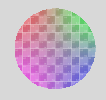
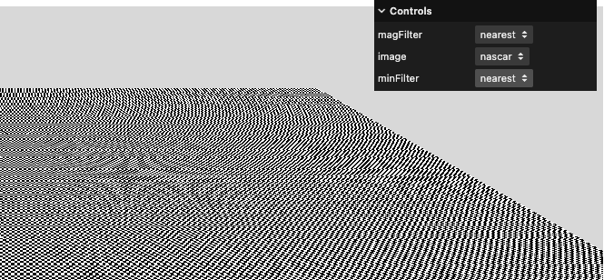
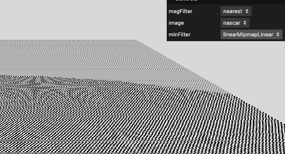

$$
\newcommand{\vecIII}[3]{\left[\begin{array}{c} #1\\\\#2\\\\#3 \end{array}\right]}
\newcommand{\vecIV}[4]{\left[\begin{array}{c} #1\\\\#2\\\\#3\\\\#4 \end{array}\right]}
\newcommand{\Choose}[2]{ { { #1 }\choose{ #2 } } }
\newcommand{\vecII}[2]{\left[\begin{array}{c} #1\\\\#2 \end{array}\right]}
\renewcommand{\vecIII}[3]{\left[\begin{array}{c} #1\\\\#2\\\\#3 \end{array}\right]}
\renewcommand{\vecIV}[4]{\left[\begin{array}{c} #1\\\\#2\\\\#3\\\\#4 \end{array}\right]}
\newcommand{\matIIxII}[4]{\left[
\begin{array}{cc}
#1 & #2 \\\\ #3 & #4
\end{array}\right]}
\newcommand{\matIIIxIII}[9]{\left[
\begin{array}{ccc}
#1 & #2 & #3 \\\\ #4 & #5 & #6 \\\\ #7 & #8 & #9
\end{array}\right]}
$$

# Texture Mapping Part 3

This reading concludes our work on texture mapping. We'll cover:

- texture mapping onto curves and surfaces
- texture mapping onto non-rectangular surfaces
- magnification and minification

## Mapping onto Circles

Mapping onto a circle is not so bad. The texture coordinates for the
circle geometry don't cover the whole range from 0-1, so we are
essentially cutting a circle out of the unit square of texture
coordinates, so we don't get any distortion. This is good news. (Older
versions of Threejs, as I recall, didn't do that.) Here's a screenshot
of our UV grid texture-mapped onto a circle:



Here's a live demo you can play with:

[texture3/circle](https://learn.sewanee.edu/d2l/le/content/43027/viewContent/403542/View)

There are several options there, using keyboard callbacks to choose:

1. a map of the world
2. the UV grid, so you can see how the texture coordinates map
3. a plain grid, but it's not square, so you get some distortion.

Just a reminder, here's how you can set up keyboard callbacks:

```js
TW.setKeyboardCallback('1', globe, 'globe');
TW.setKeyboardCallback('2', uvCircle, 'UV circle');
TW.setKeyboardCallback('3', gridCircle, 'grid circle');
```

Where the first argument is the key, as a string of length 1, the
second argument is the function you want invoked, and the third
argument is the documentation for the "?" character.

## Mapping Textures onto Curved Surfaces

In Three.js, textures can be mapped onto curved objects (e.g. spheres, cones,
or cylinders) in the same way they're mapped onto flat surfaces, by setting
the `map` property for the material to a `THREE.Texture` object.

Here's a demo of mapping onto a sphere

[texture3/globe](https://learn.sewanee.edu/d2l/le/content/43027/viewContent/403542/View)

There are several options there, using keyboard callbacks to choose:

1. a globe
2. the UV grid, so you can see how the texture coordinates map
3. a plain grid, which makes the distortion at the poles more obvious

Mapping onto a sphere is easy, but the results may not look good,
because of that distortion at the poles. This is the opposite of the
cartographer's problem, which is representing the round globe on a
flat, square piece of paper.

There is a [Wikipedia article on Map
Projection](https://en.wikipedia.org/wiki/Map_projection) if you are
curious.

## Texture Mapping onto a Cone

Here's some texture mapping onto a cylinder and a cone, attempting to
look like a tree.

[texture3/tree](https://learn.sewanee.edu/d2l/le/content/43027/viewContent/403542/View)

Again, there are keyboard callbacks:

1. a pine tree
2. the UV grid, so you can see how the texture coordinates map

## Texels and Pixels

An issue that can arise is when the pixels we want to use
texture-mapping with don't match well with the texels (texture
elements). Obviously, there are two ways the mis-match can go:

- The texel covers more than one screen pixel. This can happen if the
  texture is pretty coarse (low resolution) and/or there are lots of
  pixels. This is addressed by the Threejs `magFilter`.
- Multiple texels fit onto one screen pixel. This can happen if the
  texture is high resolution and/or the aren't many pixels (maybe the
  object is far away). This is addressed by the Threejs `minFilter`.

The following Threejs example was built to demonstrate these issues
and the options.

[threejs mipmaps example w/ Caravaggio](https://threejs.org/examples/webgl_materials_texture_manualmipmap.html)

Here's a better/alternative example (scroll down a bit)

[sbcode.net mipmaps](https://sbcode.net/threejs/mipmaps/)

## MagFilter

Let's start with the magFilter. In our texture tutor, we had a trivial
2x2 texture that we texture-mapped onto a plane that eventually took
up several hundred pixels in each direction.

[texture2/tutor](https://learn.sewanee.edu/d2l/le/content/43027/viewContent/403348/View)

Try switching magFilter from nearest to linear. You'll see that the
computation is trying very hard to smoothly transition between the
texels, interpolating values between, say, white and red.

With this very coarse texture, the linear magfilter looks terrible,
but at least you can understand what it's doing.

When the texture isn't too coarse, it usually looks better to smoothly
transition, to avoid jaggies.

Look at the painting in the Threejs example.

## MinFilter

When multiple texels fit into a single screen pixel, things get even
more complicated. One strategy is to *downscale* the texture, creating
one at a lower resolution, until it nearly matches the pixel. These
are called *mipmaps*. Then use linear filtering, just like we did with
magFilter.

If the texture's dimensions are powers of two (POT), Threejs can do
this automatically, on the graphics card. (You can also supply your
own [custom mipmaps](https://sbcode.net/threejs/custom-mipmaps/) if
you want.)

The default value for `minFilter` in Threejs is `THREE.LinearMipMapLinearFilter`

Here's a demo that is helpful. Look at the pixels in the far part of
the plane and toggle the minfilter:

[texture3/tutor-w-minfilter/](https://learn.sewanee.edu/d2l/le/content/43027/viewContent/403542/View)

Here are two screenshots of that tutor:





In both pictures, the far part of the tilted plane has texels that are smaller than pixels. In the first, we use the "nearest" filter, so the pixels are either black or white, in a jumbled way. In the second, we use the "linear" filter, so the pixels are shades of gray, looking blurry but not as jumbled.

## Best Practices

The default values are pretty good, so you won't typically have to
worry about it. But it's useful to know your options.

### Magnification filter

This controls how the texture is upscaled (when a texel covers more than 1 screen pixel).

Best options:

| Filter | Description | Best Use Case |
| --- | --- | --- |
| THREE.LinearFilter (default) | Smooth bilinear filtering | Use this almost always |
| THREE.NearestFilter | Pixelated look (no smoothing) | Use for retro/pixel art or debugging |

Best practice: Stick with LinearFilter unless you're intentionally going for a retro / pixel style.

### Minification filter

Controls how the texture is downscaled (when multiple texels fit into
one screen pixel). This is where mipmaps come in.

Best options:

| Filter | Description | Needs mipmaps? | Best Use Case |
| --- | --- | --- | --- |
| THREE.LinearMipMapLinearFilter (default) | Trilinear filtering: smooth between mipmap levels | Yes | Best quality for general use |
| THREE.LinearMipMapNearestFilter | Bilinear per level (no crossfade) | Yes | Slightly faster, lower quality |
| THREE.NearestMipMapNearestFilter | Blocky between levels | Yes | Retro style, debugging |
| THREE.LinearFilter | No mipmaps, linear filtering | No | Only use for small or NPOT textures |
| THREE.NearestFilter | No mipmaps, nearest only | No | Use only if you want pixel-perfect look |

### Best Practices Summary

| Use Case | minFilter | magFilter |
| --- | --- | --- |
| Default / best quality | LinearMipMapLinearFilter | LinearFilter |
| Pixel art / retro | NearestFilter | NearestFilter |
| Low-end devices / speed | LinearMipMapNearestFilter | LinearFilter |
| Non-power-of-two textures | LinearFilter | LinearFilter (and set generateMipmaps = false) |

Important Notes

Mipmaps require power-of-two textures (e.g. 512x512, 1024x1024). If
your texture is NPOT, mipmapping won't work.

Three.js default filters are:

- minFilter: LinearMipMapLinearFilter
- magFilter: LinearFilter

If you don'€™t need mipmaps (e.g. icons, UI), use LinearFilter for both
and set generateMipmaps = false to avoid GPU overhead.

### My Summary

- MagFilter is only important if you have a fairly coarse texture. Otherwise, it's minor.
- MinFilter is hard to see that it ever makes much difference. just leave it at the default

## Finding Textures

Some websites that have textures:

- <https://cc0-textures.com/> Creative Commons, so you can use these.
- <https://www.textures.com/> requires login
- <https://ambientcg.com/> free assets

## Summary

- texture-mapping onto surfaces that aren't quadrilaterals can create lots of distortion.
- nevertheless, it can be nice to texture-map such objects.
- if the texture resolution doesn't match the pixel resolution you can get issues.
- magFilter is when the texel is covering several pixels
  - typically, we use linear filtering to smoothly transition,
  - but you can use nearest for sharp transitions
- minFilter is when many texels are covering a single pixel
  - you can use linear or nearest, or
  - you can use mipmaps to downscale your texture
  - but it has to be a power of two

The defaults are good:

```js
texture.magFilter = THREE.LinearFilter;
texture.minFilter = THREE.LinearMipMapLinearFilter;
```