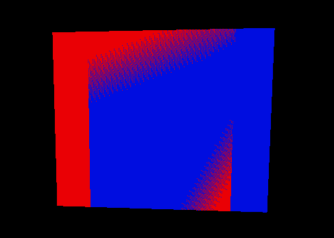

$$
\newcommand{\vecIII}[3]{\left[\begin{array}{c} #1\\\\#2\\\\#3 \end{array}\right]}
\newcommand{\vecIV}[4]{\left[\begin{array}{c} #1\\\\#2\\\\#3\\\\#4 \end{array}\right]}
\newcommand{\Choose}[2]{ { { #1 }\choose{ #2 } } }
\newcommand{\vecII}[2]{\left[\begin{array}{c} #1\\\\#2 \end{array}\right]}
\renewcommand{\vecIII}[3]{\left[\begin{array}{c} #1\\\\#2\\\\#3 \end{array}\right]}
\renewcommand{\vecIV}[4]{\left[\begin{array}{c} #1\\\\#2\\\\#3\\\\#4 \end{array}\right]}
\newcommand{\matIIxII}[4]{\left[
\begin{array}{cc}
#1 & #2 \\\\ #3 & #4
\end{array}\right]}
\newcommand{\matIIIxIII}[9]{\left[
\begin{array}{ccc}
#1 & #2 & #3 \\\\ #4 & #5 & #6 \\\\ #7 & #8 & #9
\end{array}\right]}
$$

# Transparency

Three.js makes it easy to create transparent surfaces. There are aspects of
the underlying implementation that are important to understand, however, in
case you need to customize the way transparent objects are rendered for your
scene.

## Alpha

The "color" of an object or material can have a fourth component,
called *alpha*. The color system is then four dimensional and is
referred to as the **RGBA** system, or, sometimes, $RGB \alpha$.

The alpha component has no fixed meaning, but usually refers to the *opacity*
of the material:

- 1 is perfectly opaque
- 0 is perfectly transparent

An alpha buffer is available on the graphics card and is part of the
frame buffer. When needed, Three.js takes care of requesting an alpha
buffer for us.

In Three.js, all
[`Material`](https://threejs.org/docs/index.html#api/materials/Material)
objects have a `transparent` property that is a boolean, and an `opacity`
property in the range from $0$ to $1$, for example:

```
const mat = new THREE.MeshBasicMaterial( {color: 0x00ffff,
                                          transparent: true,
                                          opacity: 0.5} );
```

To see the visual effect of setting the alpha (opacity) property, explore the
following tutor:

- [transparency/planes](https://learn.sewanee.edu/d2l/le/content/43027/viewContent/406782/View)

The tutor lets you adjust the alpha values for three planes, which are drawn
by Three.js from farthest in depth (from the camera) to nearest. To see the
surfaces in the reverse order, use the orbit controls to look at them from the
other side.

## Blending

Given the rendering pipeline model, we understand that at some moment during
the rendering process, some objects have been drawn and exist only in the
frame buffer and some objects have not yet been drawn. So there is a time when
the rendering of the next object is being *combined* with the rendering of
some previous object. In the usual case, the new object's pixels *overwrite*
the old pixels.

In general, though, OpenGL/WebGL allows you to *blend* the two sets of pixels
in the following way. The pixels already in the frame buffer are known as the
*destination* pixels and a particular pixel is colored $(R_d,G_d,B_d,A_d)$.
The new pixels are called the *source* pixels and a particular one is colored
$(R_s,G_s,B_s,A_s)$. In the equation below, you can choose the blending
factors, $s$ and $d$ so that the combined color is computed as a weighted sum
of the source and destination pixels:

In one dimension:

$$ C = d\cdot C_d + s\cdot C_s $$

where the weights $s$ and $d$ add to one, so it's a weighted sum. In
all four dimensions:

$$ \vecIV{R}{G}{B}{A} = d\vecIV{R_d}{G_d}{B_d}{A_d} + s\vecIV{R_s}{G_s}{B_s}{A_s} $$

The result components are clamped to the range $[0,1]$.

The blending factors can be controlled in Three.js (see properties of the
[`Material`](https://threejs.org/docs/index.html#api/materials/Material) class
whose names begin with "blend"), but for our examples, we will use the default
implementation of transparency.

## Hidden Surface Elimination

So far, this seems pretty easy. But now we have to discuss why this
might get difficult. First, we need to discuss *hidden surface
elimination*.

Suppose we render a scene with surfaces that overlap or even interpenetrate.
For example:

- a blue ball (or teapot) sitting on a brown table. Some pixels in the
  framebuffer are "both" blue and brown.
- a teddy bear (its ears and nose are spheres that penetrate its head)

Here is a demo of a red ball on a brown "table" (just a plane) that
enables you to adjust the alpha value for the ball:

- [transparency/ball-on-plane](https://learn.sewanee.edu/d2l/le/content/43027/viewContent/406782/View)

How does a graphics system determine *which* color to use for any pixel? There
are two major algorithms:

- depth sort, which is *object-based* , and
- depth buffer, which is *pixel-based*.

We'll start with the first and build up to the second.

## Depth Sort

The Depth Sort algorithm is sometimes called the "painter's" algorithm:
imagine an artist painting a scene with oil paints. They would paint the
farther stuff first (say, the table), then paint the ball right on top of the
paint of the table.

The painter's algorithm determines which *object* is farthest from the
camera, draws that first, then the next, and so forth. Because the
nearer stuff always overwrites the farther stuff, this works well,
*but:*

- We would need to draw things in different orders depending on the position of the camera.
- What about objects that inter-penetrate? How do you handle that?

To handle the latter issue, the algorithm sometimes breaks up objects
into smaller pieces that don't interpenetrate, just so that it can
sort them by distance. If we take this to its logical extreme, and
re-organize our thinking, we come to the next algorithm.

## Depth Buffer

The Depth Buffer algorithm is also called the Z-buffer algorithm, because Z is
the dimension of depth (distance from the camera). (Recall the Normalized
Device Coordinates that we talked about with respect to *picking*.)

This algorithm uses an extra storage buffer so that, for each pixel,
it can keep track of the *depth* of that pixel. This buffer is
initialized to some maximum at the beginning of rendering. When we
consider drawing a pixel, we first compute the new depth and compare
to the old depth, looking it up in the depth buffer. If the new depth
is *less* , meaning that the new pixel is *closer to the camera* , the
depth and color buffers are updated, so that the rendering of the
closer object updates the contents of the frame buffer. Computing the
depth is easy, because we have the original $(x,y,z)$ coordinates of
the object at the beginning of the transformation process, and we
maintain all of them to the end.

Let's take an example, drawing a red ball on a brown table, as in the
demo above. Suppose the pixel in the center of the window is red
because it's part of the ball, but if the ball weren't there it would
be brown because the table also projects to that pixel. Here's how it
works:

- Suppose the depth values in your scene range from 0 (closest) to 100 (farthest).
- Every pixel in the depth buffer is initialized to 100 before anything is drawn.

Now, there are two possibilities: we draw the ball first and the table second,
or vice versa.

- Ball first: When you draw the ball, the center pixel is set to red
  with a depth of, say, 50, because 50 < 100 (the current value of
  the depth buffer). Later, when you draw the table, the table is at a
  Z value of 70 and 70 > 50, and so the center pixel stays red,
  because the ball is closer to the camera than the table.
- Table first: When you draw the table, the center pixel is set to
  brown, with a depth of 70, because 70 < 100. Later, when you draw
  the ball, the center pixel is changed to red and the depth is
  updated to 50, because the ball is closer to the camera than the
  table (50 < 70).

So, this algorithm does the right thing regardless of the order that
things are drawn and their distance from the camera. Threejs uses the
z-buffer algorithm by default because it's very efficient and works
great with opaque objects.

## Depth and Transparency

The depth buffer algorithm has real trouble with transparency. Why?

> If you update the depth buffer when you draw a transparent object, then an
> opaque object that is drawn *later* but is *farther* won't be drawn.

Let's go back to our ball and table example, but now suppose the ball is
partially transparent, which you can do using that demo.

- You draw the transparent ball, say at a Z value of 50, and you
  update the depth buffer to record a distance of 50 for that center
  pixel.
- When you later draw the brown table at a distance of 70, the depth
  test says *not* to draw those pixels that overlap the ones that are
  at a depth of 50, because the table is *farther* than the ball. So,
  parts of the table are simply not drawn. We also don't see the brown
  of the table mixed with the red of the ball for those pixels.

So instead of seeing through the partially transparent ball to see the brown
table, we see through the ball to see whatever color the framebuffer was
cleared to at the beginning. (Or some farther object.)

The only way to really win is to employ the painter's algorithm, which
means to sort all the objects by their depth and draw them farthest to
nearest. Three.js does this by default.

Thus, the basic approach is:

- Draw all the opaque objects first, in the normal way, using the
  z-buffer algorithm.
- Then switch to blending, disable updating the depth buffer and draw
  all the transparent ones, from farthest to nearest (switching to the
  painter's algorithm).

## Depth in OpenGL/WebGL

As we mentioned above, the depth buffer is only updated for a material
if `depthWrite` is true. This is the default value, but you can turn
it off in the Three.js
[Material](https://threejs.org/docs/#api/materials/Material) with:

```
material.depthWrite = false;
```

Finally, the depth buffer algorithm is only used if `depthTest` is
true. This is the default value, but you can turn it off in the
Three.js and
[Material](https://threejs.org/docs/#api/materials/Material) with:

```
material.depthTest = false;
```

A simple and useful demo is the following, which draws two quads that occupy
the same space. By "occupy the same space," we don't mean just that their 2D
*projections* overlap, we mean that in the 3D world, their volumes overlap.
(Since they are planes, their volumes are flat, but what we mean is that they
are coincident in places.)

- [transparency/same-depth](https://learn.sewanee.edu/d2l/le/content/43027/viewContent/406782/View)

Try dragging just a little, so that the camera moves. If the depth
test is on, you should see a speckling effect in the overlapping area,
where the two planes are at an identical distance from the camera.

Here's a screenshot from the demo:




Speckling caused by pixels being at the same depth from the camera

Because OpenGL/WebGL retains depth information through projection (that's the
"$z$ coordinate"), if the projections of two things overlap, OpenGL can still
tell which one is "in front." However, if the volumes coincide, it can't tell
which one is in front because, in fact, neither one is. Therefore, if the
depth test is enabled, OpenGL will make the decision based on the depth
buffer, where tiny roundoff errors may differ from pixel to pixel, so that
sometimes it decides that the red one is "in front" and sometimes the blue
one. Thus, we get a speckling effect or other random effect. If you turn off
the depth test, one plane (the one drawn later) always wins. (Try moving the
camera a little from left to right.)

Note that turning off the depth test isn't a really practical way to
resolve this speckling issue. It's usually best to avoid this
situation by having the planes be at slightly different
distances. However, since it is a property of the material that you
apply, you have a lot more control than you might think.

## Depth Resolution

There's another issue that arises with the z-buffer algorithm. There
are a limited number of bits in the depth buffer; the actual number
depends on the graphics card. Quoting from the OpenGL Reference Manual
page for `gluPerspective`

> Depth buffer precision is affected by the values specified by `zNear` and
> `zfar`. The greater the ratio of `zFar` to `zNear` is, the less effective
> the depth buffer will be at distinguishing between surfaces that are near
> each other. If $$ r=\text{zFar}/\text{zNear} $$
>
> roughly $\log_2 r$ bits of depth buffer precision are lost. Because $r$
> approaches infinity as `zNear` approaches 0, `zNear` must never be set to 0.

So, even though it seems realistic to set `near` to zero (or nearly so) and
`far` to infinity, the practical result is that the depth buffer algorithm
won't be easily able to tell which of two surfaces is closer if they are
similar in distance. We already know not to set `near` to zero, but this says
we also shouldn't set `far` to $2^{32}$, because then we'd lose 32 bits of
precision, which is probably all we have.

This is why we need to keep the view-volume relatively tight, because
if it's too large, it becomes hard or impossible to tell the
difference between the distances of two objects, which is crucial for
the z-buffer algorithm.

Here's a concrete example. Suppose we have two objects, A and B, one
of which is at Z=1 and the other is at Z=2. No problem, right?
Clearly, if their projections overlap, we need to draw A, not B. But
now, suppose that the view volume is huge, so that far-near is
1,000,000,000. When the scene is projected to NDC, the distance of A
and B are now something like:

- A.z = 0.000000001
- B.z = 0.000000002

Now, suppose that because of the limited number of bits, it only keeps
the first 8 decimal digits. (Of course, the real computation is in
binary, but the concept is the same.) Then:

- A.z = 0.00000000
- B.z = 0.00000000

And the algorithm has no idea which to draw.

In practice, this means you will get the speckling effect even if the
two surfaces are at different depths, if the difference is
indistinguishable given the precision of the depth buffer.

## Alpha Test and More

The Threejs website also has an excellent article on
[transparency](https://threejs.org/manual/#en/transparency) that you
should read. It discusses the z-buffer and painter's algorithm, though
it doesn't use those terms, but notice the discussion of *depth*
and *sorting* the objects.

It also discusses textures that have transparent pixels and using the
alphaTest as an option.

## Summary

Transparency is seemingly easy, but in practice can be quite tricky.

- Use the alpha channel of color, or
- use textures that have transparent pixels
- mark objects as `transparent`, so that Threejs knows to save them
  for last (painter's algorithm) and sort them by depth
- To make the sorting more effective, break larger objects down into
  smaller components that are at clearly different depths from the
  camera.
