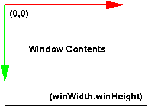
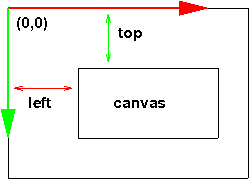

$$
\newcommand{\vecIII}[3]{\left[\begin{array}{c} #1\\\\#2\\\\#3 \end{array}\right]}
\newcommand{\vecIV}[4]{\left[\begin{array}{c} #1\\\\#2\\\\#3\\\\#4 \end{array}\right]}
\newcommand{\Choose}[2]{ { { #1 }\choose{ #2 } } }
\newcommand{\vecII}[2]{\left[\begin{array}{c} #1\\\\#2 \end{array}\right]}
\renewcommand{\vecIII}[3]{\left[\begin{array}{c} #1\\\\#2\\\\#3 \end{array}\right]}
\renewcommand{\vecIV}[4]{\left[\begin{array}{c} #1\\\\#2\\\\#3\\\\#4 \end{array}\right]}
\newcommand{\matIIxII}[4]{\left[
\begin{array}{cc}
#1 & #2 \\\\ #3 & #4
\end{array}\right]}
\newcommand{\matIIIxIII}[9]{\left[
\begin{array}{ccc}
#1 & #2 & #3 \\\\ #4 & #5 & #6 \\\\ #7 & #8 & #9
\end{array}\right]}
$$

# User Interaction

So far, we've mostly been creating images and animations, rather than
interacting with the user. Our interaction has mostly been limited to keyboard
callbacks using TW or GUI controls, and even that has been mostly toggling
global settings such as lighting or textures, or adjusting parameters. This is
fine for producing animations (after all, Pixar movies aren't interactive),
but if we want to do games and other kinds of interactive software, we'll need
to do better. In this reading, we'll start digging into how to have a more
interactive program.

Note that user interaction isn't really part of OpenGL per se. OpenGL is about
graphics, not about handling mouse clicks or keyboard input, or tangible user
interfaces or any of the many other ways that we can imagine interacting with
our devices.

Nevertheless, if you want to build a game or any other software that combines
computer graphics with user interaction (even an animation might have a
"pause/resume" feature), we'll want to confront this.

## Keyboard Events in a Web Browser

Web browsers have a reasonably straightforward way of handling keyboard input
— until you start looking into it more deeply. Then it becomes a
[mess](http://www.unixpapa.com/js/key.html). But, let's ignore the mess for
now and start with some straightforward elements.

When the keyboard changes state (a key goes up or down ...) the
browser generates several *events*, any of which you can add a
*handler* for. I'm suggesting that we use the `keydown` event.

(In the past, I have used the
[`keyPress`](https://developer.mozilla.org/docs/Web/API/Element/keypress_event)
event, but that has been
[deprecated](http://www.w3.org/TR/DOM-Level-3-Events/#event-type-keypress)
for a long time. It is currently supported by all major browsers and
probably always will be, but the threat remains that it *could* be
withdrawn at any time. So, we'll use `keydown` in new code (old code
might still use `keypress`). An alternative is `beforeinput`, but that
seems to require that the "enter" key be pressed, and that's not what
we want.)

Here's what the code might look like:

```js
function handleKey (event) {
    // do something
}

document.addEventListener("keydown", handleKey);
```

As you can see, you bind the `keydown` event to a callback function
that is invoked whenever a key goes down. This callback function is
invoked with an *object* that represents all the information about the
event. The particular type (class) of object is
[KeyboardEvent](https://developer.mozilla.org/en-US/docs/Web/API/KeyboardEvent). You
can read more than you'd ever want to know at the linked MDN page.

The two properties we will look at are `code` and `key`:

- `code` is a string identifying the key, such as `KeyA`
- `key` is a string saying what the input is, such as `a` or `A`

You'll notice that both of the above happen when we press the "a" key
on the keyboard. The first doesn't care whether the shift key is down
or caps-lock is on; the second does. You can decide which one you want
to look at.

I have added a keyboard event handler to this demo:

- [interaction/events](https://learn.sewanee.edu/d2l/le/content/43027/viewContent/406178/View)

Here's the code:

```js
function handleKey (event) {
    const code = event.code;
    const key = event.key;
    console.log(`code: ${code} and key: ${key}`);
}
document.addEventListener("keydown", handleKey);
```

You can see that what this does is just print those useful values in
the JS console. So, open up the JS console. and try pressing some
keys, to see what is printed. **Note:** the browser window needs to be
"in focus", otherwise you'll just be typing into the JS console. So,
if you find that your keystrokes are just going to the JS console,
click on the document to put it *in focus*.

Don't just try the letter keys. You can try the arrow keys, the number
keys, punctuation, etc.

## Handling Events

What you'll next want to do is figure out what key was pressed and
then do something appropriate. For now, let's imagine that what you
want to do is something to create a
[WASD](http://en.wikipedia.org/wiki/Arrow_keys#WASD_keys) interface to
move an avatar around the scene while using a mouse with your right
hand. In this case, I decided that I don't care about upper or lower
case, I'm just using the keys similarly to the arrow keys, so I used
the

```js
function handleKey (event) {
    const code = event.code;
    switch (code) {
    case 'KeyW': goForward(); break;
    case 'KeyS': goBackward(); break;
    case 'KeyA': goLeft(); break;
    case 'KeyD': goRight(); break;
    default:
       console.log(`key {$code} is not handled`);
    }
}
```

## Key Mappings

Note that the code above "hard codes" the meaning of each key and
isn't extensible or customizable. You can't, for example, easily
switch to ESDF or IJKL, if you wanted to.

One option is to store the mapping from characters to functions (this
mapping is called *key bindings*) in an *array*. The contents of the
array can easily be modified to re-bind the keys. This is what TW
does, and functions like `TW.setKeyboardCallback()` just sets an
element of the array.

Alternatively, we could have a *dictionary* that maps a string like
`KeyA` to a function. The code to store a function might be like this:

```js
const keyMappings = {};

function setKeyMapping(key, func) {
    keyMappings[key] = func;
}
```

We could set up some mappings like this:

```js
setKeyMapping('KeyA', goLeft);
setKeyMapping('KeyD', goRight);
setKeyMapping('KeyW', goForward);
setKeyMapping('KeyS', goBackward);
```

Notice that the functions are just being stored in the array, they are
not being invoked, so they don't get parentheses after them.

Finally, the code to handle an event is very abstract. It just
retrieves the function from the dictionary and invokes it. It might
look like this:

```js
function handleKey (event) {
    const code = event.code;
    if( typeof keyMappings[code] === 'function' ) {
        keyMappings[key](event);  // invoke the function
    } else {
        console.log('no binding for key ' + key + ' (' + ch + ')');
    }
}
```

There are, of course, many variations on this kind of code. For example,
several similar blocks might be coalesced. You might invoke `TW.render()`
after every keypress, in case it changed the scene, and relieve every
keybinding from having to do that.

Note, another simplification we will make is to bind the keypress event on the
entire document. You can bind the keypress event to any focussable element
(such as an `<input>`), but, alas, a `<canvas>` is not a focussable element.
So, we will be binding the keypresses for the entire document. If you want to
have keypresses mean different things in different elements of your page, you
can track the mouse (or require the user to click on the element they want the
input to go to) and use some conditionals inside your event handler to sort
that out.

The event object can also tell whether the shift, control, alt, or meta keys
are down, so you can treat Control-A differently from "a" or "A."

## Key Up and WASD motion

Unsurprisingly, there's also an event when a key goes up. If we start
an animation going when a key goes down, and stop when the key goes
up, we can build a nice interface using keys, such as WASD. Here's a demo:

- [interaction/walk-with-wasd](https://learn.sewanee.edu/d2l/le/content/43027/viewContent/406178/View)

## Mouse Coordinates

When an old-fashioned CRT (Cathode Ray Tube) monitor redraws the
screen, it starts in the upper left corner and the electron gun sweeps
left to right and top to bottom. For that reason, browsers still use a
coordinate system where the origin is at the upper left, the $x$
coordinate increases to the right and the $y$ coordinate increases
going *down*. Strange, but true.

The mouse coordinates are reported in *window* coordinates, which is
in pixels measured from the upper left of the window. If your browser
is in a 960 by 500 window, those values will be, respectively, the
largest possible $x$ and $y$ coordinates. See this figure:




Mouse
Coordinates are reported with 0,0 in the upper left, and
maximum values of window width and window height

Suppose you want to process mouse clicks, then the event you want to bind is,
unsurprisingly, `click`. Thus, the code might look like this:

```js
function onMouseClick (event) {
    const mx = event.clientX;
    const my = event.clientY;
    console.log(`click at (${mx}, ${my})`);
}

document.addEventListener('click', onMouseClick);
```

I have also implemented the code above in this demo:

- [interaction/events](https://learn.sewanee.edu/d2l/le/content/43027/viewContent/406178/View)

You can test the mouse clicking behavior the same way you tested the keyboard
handling: open the JS console, make sure the document is in focus, and
click a few times. Try it! Try clicking near the corners of the
document window. The upper left should result in small values for x
and y, the upper right should result in a large value for x and small
for y, and so forth.

## Canvas Coordinates

Don't you wish it were that easy? Unfortunately, when we are using a
canvas in a web browser, the absolute mouse coordinates aren't exactly
what we want. Instead, we'd like to have the coordinates specified
relative to where our
canvas is (and there might be more than one, though we haven't done that so far). See this figure:




Canvas coordinates are offset from the window coordinates

Note that most of the Three.js examples use one canvas and have it
take over the entire window, so that there's no difference between the
mouse coordinates relative to the window and the mouse coordinates
relative to the canvas. They do this in their CSS style rules:

```js
   canvas { width: 100%; height: 100%; }
```

This is *almost* correct, but if you need exact coordinates, you may
need to zero out any margins or padding for the `<body>`, which often
default to 8px or so.

To adjust for the location of the canvas within the window, we need to
find out the *target* of the click (what element was clicked on), and
then we can find out its offset from the window, using the very useful
[getBoundingClientRect()](http://developer.mozilla.org/en-US/docs/Web/API/element.getBoundingClientRect)
method.

Suppose that we previously saved the canvas in the variable `c1`. Our code then becomes:

```js
function onMouseClick (event) {
    const mx = event.clientX;
    const my = event.clientY;
    console.log(`click at (${mx}, ${my})`);
    const target = event.target;
    if( target == c1 ) {
        console.log("clicked on a canvas");
        const rect = target.getBoundingClientRect();
        const cx = mx - rect.left;
        const cy = my - rect.top;
        console.log(`clicked on canvas c1 at (${cx},${cy})`);
    }
}
```

If you care about which button was clicked (left, middle, right), the
`event` object has a `button` property that gives the numerical index
of the button. Zero is the left button, one is the middle button, and
so forth. It may be hard to capture a right-click, since the browser
usually intercepts that and processes it specially.

## Using Mouse Clicks

That's all very interesting, but what can we do with mouse clicks?
Next time, we'll learn about *picking*, but for now, let's use the
mouse to turn the camera.

What's cool about using the mouse is that we can get finer gradations
than using keyboard callbacks. With keyboard callbacks, we can easily
have the 'a' key turn the camera by 10 degrees or 45 degrees or
whatever. But with the mouse, we can click to move the
camera. Clicking above the midline moves forward, while clicking below
moves backwards. Clicking to the left of the midline turns to the
left, and clicking to the right of the midline turns to the
right. Furthermore, the *farther* from the midline, the more we move
or turn.

Here's a demo:

- [interaction/nav-town1](https://learn.sewanee.edu/d2l/le/content/43027/viewContent/406178/View)

Note that the camera doesn't move vertically. It moves in a plane of
constant Y, parallel to the XZ (Y=0) plane. That simplifies a lot of
our math.

## Camera Representation

Let's approach this in several steps. First our camera is going to
have the following properties. (You may remember these from our
reading on cameras.)

- EYE: the location of the camera
- AT: a point the camera is pointing at
- VPN: View Plane Normal. a vector indicating the direction of the camera. Equal to AT-EYE
- VUP: the vertical vector.
- VRIGHT: A vector pointing to the camera's right. Useful if we want to [strafe](https://en.wikipedia.org/wiki/Strafing_(video_games)) right or left

These will be instance variables of the camera object.

## Camera Methods

We will store instance variables in the camera object. The code looks like:

```js
    camera.position.set(center.x, center.y, center.z + camParams.cameraRadius);
    camera.up.set(0,1,0);
    camera.lookAt(center);
    camera.vpn = new THREE.Vector3(0,0,-1);
    camera.at = new THREE.Vector3(0,0,0);
    camera.at.addVectors( camera.position, camera.vpn );
    camera.vright = new THREE.Vector3(0,0,1);
```

The `cameraRadius` is roughly the radius of the bounding sphere for
the scene, so we can be sure to be *outside* the scene. Of course, we
could start in the center if you want. But that runs the risk of
starting in the middle of a house or tree or something.

We will define methods to move the camera forward/backwards,
left/right, and to turn.

Moving the camera forwards and backwards is pretty easy: we modify the
`position` using the VPN, since that's the vector indicating where we
are pointing. Similarly for left/right, we can use VRIGHT. Our code
looks like this:

```js
    camera.forward = function (dist) {
        this.position.addScaledVector( this.vpn, dist );
        this.at.addScaledVector( this.vpn, dist );
        this.lookAt(this.at);
    };
    camera.backward = function (dist) {
        this.position.addScaledVector( this.vpn, -1 * dist );
        this.at.addScaledVector( this.vpn, -1 * dist );
        this.lookAt(this.at);
    };
```

Turning is a little trickier. We need to rotate the VPN vector around
the Y axis. Fortunately Threejs has a method to do just that. The code
looks like this:

```js
    const yaxis = new THREE.Vector3(0,1,0);
    camera.rotateBy = function (angle) {
        // change the coordinates of VPN. Awesome that THREE.js has this method
        this.vpn.applyAxisAngle( yaxis, angle );
        this.at.addVectors( this.position, this.vpn );
        this.lookAt(this.at);
    }

    camera.left = function (deg) {
        this.rotateBy( THREE.MathUtils.degToRad(deg) );
    };
    camera.right = function (deg) {
        this.rotateBy( -1 * THREE.MathUtils.degToRad(deg) );
    };
```

## Event Handling

We can bind some of these methods to keys like this:

```js
function handleKey(event) {
    switch (event.code) {
    case 'KeyW':
    case 'ArrowUp':
        myCam.forward(1);
        break;
    case 'KeyS':
    case 'ArrowDown':
        myCam.backward(1);
        break;
    case 'KeyD':
    case 'ArrowRight':
        myCam.right(10);
        break;
    case 'KeyA':
    case 'ArrowLeft':
        myCam.left(10);
        break;
    }

}

document.addEventListener('keydown', handleKey);
```

Now, the fun part. We can set up a mouse click handler that will turn
or move by an amount that is *proportional* to how far from the center
we click. If we click at the very edge of the screen, we go the max
amount. Let's call that the "speed". We might have:

```js
const forwardSpeed = 3.0;       // distance in world units
const turnSpeed = 45.0;         // degrees
```

Now, we set up the mouse handler like this:

```js
function onMouseClick (event) {
    var mx = event.clientX;
    var my = event.clientY;
    console.log("click at (" + mx + "," + my + ")");
    var target = event.target;
    var rect = target.getBoundingClientRect();
    var cx = mx - rect.left;
    var cy = my - rect.top;
    console.log("clicked on c1 at (" + cx + "," + cy + ")");
    // Now, do something with it
    const x = cx - rect.width/2
    const y = rect.height/2 - cy;
    // the fraction of the distance: 0 near the center, 1 near the edges
    const fx = x/(rect.width/2);
    const fy = y/(rect.height/2);
    console.log(fx, fy);
    myCam.forward(forwardSpeed * fy);
    myCam.right(turnSpeed * fx);
}

document.addEventListener('click', onMouseClick);
```

Next time, we'll see even more powerful ways of user interaction.

## Summary

- keyboard events can be captured and handled, allowing us to do things in response to the user
- we saw a cool demo of Steve walking around a grid world
- mouse clicks are events that can also be captured
- mouse clicks can provide more calibrated input to the system
